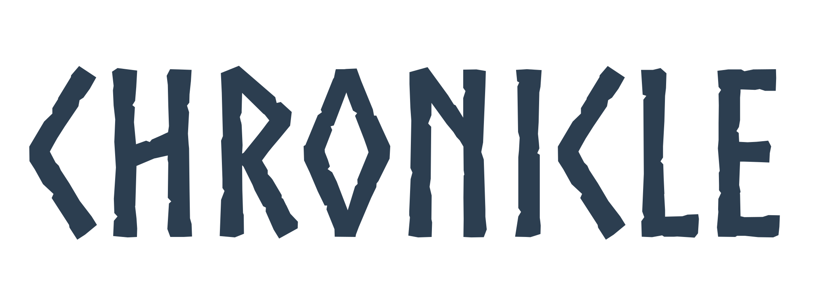
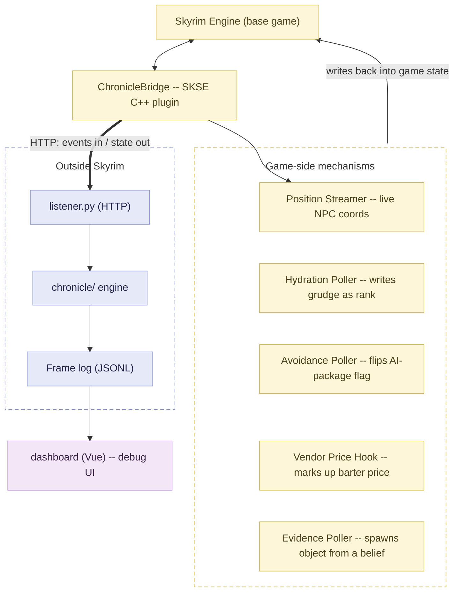
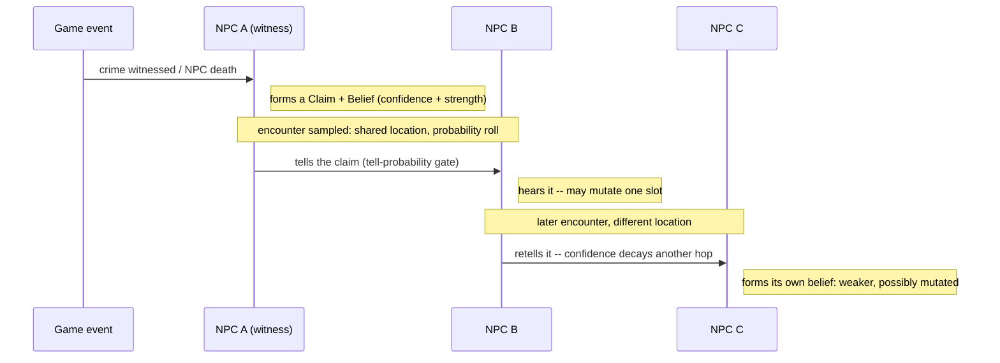
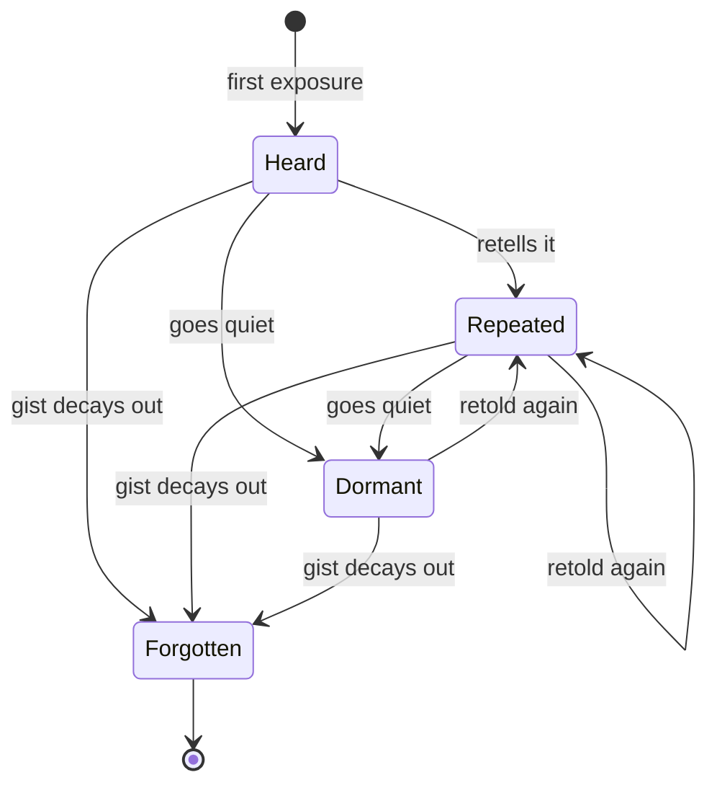
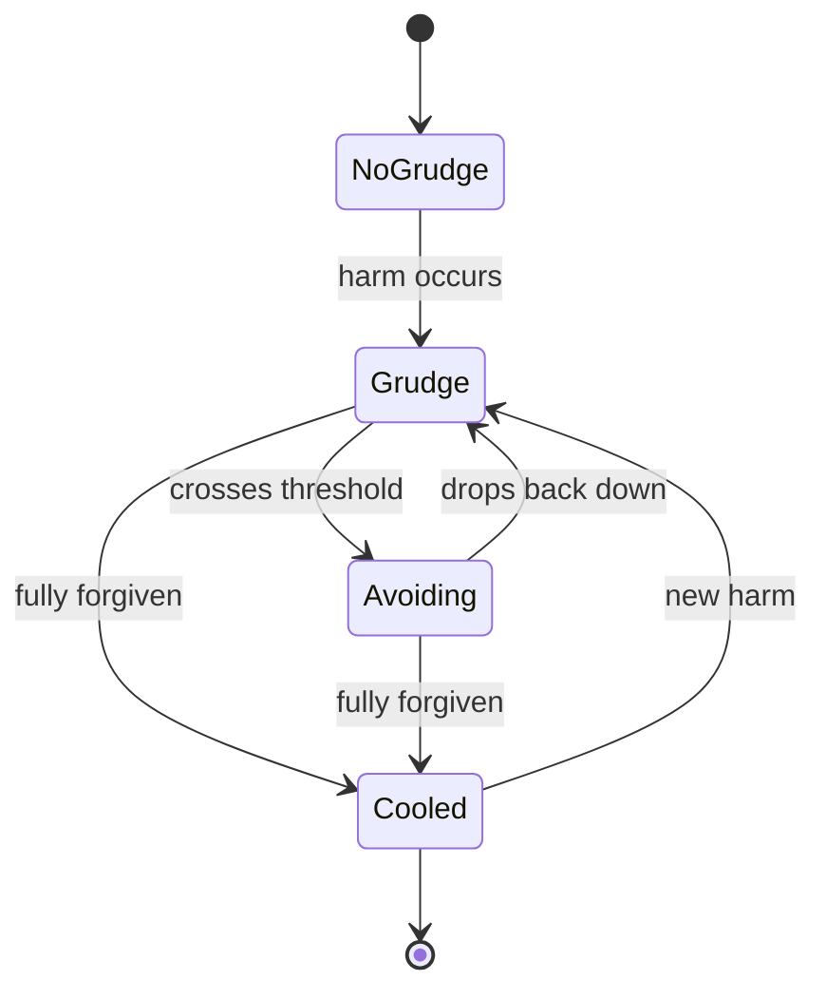

<picture>
  <source media="(prefers-color-scheme: dark)" srcset="docs/assets/chronicle-title-light.svg">
  
</picture>


[](https://bytebard97.github.io/Chronicle/)

Chronicle is an external social-simulation service for Skyrim SE/AE.
Every named NPC gets beliefs with provenance and strength attached.
Rumors spread and mutate as they pass from person to person. Grudges and
obligations build up from what actually happened, not from a quest flag,
and all of it feeds back into the game as behavior you can actually see.

Here's the scenario I keep testing against: you assassinate the Jarl of
Whiterun. In vanilla Skyrim that's a quest trigger. In Chronicle it's a
succession contest shaped by the court's real relationships, an economic
hit to merchants who depended on him, a rumor that's already mutated by
the time it reaches Riften, and guard patrols that shift because of what
the simulation computed, not because a script branch fired.

## How it works

*(The diagrams below also live on the
[GitHub Pages site](https://bytebard97.github.io/Chronicle/diagrams.html),
rendered without GitHub's Mermaid-in-README quirks: same content, cleaner
rendering.)*

Chronicle is really two programs talking over plain HTTP: a small C++
plugin living inside the Skyrim process, and a Python simulation service
running natively on the host. The plugin doesn't simulate anything, it
just reads and writes game state and relays events. Every bit of actual
social reasoning (who believes what, how a rumor mutates, when a grudge
cools) happens outside the game entirely. That's the part that let me
test and replay the whole simulation for months before ever pointing it
at a running copy of Skyrim.



*Node label colors are set inline in the diagram source (not via
`classDef`'s own `color:`, which modern Mermaid doesn't reliably apply to
HTML-rendered labels) because Material renders each diagram inside a
closed shadow root -- page-level CSS, `!important` or not, structurally
cannot reach inside it. Verified by reading Material's own bundled JS
(`attachShadow({mode:"closed"})`) rather than guessing after the fact.*

These mechanisms are all built, compiled, and now confirmed writing
correctly against a real, running game. See Project status below for
exactly what's verified and what's still open.

 the mod: Skyrim engine + the ChronicleBridge SKSE plugin (C++) &nbsp;&nbsp;  the service: native Python, outside the game &nbsp;&nbsp;  the dashboard: Vue debugging UI, reads the service's logs

Everything under `chronicle/` never imports anything Skyrim-specific. It
would run the exact same way against a different game entirely. The
only place allowed to know Skyrim exists is `adapters/skyrim/`.

### How a rumor spreads and mutates

Gossip travels only through sampled encounters (shared location +
schedule overlap), never a broadcast. Each retelling can mutate one
detail and always loses some confidence:



### How a rumor ages: heard, repeated, dormant, forgotten

`Dormant` means ~45 game-days with no retelling; `Forgotten` fires
independently, whenever the underlying belief's gist strength decays
past its floor, whichever stage it happens to be in:



### How a grudge turns into visible avoidance

Grudges decay continuously rather than clearing instantly, so a fresh
harm and a genuinely-forgiven one behave differently even at the same
raw severity. `Avoiding` fires once decayed severity crosses a
threshold; `Cooled` fires once it decays below a separate, lower
forgiveness floor:



`Avoiding` is what a live game session would actually show: two NPCs
breaking off their usual routine to keep apart, driven purely by decayed
grudge severity, and none of it is scripted.

## Read next

| | |
|---|---|
| [`docs/vision-v2.2.md`](docs/vision-v2.2.md) | What this is and why, anchored on the north-star scenario. |
| [`docs/architecture.md`](docs/architecture.md) | The event-sourced core, the three-tier belief architecture, the Substrate Abstraction Layer, deployment target. |
| [`docs/decisions/`](docs/decisions/) | Numbered ADRs and `open-questions.md`: the project's working memory for every design tension research surfaced. |
| [`docs/research/00-index.md`](docs/research/00-index.md) | Every research report behind this design, with tagged findings and merged build-on/risk lists. |

## Project status (August 2026)

Short version: the headless engine works, the Skyrim bridge compiles and
deploys, and every write path has now been checked against a real,
running game. Here's where each piece actually stands.

The v0.1 headless sim is done. `docs/v0.1-spec.md`'s ~20-rule budget is
implemented and scenario-tested: the claim/variant/belief store with the
rumor stage machine (`chronicle/claims.py`), the social-state store for
relationships, grudges, obligations and observer-local reputation
(`chronicle/social.py`), and schedule-driven encounter sampling
(`chronicle/schedule.py`, `chronicle/propagate.py`). None of it needs a
Skyrim install to build, run, or test. Schedules and relationships for
the v0.1 Whiterun cast are still hand-seeded (`chronicle/fixtures/`)
rather than derived from a full simulation.

ChronicleBridge builds and deploys. Its 7 SKSE slices (C++,
CommonLibSSE-NG) cover live position streaming, death events, hydration,
avoidance, vendor markup via a barter-menu price hook, a crime-witness
cascade, and diegetic evidence, and the whole tree compiles clean. The
DLL plus a real 171-pair patched ESP install into a real MO2/Proton setup
and load correctly.

In-game validation is confirmed at the data level. A pytest harness
drives every slice against a live, running game over DevBench
(`adapters/skyrim/livetest/`), and 14 of its 16 checks pass: a real death
event lands in the run log under the right identity, a Chronicle grudge
turns into an actual vanilla relationship rank, an avoidance pair's
AI-package flag really flips, a vendor's markup multiplier caches
correctly off a barter-directed grudge, and an evidence object spawns
and survives a cell reload. The 2 failing checks share one bug: reloading
a save through the test harness currently silently does nothing, I've
dug into it a while and still haven't root-caused it (see
`docs/design/simple-modlist-milestone.md` for the gory details).

What's not confirmed yet is whether any of this is visible to a player.
Everything above proves ChronicleBridge's writes land correctly in game
state, not that you'd notice a change on screen, e.g. two NPCs actually
walking apart in real time rather than a flag flipping somewhere. Closing
that gap is M5.

Named-cast coverage sits at 19 of 28: `IdentityMap.cpp`'s `kNamedCast`
resolves 19 of Whiterun's 28 live-captured NPCs to a Chronicle identity
(up from 1 at the start of this), and the rest stream as generic
fallbacks the current rules can't act on yet.

| Milestone | What it means | Status |
|---|---|---|
| M0: Headless proof | Belief cascade (Jarl dies → rumors spread → grudges form), scenario-tested, no game required | Done |
| M1: Bridge compiles | All 7 ChronicleBridge slices build clean against CommonLibSSE-NG | Done |
| M2: Bridge deploys | DLL + patched ESP in a real MO2 install, listener wired, ready to launch | Done |
| M3: In-game validation | Every slice confirmed live via an automated test harness | Substantially done (14/16 checks pass; save/load persistence is the one open bug) |
| M4: Named-cast coverage | Resolve the remaining 9 of 28 Whiterun NPCs to Chronicle identities | Mostly done (19/28, 9 remaining, see `docs/design/next-phases-2026-08.md` §0c) |
| M5: Visible "out" direction | A player watching the screen actually perceives the sim's effect, not just the underlying state change | Next |
| M6: Player-shareable | Downloadable artifact, install instructions, save-safety guarantee | Blocked on M5 |

See `adapters/skyrim/README.md` for per-slice status and
`docs/design/next-phases-2026-08.md` for the current plan.

## Future directions

The headless engine and bridge are the foundation, not the goal. Where this is
going, in dependency order. Each of these is a designed, claimable problem,
not a vibe (see `docs/decisions/` and the open issues):

Tier 3 of the vision gives the simulation a voice: a local LLM renders
NPC belief state as dialogue. It never *decides* anything on its own,
it just says out loud what the deterministic engine already computed,
and whatever the player says back gets ingested as evidence. The sim
itself stays fully reproducible; the LLM sits behind a seam as a
replaceable component, sized for consumer hardware on your own LAN (I'm
targeting a 27B-class open-weights model on about 64GB of unified
memory), not a cloud API.

Player persona (ADR-0011, still just a proposal) would let you author
your character's personality at creation the way you already author
their face: trait profile, mannerisms, voice. Dialogue turns
intent-driven, so you pick what you're trying to do (negotiate, deceive,
intimidate) and the engine writes the actual line in your character's
voice, grounded in whatever this particular NPC believes about you.
Committed lines feed straight into the rumor engine as claims, so a
boast you make in Whiterun can end up in Riften, mutated along the way.
What you say has consequences because what you say becomes evidence.

Down the line, committed dialogue gets rendered as audio through a
small local voice model, with an original synthetic voice per NPC. One
hard line I'm not moving on: no cloning Skyrim's voice actors, or
anyone's voice, without documented consent. Every voice Chronicle ships
will be original or properly licensed.

If you want to get involved, the open problems worth collaborating on
are co-save sync across save/reload (ADR-0005's C++ half), runtime
package injection to replace NPC-record overrides, and in-game
validation of the write paths. Each one has its own issue with
acceptance criteria.

## Development

Requires [uv](https://docs.astral.sh/uv/), which installs the right Python
(3.12+) automatically.

```sh
uv sync      # install dependencies
make test    # uv run pytest
make lint    # uv run ruff check .
make sim     # uv run python -m chronicle -- inspect/trace/feed/inject subcommands (chronicle/cli.py)
```

**Layout**: `chronicle/` is the pure-Python simulation engine. It never
imports anything Skyrim-specific. `adapters/skyrim/` is the only place
allowed to know Skyrim exists. `dashboard/` is the debug/observability web
UI (first-class, not an afterthought, see `docs/vision-v2.2.md`).
`scenarios/` holds headless regression scenarios with asserted outcomes.
`notes/` is working memory: `inbox/` for unprocessed material, `daily/`
for session notes, `ideas.md` for unsorted ideas and action items.
