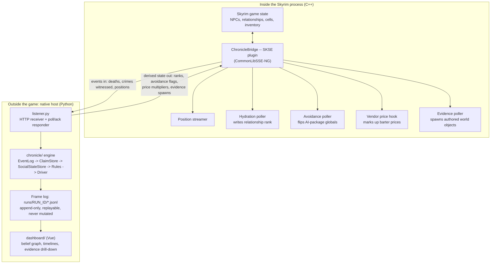
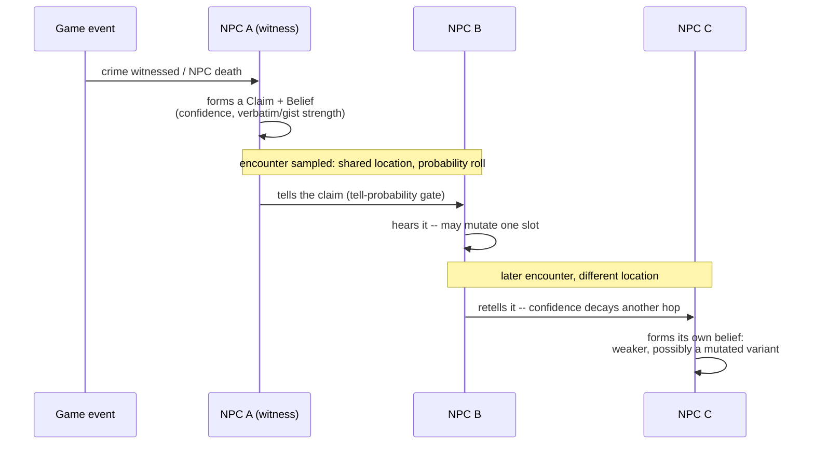
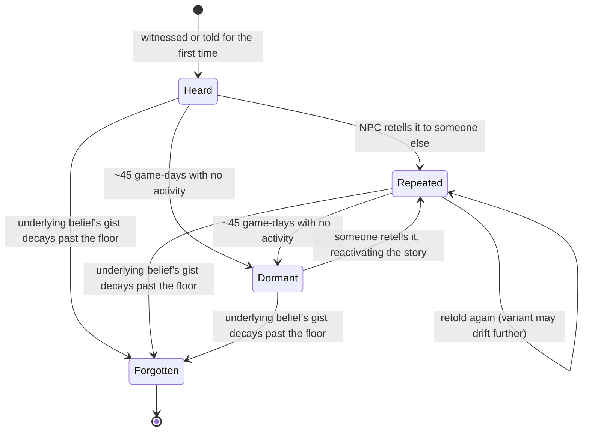
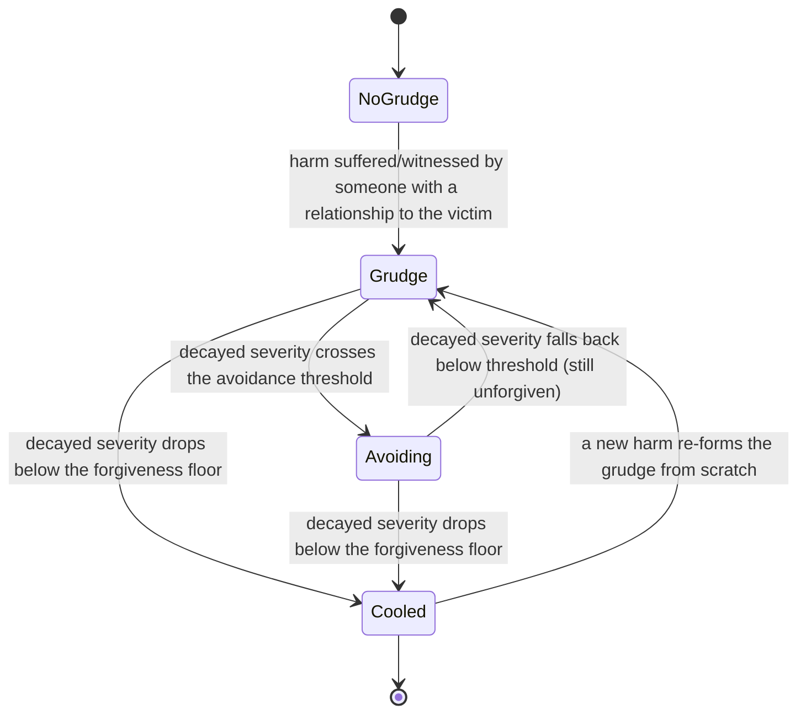

# Chronicle


**A world that remembers.** Chronicle is an external social-simulation
service for Skyrim SE/AE: it gives every named NPC beliefs with
provenance and strength, lets rumors spread and mutate as they pass from
person to person, tracks grudges and obligations from what actually
happened, and feeds all of it back into the game as behavior the player
can perceive and shape.

The north star: if the player assassinates the Jarl of Whiterun, that
should cascade — a succession contest driven by the court's real
relationships, an economic ripple through dependent merchants, a rumor
that mutates as it travels to Riften, guard patrols that shift as a
*consequence* of the simulation, not a scripted quest branch.

## How it works

Chronicle is two things talking to each other over plain HTTP: a small
C++ plugin living inside the Skyrim process, and a Python simulation
service running natively on the host. The plugin never simulates
anything — it only reads/writes game state and relays events. All the
actual social reasoning (who believes what, how a rumor mutates, when a
grudge cools) happens outside the game entirely, which is what makes it
possible to test, replay, and inspect the whole simulation without ever
launching Skyrim.



Everything under `chronicle/` never imports anything Skyrim-specific —
it would run the exact same way against a different game entirely. The
only place allowed to know Skyrim exists is `adapters/skyrim/`.

### How a rumor spreads and mutates

Gossip travels only through sampled encounters (shared location +
schedule overlap), never a broadcast. Each retelling can mutate one
detail and always loses some confidence:



### How a rumor ages: heard, repeated, dormant, forgotten



### How a grudge turns into visible avoidance

Grudges decay continuously rather than clearing instantly, so a fresh
harm and a genuinely-forgiven one behave differently even at the same
raw severity:



`Avoiding` is what a live game session would show as visible behavior —
two NPCs breaking off their usual routine to keep apart — driven purely
by decayed grudge severity, no scripting involved.

## Read next

| | |
|---|---|
| [`docs/vision.md`](docs/vision.md) | What this is and why, anchored on the north-star scenario. |
| [`docs/architecture.md`](docs/architecture.md) | The event-sourced core, the three-tier belief architecture, the Substrate Abstraction Layer, deployment target. |
| [`docs/decisions/`](docs/decisions/) | Numbered ADRs and `open-questions.md` — the project's working memory for every design tension research surfaced. |
| [`docs/research/00-index.md`](docs/research/00-index.md) | Every research report behind this design, with tagged findings and merged build-on/risk lists. |

## Project status (August 2026)

**Chronicle is a headless social-simulation engine with a live Skyrim
bridge deployed — but no visible in-game effects confirmed yet.**

- **v0.1 headless sim: done.** `docs/v0.1-spec.md`'s full ~20-rule
  budget is implemented and scenario-proven: the claim/variant/belief
  store with the rumor stage machine (`chronicle/claims.py`), the
  social-state store — relationships, grudges, obligations,
  observer-local reputation (`chronicle/social.py`) — and
  schedule-driven encounter sampling (`chronicle/schedule.py`,
  `chronicle/propagate.py`). No Skyrim installation required to build,
  run, or test any of it. Schedules/relationships are still hand-seeded
  for the v0.1 Whiterun cast (`chronicle/fixtures/`) rather than derived
  from a full math-tier simulation.
- **ChronicleBridge builds and deploys: done.** 7 SKSE slices (C++,
  CommonLibSSE-NG) — live position streaming, death events, hydration,
  avoidance, vendor-markup (barter-menu price hook), a crime-witness
  cascade, and diegetic evidence — compile clean as a whole tree. The
  DLL and a real 171-pair patched ESP are deployed into a live dev
  install (`~/Games/ChronicleDev`, correct load order).
- **In-game validation: not started.** The bridge has never been
  launched against a live game save. Every write path (hydration,
  avoidance, vendor-markup, evidence) is unit/scenario-tested on the
  Python side but unverified in a running game — see
  `docs/design/chronicle-bridge-verification-runbook.md`.
- **No write path has been confirmed to produce a visible in-game effect
  yet.** Every "out" slice (hydration, avoidance, vendor-markup,
  evidence) is compiled and Python-tested, but none has run against a
  live game — only "in" (positions, deaths) has ever been observed
  working.
- **Named-cast coverage: 19 of 28.** `IdentityMap.cpp`'s `kNamedCast`
  resolves 19 of Whiterun's 28 live-captured NPCs to a Chronicle
  identity (grown from 1); the rest stream as generic fallbacks the
  landed rules can't act on.

**What this means:** you can clone and run the simulation + dashboard
today with no Skyrim install. You cannot yet install it as a mod and
see the world react. That's the next milestone.

| Milestone | What it means | Status |
|---|---|---|
| M0: Headless proof | Belief cascade (Jarl dies → rumors spread → grudges form), scenario-tested, no game required | Done |
| M1: Bridge compiles | All 7 ChronicleBridge slices build clean against CommonLibSSE-NG | Done |
| M2: Bridge deploys | DLL + patched ESP in a real MO2 install, listener wired, ready to launch | Done |
| M3: In-game validation | Launch the game, confirm each slice live via the verification runbook | Next |
| M4: Named-cast coverage | Resolve the remaining 9 of 28 Whiterun NPCs to Chronicle identities | Mostly done (19/28, 9 remaining — see `docs/design/next-phases-2026-08.md` §0c) |
| M5: Visible "out" direction | Sim state actually changes what the player sees | Blocked on M3 |
| M6: Player-shareable | Downloadable artifact, install instructions, save-safety guarantee | Blocked on M5 |

See `adapters/skyrim/README.md` for per-slice status and
`docs/design/next-phases-2026-08.md` for the current plan.

## Development

Requires [uv](https://docs.astral.sh/uv/) — it installs the right Python
(3.12+) automatically.

```sh
uv sync      # install dependencies
make test    # uv run pytest
make lint    # uv run ruff check .
make sim     # uv run python -m chronicle -- inspect/trace/feed/inject subcommands (chronicle/cli.py)
```

**Layout**: `chronicle/` is the pure-Python simulation engine — it never
imports anything Skyrim-specific. `adapters/skyrim/` is the only place
allowed to know Skyrim exists. `dashboard/` is the debug/observability web
UI (first-class, not an afterthought — see `docs/vision.md`).
`scenarios/` holds headless regression scenarios with asserted outcomes.
`notes/` is working memory: `inbox/` for unprocessed material, `daily/`
for session notes, `ideas.md` for unsorted ideas and action items.
