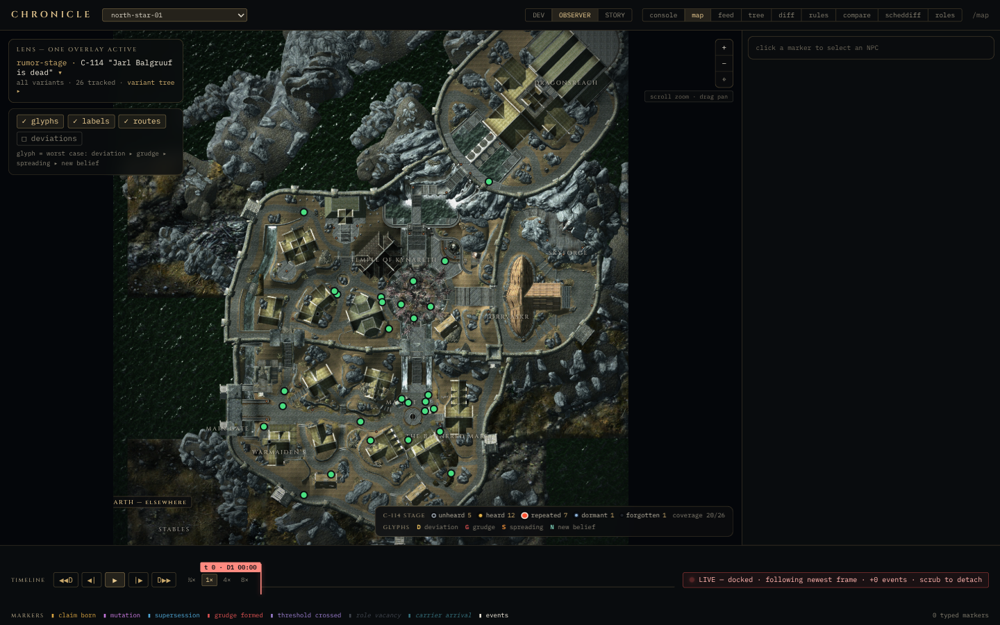

# Chronicle

Chronicle is an external social-simulation service for Skyrim SE/AE.
Every named NPC gets beliefs with provenance and strength attached.
Rumors spread and mutate as they pass from person to person. Grudges and
obligations build up from what actually happened, not from a quest flag,
and all of it feeds back into the game as behavior you can actually see.

Here's the scenario I keep testing against: you assassinate the Jarl of
Whiterun. In vanilla Skyrim that's a quest trigger. In Chronicle it's a
succession contest shaped by the court's real relationships, an economic
hit to merchants who depended on him, a rumor that's already mutated by
the time it reaches Riften, and guard patrols that shift because of what
the simulation computed, not because a script branch fired.

[:material-github: View on GitHub](https://github.com/ByteBard97/Chronicle){ .md-button .md-button--primary }
[Read the architecture](architecture.md){ .md-button }

## Try it yourself

The headless simulation runs on any machine with no Skyrim install.
Clone it, run three commands, and watch 358 scenario tests pass in under
four seconds:

```sh
git clone https://github.com/ByteBard97/Chronicle.git
cd Chronicle
uv sync && make test
```

## The dashboard, live against a real run



*The map view of `dashboard/`, showing rumor-stage glyphs (unheard, heard,
repeated, dormant, forgotten) and NPC markers over a real Whiterun layout,
against the `north-star-01` scenario run. Not a mockup, it's a screenshot
of the actual debug UI running against real simulation output.*

## How it works



## Project status



*(This section is pulled straight from the repository's own README, so
it stays current with the codebase without me having to remember to
update two places.)*
