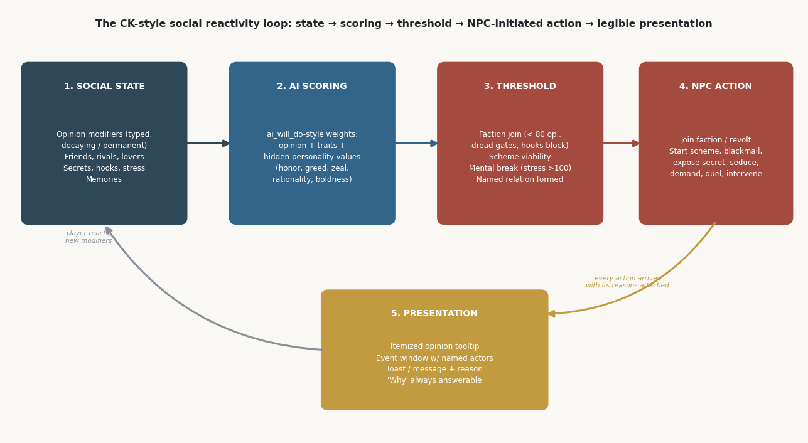
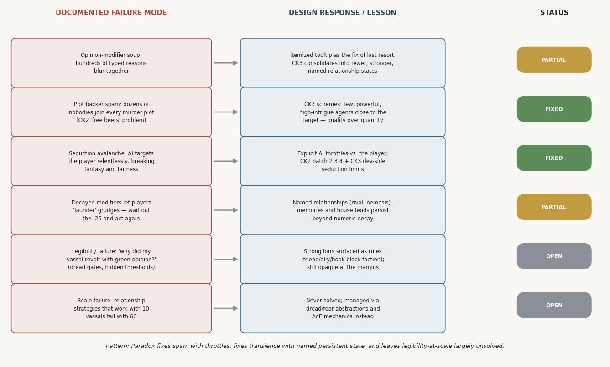

> Filed 2026-08-22 in `docs/research/comparative-systems/` — external research
> (Kimi), not code-verified. A third independent pass on CK postmortems/
> design lessons (alongside `ck-postmortems-and-design-lessons.md` and
> `ck-fahraeus-primary-sources-and-legibility.md`); distinctive for its two
> original diagrams (a social-reactivity-loop diagram and a failure-modes
> map, under `figures/ck-failure-modes-and-reactivity-loop/`), a structured
> failure-mode table with a "Status" column, and citations reaching beyond
> Paradox's own commentary into Bret Devereaux's structural CK3 analysis and
> a Total War: Attila cross-genre comparison. Feeds the scenario-ladder /
> reactivity design work, not any accepted ADR.

# Design Lessons from CK-Style Social Simulation
## What Crusader Kings 2/3 and Their Genre Neighbors Teach About State-Driven, NPC-Initiated Social Action

*A design-lessons research report for a Skyrim NPC social-reactivity mod (subjective beliefs → grudges/obligations/reputation → NPC-initiated actions), covering Paradox designer commentary, documented failure modes, the event architecture, genre neighbors, and academic/GDC analysis — synthesized into what to copy, what to adapt, what to avoid, and open questions.*

---

## Executive Summary

Crusader Kings is the best-documented shipped precedent for character-level social state driving NPC behavior, and the fifteen years of dev diaries, postmortems, wiki-formalized mechanics, GDC talks, and academic treatments around it converge on a surprisingly small set of load-bearing design lessons. **The core bet is legibility through simplicity**: Fåhraeus's team deliberately reduced social simulation to one unilateral number with itemized, visible reasons, and then spent two sequels' worth of patches and a full sequel managing the failure modes of that bet — modifier soup, spam, gaming decay, and "why did my vassal revolt" confusion  [(Game Developer)](https://www.gamedeveloper.com/design/the-surprising-design-of-i-crusader-kings-ii-i-) . CK3's signature additions (stress, secrets, hooks, schemes, memories) are best read not as new features but as **targeted repairs to specific, documented CK2 failure modes**: stress exists because players could ignore their own personality in CK2  [(Rock Paper Shotgun)](https://www.rockpapershotgun.com/in-crusader-kings-3-character-is-everything) , schemes exist because CK2 plots attracted dozens of indiscriminate backers  [(Rock Paper Shotgun)](https://www.rockpapershotgun.com/in-crusader-kings-3-character-is-everything) , and hooks/secrets exist to give social knowledge a tangible, spendable economy.

For a Skyrim mod with subjective beliefs and provenance, the highest-value transferable ideas are: **named, persistent relationship states that outlive numeric decay** (rivals, nemeses, house feuds); **tangible social currency** (hooks as spendable objects — echoed independently by academic work on "bargaining chips")  [(Aaltodoc)](https://aaltodoc.aalto.fi/server/api/core/bitstreams/4c2bdf0f-ebae-4776-81d9-71c07185be5b/content) ; **AI throttles against the player** as a first-class design requirement rather than an afterthought  [(PCGamer)](https://www.pcgamer.com/the-crusader-kings-3-ai-kept-trying-to-seduce-female-player-characters-and-had-to-be-nerfed/) ; and **story-sifting-style surfacing** so the player's attention lands on the narratively interesting fraction of simulated social activity  [(eScholarship)](https://escholarship.org/content/qt4mr6c29j/qt4mr6c29j.pdf) . The problems CK never solved — legibility of NPC action at scale, and the event-repetition ceiling of authored content — should be treated as active design risks with planned mitigations, not as things the architecture will magically handle  [(A Collection of Unmitigated Pedantry)](https://acoup.blog/2022/10/07/collections-teaching-paradox-crusader-kings-iii-part-iii-constructivisting-a-kingdom/) .

---

## 1. The Design Philosophy Layer: What CK's Designers Say They Were Doing

### 1.1 Character-first as a founding constraint, not a feature

The most important piece of designer commentary is also the earliest: the opinion system was not discovered, it was a deliberate simplification forced by scale. Fåhraeus has stated that "very early on during the design phase of Crusader Kings II, I realized that the way we usually model relations between states in our games would not suffice," and that the team "came up with the Opinions of Crusader Kings II; one single value summed up from a number of clear reasons why someone would like or dislike you" — explicitly unilateral, explicitly readable by the AI, and intended as "a simple, unified mechanic; easy to understand, yet deep and meaningful"  [(Game Developer)](https://www.gamedeveloper.com/design/the-surprising-design-of-i-crusader-kings-ii-i-) . The framing matters: with thousands of living characters each running their own AI, the design constraint was computational and cognitive at once — performance with "an enormous amount of characters, each with their own AI" was named by Fåhraeus as one of the two central development challenges alongside learnability  [(gamescope.ru)](http://en.gamescope.ru/features/henrik-fahraeus-crusader-kings-ii-interview-en/) . The lesson that generalizes: **a social simulation's state model is chosen under scale pressure first, and expressiveness second**. CK2 did not simulate belief, memory, or subjective models of others; it simulated summed attitude, and let events supply the narrative texture on top.

The philosophical frame around that mechanic is equally well documented. Fåhraeus described the game as drawing on *The Sims* and obscure character-driven strategy ancestors, with the explicit goal that players care about "the epic story of their ruler and dynasty" rather than which country they control  [(Game Developer)](https://www.gamedeveloper.com/design/the-surprising-design-of-i-crusader-kings-ii-i-) . By CK3's announcement this had hardened into stated pillars — characters first, player freedom second — with the director describing CK2 as a proof of concept ("if the second game proved the mechanics, then Crusader Kings 3 makes them smooth, functional, friendlier")  [(shacknews.com)](http://www.shacknews.com/article/114966/crusader-kings-3-director-shares-vision-of-game-depth-in-new-dev-diary) . Notably, Fåhraeus also articulated the tolerance for randomness that underpins NPC-initiated action: "I generally don't like to be surprised by the game mechanics… There is, however, a huge difference between unexpected (weird) and expected (reasonable) random outcomes. The former is normally undesired… whereas the latter is exactly what we are aiming for"  [(Game Developer)](https://www.gamedeveloper.com/design/the-surprising-design-of-i-crusader-kings-ii-i-) . That distinction — *expected randomness* — is arguably the single most useful design principle in the entire CK canon for an NPC-initiated-action system: every autonomous NPC behavior should be surprising in outcome but retroactively explainable in cause.

### 1.2 CK2 → CK3: what the designers treated as failures

The CK3 dev diary and interview record reads like a repair list for CK2's social systems. Fåhraeus stated the motivation for stress directly: "In CK2, you can largely ignore your own personality traits. You're the player character, right, so why does it matter? In this game, we wanted to make it matter"  [(Rock Paper Shotgun)](https://www.rockpapershotgun.com/in-crusader-kings-3-character-is-everything) . Stress was the fix — a mechanic where acting against your personality traits accumulates pressure toward penalizing mental breaks, so that roleplay is mechanically enforced rather than optional  [(reddit.com)](https://www.reddit.com/r/CrusaderKings/comments/dm2hnv/what_do_you_folks_think_of_this_new_stress/) . Oltner gave the matching diagnosis for intrigue: in CK2, floating a murder plot drew "dozens of pudding-bowl-haircutted nobodies queue up as if someone was handing out free beers," which CK3 replaced with schemes built around "a few powerful conspirators who are really close to the target… quality rather than quantity — if you had hundreds of people willing to plot against the king, that's not a plot: it's an open rebellion"  [(Rock Paper Shotgun)](https://www.rockpapershotgun.com/in-crusader-kings-3-character-is-everything) . Both quotes are doing the same work: **identifying places where mechanically-correct-but-narratively-absurd AI behavior broke the fiction, and redesigning so that the statistically sensible action is also the believable one**.

The secrets/hooks economy follows the same logic, documented in Dev Diary #5 ("Schemes, Secrets and Hooks") and the surrounding pre-release material: knowledge about other characters was converted from invisible opinion math into **discrete, ownable, spendable objects** — secrets that can be discovered and exposed, hooks (weak: single-use; strong: persistent but cooldown-gated) that compel specific behaviors from specific characters  [(Crusader Kings II Wiki)](https://ck2.paradoxwikis.com/Developer_diaries) . The pattern across all three CK3 additions is consistent: take something CK2 modeled as invisible scalar state (personality consistency, conspirator recruitment, leverage over others) and reify it into a **named, countable, player-visible resource with explicit acquisition and spending rules**. That is the single clearest "what changed and why" thread in the CK2→CK3 transition, and it is directly applicable to a beliefs-with-provenance design: provenance is exactly the kind of state that players lose track of unless it is materialized into inspectable objects.

### 1.3 The limits of designer self-knowledge

A cautionary counterweight: Paradox's own retrospective practice shows that the studio's *stated* lessons are not always the *right* lessons. The forum discussion around the poorly-received Legends of the Dead expansion records a community consensus that the official postmortem identified communication and expectation-setting as the failure, while players argued the actual failure was mechanical — a system that "doubles down on many design flaws that people have repeatedly complained about since release"  [(Paradox Interactive Forums)](https://forum.paradoxplaza.com/forum/threads/i-feel-like-the-devs-have-learned-absolutely-nothing-from-legends-of-the-dead.1727784/) . The Stellaris postmortem by the same studio culture makes the adjacent process point explicitly: not prototyping risky systems early is "stupid, plain and simple," because interlocking complex systems mean "we discover fundamental problems really late in development"  [(Game Developer)](https://www.gamedeveloper.com/design/postmortem-paradox-development-studio-s-i-stellaris-i-) . For a mod project, the transferable lesson is to treat designer commentary as high-value evidence about *intent*, but to verify claimed fixes against the community's documented experience — several CK3 "fixes" (schemes, dread) generated their own well-documented successor problems, detailed in Section 2.

---

## 2. Known Failure Modes and How They Were Addressed

### 2.1 Opinion-modifier soup and the decay-gaming problem

Fåhraeus himself named the first failure mode, with notable honesty: "Thinking back to how I envisioned the system, I don't think I anticipated the sheer number of opinion reasons we ended up with. It is surprising how it can still 'click' in the end"  [(Game Developer)](https://www.gamedeveloper.com/design/the-surprising-design-of-i-crusader-kings-ii-i-) . The CK2 wiki's opinion page documents what the system grew into — dozens of typed modifiers with heterogeneous rules: scaling formulas (prestige at +1 per 200, personal diplomacy at +1.5 per point over 4), duration-based modifiers (gifts, "declared war" at −25 for 160 months), linearly decaying ones, permanent trait-based ones, and conditional ones like the −25 "Ambitious" modifier that stacks only when the character desires something you hold  [(Crusader Kings II Wiki)](https://ck2.paradoxwikis.com/index.php?title=Opinion&mobileaction=toggle_view_desktop) . The system's saving grace was the itemized tooltip — every reason listed with its value — but the cognitive load of the aggregate is real, and community discussion of modifier stacking remains an active complaint genre years later  [(reddit.com)](https://www.reddit.com/r/CrusaderKings/comments/1i2jcrl/game_kinda_suffers_from_modifier_stacking/) . The decay half of the problem is subtler: because temporary modifiers simply expire, a rational player learns to "wait out" grudges, and community suggestions explicitly propose gradual decay instead of cliff-edge expiry precisely because the binary expiry is gameable and feels artificial  [(Paradox Interactive Forums)](https://forum.paradoxplaza.com/forum/threads/character-opinion-modifiers-such-as-gift-could-slowly-decay-rather-than-jump.1330243/) .

CK3's actual response to decay-gaming was not better decay curves — it was **persistent named state layered on top of the numbers**. Rivalries, friendships, and (from the Friends & Foes update onward) house feuds continue to drive AI behavior regardless of where the raw opinion number sits, which is why players report bafflement that "friends and 100 opinion characters are backing murder plots" — the relationship state and feud flags outvote the modifier sum  [(reddit.com)](https://www.reddit.com/r/CrusaderKings/comments/rqhzgn/wtf_crusader_kings_friends_and_100_opinion/) . Community analysis of the Friends & Foes era documents the downstream consequence vividly: one feuding house can put "160 people scheming against me," with players unsure how to even view the feud, let alone end it — "kind of frustrating and not very fun" for some, "a better story" for others  [(Paradox Interactive Forums)](https://forum.paradoxplaza.com/forum/threads/is-it-just-me-or-are-murder-schemes-way-more-frequent.1542772/page-2) . The dual lesson for a beliefs-based mod: decay curves alone will always be gamed and will always feel arbitrary at the boundary; but the named-state fix trades that problem for a **tracking problem**, where the player loses sight of one-sided grudges. Provenance-rich beliefs are actually well positioned here — a grudge with a visible origin story is more trackable than CK3's feud flag — *if* the UI surfaces it, which CK3 demonstrably failed to do for feuds  [(Paradox Interactive Forums)](https://forum.paradoxplaza.com/forum/threads/is-it-just-me-or-are-murder-schemes-way-more-frequent.1542772/page-2) .

### 2.2 The spam problem: plots, seduction, and murder frequency

The second cluster of failure modes is about **rate**, not state. CK2's Way of Life seduction focus became the canonical example: because AI characters rarely changed focus, a ruler playing a woman (or married to one) faced a perpetual avalanche of seduction attempts — the CK2 wiki's "avoid being cuckolded" strategy section is essentially a list of workarounds for an unthrottled AI behavior, including disabling the DLC's focus system via game rule  [(Crusader Kings II Wiki)](https://ck2.paradoxwikis.com/Seduction) . Paradox's own patch history shows the fix pattern: patch 2.3.4 notes record "Seduction Focus: AI will not try to seduce targets…" restrictions  [(reddit.com)](https://www.reddit.com/r/paradoxplaza/comments/31vf9t/crusader_kings_ii_234_patch/) . CK3 inherited the lesson at design time rather than patch time — programmer Magne Skjæran described it openly pre-launch: "Sometimes we will have to have some restrictions on the AI for how it interacts with the player just so that it doesn't get overwhelming or frustrating. The prime example here is seduction, where at various stages in the game we've needed to tweak the rules so that if the player is playing a woman… they just don't get a hundred seduction attempts constantly"  [(PCGamer)](https://www.pcgamer.com/the-crusader-kings-3-ai-kept-trying-to-seduce-female-player-characters-and-had-to-be-nerfed/) . This is one of the most directly quotable design lessons in the corpus: **AI-vs-player interaction rates need explicit, separate throttles from AI-vs-AI rates**, because the player's attention is the scarce resource.

The murder-scheme frequency saga shows the same problem recurring in a subtler form. After Friends & Foes expanded rivalry and feud triggers, players documented step-change increases in assassination attempts — four rulers in a row dying to plots — and forum analysis traced it to concrete mechanics: the AI "hardly ever attempts to murder someone outside a rivalry," so anything that makes rivalries easier to form multiplies murder attempts; additionally, the player character "can only be targeted by one AI at the same time," a hidden throttle that distorts the whole system's apparent hostility and pushes attempts onto the player's family instead  [(Paradox Interactive Forums)](https://forum.paradoxplaza.com/forum/threads/is-it-just-me-or-are-murder-schemes-way-more-frequent.1542772/page-2) . The design generalization is sharp: in a threshold→action system, **the frequency of NPC-initiated hostile action against the player is an emergent product of (a) how easily the triggering relationships form and (b) whatever hidden player-directed caps exist** — and if you tune only the caps, you get the CK3 outcome where half the playerbase reports being murdered constantly and the other half reports "300 years and nothing"  [(Paradox Interactive Forums)](https://forum.paradoxplaza.com/forum/threads/is-it-just-me-or-are-murder-schemes-way-more-frequent.1542772/page-2) . Tuning the *formation rates of the triggering states* is the lever that actually feels fair.

### 2.3 Legibility failures: "why did my vassal revolt?"

The deepest documented failure mode is legibility of NPC motivation at the moment of action. The structural analysis by historian Bret Devereaux's long-form CK3 series is the best primary evidence of where the system strains: faction membership is governed by a mix of strong bars (friends, lovers, allies, strong hooks, or ≥80 opinion absolutely prohibit joining) and soft pressures, with dread adding a conditional gate that "is entirely effective until you desperately need it at which point it is entirely ineffective" — terrified vassals cannot join factions *unless* the faction is already strong enough to generate discontent  [(A Collection of Unmitigated Pedantry)](https://acoup.blog/2022/10/07/collections-teaching-paradox-crusader-kings-iii-part-iii-constructivisting-a-kingdom/) . These rules are individually documented, but their interaction produces exactly the "green relations, sudden revolt" experience that players report as inexplicable; a directly parallel complaint from Total War: Attila's community — vassals seceding en masse despite green relations because their relations *with each other* exceeded their loyalty to the player — shows this is a genre-wide failure pattern, not a CK-specific bug  [(Total War Center)](https://www.twcenter.net/threads/ai-breaks-vassal-agreement-out-of-nowhere-all-at-the-same-time.682497/) . The mechanism underneath is always the same: **the state the player can see (opinion of me) is not the state the decision actually reads (opinion of me, plus opinions among third parties, plus threshold-gated fear, plus hidden personality values)**.

CK's partial mitigation deserves study because it is cheap and effective: convert the most important hidden conditions into **absolute, named, surfaced rules**. "Cannot join a faction against a friend" is not a −50 weight; it is a bar with a tooltip  [(A Collection of Unmitigated Pedantry)](https://acoup.blog/2022/10/07/collections-teaching-paradox-crusader-kings-iii-part-iii-constructivisting-a-kingdom/) . But the same analysis shows the ceiling of that approach at scale: with ten vassals, personal relationships can neutralize a realm's faction risk; with sixty-two vassals, eleven neutralized is "good, but it is not enough," and the system silently shifts from relationship management to mass-abstraction management (dread, armies)  [(A Collection of Unmitigated Pedantry)](https://acoup.blog/2022/10/07/collections-teaching-paradox-crusader-kings-iii-part-iii-constructivisting-a-kingdom/) . The unresolved remainder — AI that acts against its own visible personality, or appears to — is a standing community complaint in CK3 ("the AI completely ignores its personality traits") and feeds the broader frustration that the AI is simultaneously too passive strategically and too random tactically  [(reddit.com)](https://www.reddit.com/r/CrusaderKings/comments/1cqj713/its_annoying_the_ai_completely_ignores_its/) . For the Skyrim mod context the takeaway is direct: **every NPC-initiated action should ship with its reason attached** — the belief, its provenance, and the threshold crossed — because even Paradox, with itemized tooltips and an encyclopedia, never got ahead of "why did this happen" once multiple hidden state variables interacted.

| Failure mode | Documented evidence | CK3/patch response | Status |
|---|---|---|---|
| Opinion-modifier soup | "Sheer number of opinion reasons… surprising it can still click"  [(Game Developer)](https://www.gamedeveloper.com/design/the-surprising-design-of-i-crusader-kings-ii-i-) ; dozens of typed/scaling/decaying modifiers  [(Crusader Kings II Wiki)](https://ck2.paradoxwikis.com/index.php?title=Opinion&mobileaction=toggle_view_desktop)  | Itemized tooltip; CK3 consolidates around fewer, stronger named states | Partial |
| Decay gaming ("wait out the grudge") | Community proposals for gradual decay; binary expiry feels arbitrary  [(Paradox Interactive Forums)](https://forum.paradoxplaza.com/forum/threads/character-opinion-modifiers-such-as-gift-could-slowly-decay-rather-than-jump.1330243/)  | Named persistent relationships, memories, house feuds outlive numeric decay  [(reddit.com)](https://www.reddit.com/r/CrusaderKings/comments/rqhzgn/wtf_crusader_kings_friends_and_100_opinion/)  | Partial — creates tracking problem |
| Plot backer spam | "Dozens of nobodies queue up as if someone was handing out free beers"  [(Rock Paper Shotgun)](https://www.rockpapershotgun.com/in-crusader-kings-3-character-is-everything)  | Schemes: few, close, high-skill agents  [(Rock Paper Shotgun)](https://www.rockpapershotgun.com/in-crusader-kings-3-character-is-everything)  | Fixed |
| Seduction/targeting spam vs. player | CK2 wiki workaround lists  [(Crusader Kings II Wiki)](https://ck2.paradoxwikis.com/Seduction) ; Skjæran on AI restrictions  [(PCGamer)](https://www.pcgamer.com/the-crusader-kings-3-ai-kept-trying-to-seduce-female-player-characters-and-had-to-be-nerfed/)  | Explicit AI-vs-player throttles (patch 2.3.4; CK3 dev-side limits)  [(reddit.com)](https://www.reddit.com/r/paradoxplaza/comments/31vf9t/crusader_kings_ii_234_patch/)  | Fixed |
| Murder-frequency whiplash | Post-F&F feud-driven assassination spikes; hidden one-scheme-slot vs. player  [(Paradox Interactive Forums)](https://forum.paradoxplaza.com/forum/threads/is-it-just-me-or-are-murder-schemes-way-more-frequent.1542772/page-2)  | Tuned via rivalry formation rates; still contested | Partial |
| "Why did my vassal revolt" | Dread gates and ≥80-opinion bars interact invisibly  [(A Collection of Unmitigated Pedantry)](https://acoup.blog/2022/10/07/collections-teaching-paradox-crusader-kings-iii-part-iii-constructivisting-a-kingdom/) ; parallel failures in Total War  [(Total War Center)](https://www.twcenter.net/threads/ai-breaks-vassal-agreement-out-of-nowhere-all-at-the-same-time.682497/)  | Strong bars surfaced as absolute rules | Open at the margins |
| Relationship strategy collapse at scale | 11 neutralized vassals of 62 is "not enough"  [(A Collection of Unmitigated Pedantry)](https://acoup.blog/2022/10/07/collections-teaching-paradox-crusader-kings-iii-part-iii-constructivisting-a-kingdom/)  | None — abstraction (dread/fear) replaces relationships | Open |

---

## 3. The Event/Decision Architecture as the "Social Actions" Layer

### 3.1 Mean-time-to-happen: stochastic pacing with designer-shaped probabilities

CK2's event engine is the original "social actions" layer: thousands of scripted events gated by triggers and paced by mean-time-to-happen (MTTH). The math is now fully documented community knowledge: each event has a daily fire probability of `1 − 0.5^(1/MTTH_days)`, derived from Paradox's own shared source snippet, so a 3-month MTTH yields a small constant per-day chance that is then shaped by weight modifiers in plain-text game files  [(Arqade)](https://gaming.stackexchange.com/questions/239493/how-is-x-yearly-calculated-for-firing-of-events) . Two design properties follow. First, MTTH makes event arrival a **Poisson process** — memoryless, unclumpable only by cooldowns, and prone to both droughts and bursts, which is precisely the statistical signature behind "event spam" complaints when many events share a pulse. Second, MTTH's weight-modifier system is where *character* enters the machinery: the same event becomes more or less likely depending on traits and state, which is how "random dice" gets dressed as "character agency." When it works, the player experiences a paranoid rival acting paranoid; when the weights are invisible, the player experiences noise  [(Arqade)](https://gaming.stackexchange.com/questions/239493/how-is-x-yearly-calculated-for-firing-of-events) .

### 3.2 CK3's architecture: on_actions, ai_will_do, and the legibility of causation

CK3 rebuilt the layer around **on_actions** — explicit hooks (yearly pulses, on-death, on-scheme-complete, and so on) that evaluate pools of eligible events — plus scripted character interactions with `ai_will_do` blocks that expose the AI's acceptance logic to both modders and (in debug) players  [(Crusader Kings III Wiki)](https://ck3.paradoxwikis.com/Event_modding) . Dev Diary #30 documents the authoring-side intent: reusable scripted triggers/effects, `first_valid` selection, and scripted on_actions so content designers compose rather than duplicate  [(Paradox Interactive Forums)](https://forum.paradoxplaza.com/forum/threads/crusader-kings-3-dev-diary-30-event-scripting.1397140/) . The architectural lesson for a mod is significant: CK3's social reactivity is not an AI planner; it is a **library of gated, weighted, composable content fragments evaluated against character state at defined moments**. NPC "initiative" is an on_action that fires, a scheme the AI's scoring starts, or an interaction whose ai_will_do passes — all three are *the same pattern* (state → weight → action → presentation) at different latencies. This is good news for a Skyrim implementation: it means NPC-initiated social actions can be built as a content library evaluated against belief/grudge state on ticks and on world events, without needing a general planner.

### 3.3 Authoring at scale: repetition, spam, and the agency-vs-dice problem

The community record on event content is unambiguous about the ceiling of this architecture. "CK3's Biggest Issue: Event Spam" and the "fewer events, more mini-events" threads document the two horns of the problem: players see the same events repeatedly within a campaign (repetition) and are interrupted too often by events they don't care about (spam), with specific requests for auto-resolve options on recurring events  [(reddit.com)](https://www.reddit.com/r/CrusaderKings/comments/1aj5y8a/ck3s_biggest_issue_event_spam/) . A more diagnostic thread observes the uneven distribution itself — "some events are repetitive and others are super rare" — which is the fingerprint of MTTH-style memoryless pacing combined with narrow triggers: events with common triggers fire constantly, events with flavorful specific triggers fire never  [(Paradox Interactive Forums)](https://forum.paradoxplaza.com/forum/threads/its-so-weird-how-some-events-are-repetitive-and-others-are-super-rare.1512102/) . Paradox's own patch notes reveal the maintenance posture this creates — cooldowns retrofitted onto specific events ("added a cooldown to the 'Know Thyself' upcoming death event to reduce the level of spam"), trigger fixes so events fire in sensible contexts, and entirely new memory triggers so content can reference a character's actual past  [(Paradox Interactive Forums)](https://forum.paradoxplaza.com/forum/threads/dev-diary-128-ck3-1-9-0-lance-update.1583293/page-2) . Authoring at scale in this architecture is therefore not primarily a writing problem; it is a **pacing-and-targeting engineering problem** that never finishes.

What makes an event feel like agency rather than dice, across the CK evidence, reduces to three properties: the event names real characters the player already knows; its causes are reconstructable after the fact (expected randomness); and its consequences persist into named state (a rival, a secret, a memory) rather than evaporating  [(Game Developer)](https://www.gamedeveloper.com/design/the-surprising-design-of-i-crusader-kings-ii-i-) . CK3's character-memory system — added in 2023's 1.9 "Lance" update with dedicated triggers for memory age and type — is the infrastructural acknowledgment of the third property: the game needed a durable record of what happened to whom so that later content could call back to it  [(Paradox Interactive Forums)](https://forum.paradoxplaza.com/forum/threads/dev-diary-128-ck3-1-9-0-lance-update.1583293/page-2) . For a mod that already plans beliefs-with-provenance, the mapping is almost one-to-one: provenance is CK3-memories done properly, and the CK trajectory (ship without memories in 2020, retrofit them in 2023) is the cautionary tale about shipping social actions without a persistent record to ground them.

---

## 4. Genre Neighbors: Four Alternative Bets on State-Driven NPC Action

### 4.1 Mount & Blade: relationship as barren number

Mount & Blade (Warband through Bannerlord) implements the minimal version of the CK bet: a −100…+100 relation score per lord, with documented per-action deltas (rescue a prisoner +8, complete a duel quest +10) and named bands from "indifferent" through "vengeful"  [(fandom.com)](https://mountandblade.fandom.com/wiki/Relationship) . What it lacks is everything above the number: no provenance, no decay design, no threshold catalog worth the name, and almost no NPC-initiated action driven by the score. The community verdict captured in the TaleWorlds forums is blunt — "NPC and interaction with them is weak," with relations feeding only marginal passive effects like fractional loyalty bonuses  [(Taleworlds Forum)](https://forums.taleworlds.com/index.php?threads/npc-relation-score-what-does-it-affect.459025/page-2) . As a design lesson, M&B is the control group: **a legible relationship number without a threshold→action catalog and without presentation produces no social fantasy at all**. It confirms, by absence, that CK's magic is not the opinion value but what reads it.

### 4.2 Total War: loyalty as failure theater

Total War's character-loyalty attempts are instructive mostly as failure documentation. Three Kingdoms' satisfaction system is genuinely CK-like in inputs — traits with explicit guanxi affinities ("Loathes Arrogance," "Wary of Ambition"), office desires, jealousy, family matters — and genuinely consequential in outputs: a dissatisfied administrator defects *with their region*, and a dissatisfied powerful figure triggers civil war  [(fandom.com)](https://totalwar.fandom.com/wiki/Traits_(Total_War:_Three_Kingdoms)) . Yet the Attila-era community record shows the legibility failure in its purest form: puppet states seceding en masse with green relations, because the decisive variable — inter-vassal relations — was invisible to the player, producing "this is a problem… they secede and DoW on me even with green relations"  [(Total War Center)](https://www.twcenter.net/threads/ai-breaks-vassal-agreement-out-of-nowhere-all-at-the-same-time.682497/) . The Three Kingdoms epilogue adds a market lesson: despite a stellar launch, the character-driven direction was abandoned with the game's early cancellation — a reminder that social-simulation differentiation carries real commercial risk when the core audience came for battles  [(Paradox Interactive Forums)](https://forum.paradoxplaza.com/forum/threads/i-feel-like-the-devs-have-learned-absolutely-nothing-from-legends-of-the-dead.1727784/) .

### 4.3 Wildermyth: constrained procedural intimacy

Wildermyth is the most practically relevant neighbor because it solved, at small scale, the problem the Skyrim mod actually has: making players care about generated characters. Its GDC Independent Games Summit talk — "Getting Players Emotionally Invested in Procedural Characters" — frames the entire design as bending every system toward emotional investment and, critically, enumerates the failure modes to *avoid*: "breach of trust, acting out of character, or rage quits"  [(GDC Vault)](https://www.gdcvault.com/play/1027924/Independent-Games-Summit-Session-Getting) . The podcast record with the Worldwalker team fills in the method: procedural narrative is built from authored event fragments with relationship arcs that develop across a campaign, so that generated people accrue *history* rather than remaining stateless functions  [(libsyn.com)](https://gamemakersnotebook.libsyn.com/balancing-procedural-and-intimate-storytelling-in-wildermyth) . The alignment with CK3's memories and with belief provenance is exact: Wildermyth's characters feel real because the game **remembers what happened to them and lets that history shape later content**. Its lesson relative to CK is about scale: Wildermyth runs tens of characters per campaign, not thousands, and invests the savings in authored intimacy — a trade the Skyrim mod, with its settlement-scale NPC counts, can plausibly make too.

### 4.4 King of Dragon Pass / Six Ages: the "no obviously best answer" doctrine

King of Dragon Pass predates CK2 by over a decade and remains the purest expression of event-driven social narrative at clan scale. Designer David Dunham's stated doctrine is the cleanest one-sentence answer to the agency-vs-dice question in the entire corpus: "You have to roleplay because we tried to make the story choices have no obvious best answer. You can't game them"  [(publicknowledgeproject.org)](https://loading.journals.publicknowledgeproject.org/loading/index.php/loading/article/download/166/201) . The corollary design posture, from the Six Ages development account, is equally useful: Dunham deliberately *simplified* underlying systems "so that we can understand it better (i.e. have better levers for the emergent behavior), and so that players can understand it better," and restructured the writing pipeline so the writer (Robin Laws) could play a moderately complete game and revise scenes against how the emergent system actually behaves  [(publicknowledgeproject.org)](https://loading.journals.publicknowledgeproject.org/loading/index.php/loading/article/download/166/201) . In the Game Design Roundtable interview he extends this to presentation: the UI structure and art exist to keep the clan-level abstraction immersive rather than an info dump  [(thegamedesignroundtable.com)](https://thegamedesignroundtable.com/episode/226-david-dunham-talks-six-ages/) . The doctrine for the mod: **author social events whose options are value trade-offs between the NPCs' interests, not optimal-answer puzzles** — a design rule that also immunizes events against being "solved" and farmed.

| Game | Social state model | NPC-initiated action from state | Legibility technique | Documented weakness |
|---|---|---|---|---|
| CK2 | Single opinion sum, typed/decaying modifiers; hidden personality (honor, greed, zeal, rationality, ambition)  [(Game Developer)](https://www.gamedeveloper.com/design/thinking-about-people-designing-games-for-social-simulation)  | Plots, factions, council votes via MTTH events and ai_will_do-style weights  [(Arqade)](https://gaming.stackexchange.com/questions/239493/how-is-x-yearly-calculated-for-firing-of-events)  | Itemized opinion tooltip  [(Game Developer)](https://www.gamedeveloper.com/design/the-surprising-design-of-i-crusader-kings-ii-i-)  | Modifier soup; backer spam; seduction avalanche  [(Game Developer)](https://www.gamedeveloper.com/design/the-surprising-design-of-i-crusader-kings-ii-i-)  |
| CK3 | Opinion + named relationships + secrets/hooks + stress + memories  [(reddit.com)](https://www.reddit.com/r/CrusaderKings/comments/im5y6j/all_about_hooks_how_to_get_em_how_to_spend_em/)  | Schemes, factions with strong bars, blackmail/exposure, activities  [(A Collection of Unmitigated Pedantry)](https://acoup.blog/2022/10/07/collections-teaching-paradox-crusader-kings-iii-part-iii-constructivisting-a-kingdom/)  | Absolute rules surfaced ("cannot join faction vs. friend")  [(A Collection of Unmitigated Pedantry)](https://acoup.blog/2022/10/07/collections-teaching-paradox-crusader-kings-iii-part-iii-constructivisting-a-kingdom/)  | Dread-gate opacity; feud tracking; event spam/repetition  [(A Collection of Unmitigated Pedantry)](https://acoup.blog/2022/10/07/collections-teaching-paradox-crusader-kings-iii-part-iii-constructivisting-a-kingdom/)  |
| Mount & Blade | Bare −100…+100 relation with named bands  [(fandom.com)](https://mountandblade.fandom.com/wiki/Relationship)  | Almost none  [(Taleworlds Forum)](https://forums.taleworlds.com/index.php?threads/npc-relation-score-what-does-it-affect.459025/page-2)  | Number + band label | No action layer — no social fantasy  [(Taleworlds Forum)](https://forums.taleworlds.com/index.php?threads/npc-relation-score-what-does-it-affect.459025/page-2)  |
| TW: Three Kingdoms / Attila | Satisfaction + guanxi trait affinities  [(fandom.com)](https://totalwar.fandom.com/wiki/Traits_(Total_War:_Three_Kingdoms))  | Defection with region; civil war  [(fandom.com)](https://totalwar.fandom.com/wiki/Satisfaction)  | Satisfaction gauge | Hidden decisive variables (inter-vassal relations) → "green but seceded"  [(Total War Center)](https://www.twcenter.net/threads/ai-breaks-vassal-agreement-out-of-nowhere-all-at-the-same-time.682497/)  |
| Wildermyth | Relationship arcs + campaign history over few characters  [(libsyn.com)](https://gamemakersnotebook.libsyn.com/balancing-procedural-and-intimate-storytelling-in-wildermyth)  | Authored event fragments gated by arc state | History call-backs; avoidance of "breach of trust / acting out of character"  [(GDC Vault)](https://www.gdcvault.com/play/1027924/Independent-Games-Summit-Session-Getting)  | Small cast only — doesn't scale to hundreds |
| King of Dragon Pass / Six Ages | Clan-level moods/relations behind advisor commentary | Scene system with context-sensitive choices | Advisor voices interpret state; "no obvious best answer"  [(publicknowledgeproject.org)](https://loading.journals.publicknowledgeproject.org/loading/index.php/loading/article/download/166/201)  | Abstraction distance — you play the clan, not people |

---

## 5. Academic and GDC Analysis: What Makes Simulated Characters Feel Real

### 5.1 The emergent-narrative literature: simulation produces material, not stories

The academic thread most directly about CK-style systems is James Ryan's UC Santa Cruz dissertation *Curating Simulated Storyworlds*, which argues that raw simulation output "will almost always lack story structure" and that the pleasures of emergent narrative depend on **curation** — sifting the interesting fraction out of the event mass — with CK-scale games ("tens to hundreds of generated characters") explicitly named as the case where "nuggets of emergent content get lost in the noise"  [(eScholarship)](https://escholarship.org/content/qt4mr6c29j/qt4mr6c29j.pdf) . Emily Short's chapter-by-chapter reading distills Ryan's catalog of simulation pains into a checklist any mod author should steal: boringness (the simulated events aren't inherently engaging), granularity extremes (modeling at the wrong scale), lack of modularity (state that can't recombine), no/poor curation (a simulation trace "looks almost indistinguishable from a debugging console log"), and poor presentation  [(emshort.blog)](https://emshort.blog/2019/05/23/curating-simulated-storyworlds-james-ryan-2/) . The follow-on literature has operationalized the fix: Kreminski et al.'s "select the unexpected" heuristic ranks sifted story candidates by statistical unexpectedness, and Lessard et al.'s Chroniqueur project — explicitly inspired by Dwarf Fortress, The Sims, and Crusader Kings — tested narratology-derived sifting heuristics with human readers, finding (instructively) that narrativization quality could rescue mediocre story material as much as story selection could find good material  [(pcgworkshop.com)](https://www.pcgworkshop.com/archive/lessard2026narrative.pdf) . The design translation for the mod: **a "story sifter" layer that watches the belief/grudge simulation and surfaces the few NPC situations worth the player's attention is not optional garnish — it is the difference between a living world and a debug log**.

### 5.2 The GDC/industry analysis thread: chaos, constrained

On the industry-analysis side, CK2 has a GDC Vault talk of its own ("Emergent Stories in Crusader Kings II")  [(GDC Vault)](https://www.gdcvault.com/play/1020774/Emergent-Stories-in-Crusader-Kings) , and GameDeveloper.com's social-simulation survey identifies the mechanism that the academic literature later formalized: CK2's characters are driven by "5 hidden underlying personality parameters of rationality, greed, zeal, honor and ambition" layered under visible traits, producing "emergent interactions between all these characters" — what Paradox themselves framed as embracing "chaos as powerful creative force," underpinned by enough authored drama to keep the chaos readable  [(Game Developer)](https://www.gamedeveloper.com/design/thinking-about-people-designing-games-for-social-simulation) . The same piece quotes the studio philosophy that justifies the whole architecture: "the story of a nation can never be as engaging on a personal level as that of characters"  [(Game Developer)](https://www.gamedeveloper.com/design/thinking-about-people-designing-games-for-social-simulation) . Note the two-layer structure the analysts keep identifying: **visible, legible state on top (traits, opinions); hidden, variance-generating state underneath (the five personality values)**. That split is doing real work — the hidden layer produces behavioral variety the player can't fully predict (expected randomness), while the visible layer keeps every outcome retroactively explainable.

### 5.3 The strongest single piece of evidence: the Twilight Bazaar thesis

The most on-target academic work for this specific mod project is an Aalto University thesis, *Designing Emergent Narrative through Character-Driven NPC Systems* (the "Twilight Bazaar" project), which independently re-derived — by building and failing — most of CK's lessons in miniature. Three of its documented findings map directly onto the mod's design. First, **invisible richness fails**: an NPC personality model built on the OCEAN/Big Five framework "failed most clearly in playtest because its detail did not surface — two NPCs with sharply different personalities ended up behaving in ways the player could not distinguish," and was replaced by a smaller discrete-trait pool that was *more* expressive in practice  [(Aaltodoc)](https://aaltodoc.aalto.fi/server/api/core/bitstreams/4c2bdf0f-ebae-4776-81d9-71c07185be5b/content) . Second, **social knowledge must be tangible**: the thesis's "bargaining chips" — discrete inventory objects representing things the player knows about NPCs, presentable to third parties, with truth values that allow lying — exist precisely because an earlier prototype tracked social knowledge as hidden NPC state and "players forgot what they knew about whom and lost track of who had told them what"  [(Aaltodoc)](https://aaltodoc.aalto.fi/server/api/core/bitstreams/4c2bdf0f-ebae-4776-81d9-71c07185be5b/content) . That sentence is the empirical case for the mod's provenance design, and for rendering beliefs as inspectable objects rather than invisible modifiers. Third, **verbs frame interpretation**: a playtester given a "Gossip" verb constructed an enemy backstory from a state change, while the same system with a "Socialise" verb produced nothing — "the difference was in what the verb invited the player to interpret"  [(Aaltodoc)](https://aaltodoc.aalto.fi/server/api/core/bitstreams/4c2bdf0f-ebae-4776-81d9-71c07185be5b/content) . The author's own summary — "how much of the design work was about narrowing rather than expanding… designing for response, and to get the right response the player needs to perceive it" — is the best single sentence of advice in this entire report  [(Aaltodoc)](https://aaltodoc.aalto.fi/server/api/core/bitstreams/4c2bdf0f-ebae-4776-81d9-71c07185be5b/content) .

---

## 6. Synthesis for the Skyrim Mod: Copy, Adapt, Avoid, Open Questions

### 6.1 What to copy (high confidence, directly transferable)

The mechanisms in this bucket share a property: they worked in CK, were independently re-derived elsewhere, and address the exact layers the mod is building. Copy the **named persistent relationship state** pattern: grudges and obligations should crystallize into named states (grudge-holder, oath-bound, nemesis) that persist after the underlying opinion/decay math fades, because CK3's rivals/feuds and CK2's documented decay-gaming together prove that pure numeric memory is both gameable and forgettable  [(Paradox Interactive Forums)](https://forum.paradoxplaza.com/forum/threads/character-opinion-modifiers-such-as-gift-could-slowly-decay-rather-than-jump.1330243/) . Copy the **tangible social currency** pattern: secrets-as-objects and hooks-as-spendable-compulsion are the shipped proof that social knowledge works best as countable, inspectable, spendable things — and the Twilight Bazaar bargaining-chip result shows the same conclusion reached from first principles, with the added twist of *falsifiable* knowledge (chips can be lies) that maps perfectly onto beliefs-with-provenance  [(reddit.com)](https://www.reddit.com/r/CrusaderKings/comments/im5y6j/all_about_hooks_how_to_get_em_how_to_spend_em/) . Copy **expected randomness as a tuning doctrine**: every NPC-initiated action should be probabilistic in firing but deterministic in explanation, with the cause visible at the moment of action — the single most-praised property of the CK opinion system is that the tooltip always answers "why"  [(Game Developer)](https://www.gamedeveloper.com/design/the-surprising-design-of-i-crusader-kings-ii-i-) .

Also copy the two infrastructure patterns. First, **AI-vs-player throttles as a separate tuning surface**, designed in from the start rather than patched in later — Paradox needed patches in both generations for exactly this, and their programmer said the quiet part aloud on camera  [(PCGamer)](https://www.pcgamer.com/the-crusader-kings-3-ai-kept-trying-to-seduce-female-player-characters-and-had-to-be-nerfed/) . Second, the **strong-bar idiom** for the threshold→action catalog: where a condition should reliably prevent an NPC social action (close friend, active obligation, recent help), make it an absolute rule with a visible label, not a large negative weight, because players forgive hard rules and never forgive inexplicable soft weights  [(A Collection of Unmitigated Pedantry)](https://acoup.blog/2022/10/07/collections-teaching-paradox-crusader-kings-iii-part-iii-constructivisting-a-kingdom/) . Finally, copy CK3's memory infrastructure *before* shipping the action layer, not three years after: beliefs with provenance already give the mod the record-keeping substrate CK3 had to retrofit in patch 1.9  [(Paradox Interactive Forums)](https://forum.paradoxplaza.com/forum/threads/dev-diary-128-ck3-1-9-0-lance-update.1583293/page-2) .

### 6.2 What to adapt (works, but must be re-scoped for Skyrim)

The **event/on_action architecture** adapts well but needs re-scoping: CK3 evaluates weighted content libraries on pulses and hooks across thousands of characters, which neither Skyrim's engine nor a settlement-scale mod needs; the transferable core is the *pattern* — gated, weighted content fragments evaluated against social state at defined moments (on greeting, on witnessing, on rumor-received, daily pulse per NPC) — not the MTTH machinery, whose memoryless Poisson pacing is a documented source of both drought and spam  [(Arqade)](https://gaming.stackexchange.com/questions/239493/how-is-x-yearly-calculated-for-firing-of-events) . Adapt the **stress/personality-consistency** idea into NPC-facing form: CK3 stress exists to make the *player* roleplay their traits, but the mod's problem is making *NPCs* behave in character; the adaptation is an NPC "disposition pressure" where acting against one's own beliefs/traits is possible but rare and weighty, which is exactly the Wildermyth "acting out of character" failure mode inverted into a mechanic  [(Rock Paper Shotgun)](https://www.rockpapershotgun.com/in-crusader-kings-3-character-is-everything) . Adapt the **story-sifting layer** aggressively: with provenance-tracked beliefs, the mod can do what Ryan's framework only theorized and what Chroniqueur tested — query the social simulation for high-interest configurations (betrayal chains, obligations repaid to the wrong person, rumor-mutated grudges) and surface them through radiant-style pointers, gossip overhear, or NPC-initiated confrontation, rather than hoping the player stumbles into them  [(eScholarship)](https://escholarship.org/content/qt4mr6c29j/qt4mr6c29j.pdf) .

Two more adaptations deserve care. The **opinion itemization** pattern should be adapted into *belief itemization*: where CK shows "−25: declared war," the mod should show "grudge: believes you killed her brother — heard from Njada, who exaggerated" — provenance turns the tooltip from a ledger into a story, which is the mod's differentiator, but CK's modifier-soup history warns that the number of simultaneously displayed reasons must stay small and ranked  [(Game Developer)](https://www.gamedeveloper.com/design/the-surprising-design-of-i-crusader-kings-ii-i-) . And the **hook economy** should be adapted with its balance history in mind: strong hooks being non-expended-but-cooldown-gated, and blocking all hostile action while held, created both the best leverage gameplay in CK3 and a documented "never quite sure how useful a hook is" discoverability problem — enumerate the spend options visibly, because CK3 never fully did  [(reddit.com)](https://www.reddit.com/r/CrusaderKings/comments/im5y6j/all_about_hooks_how_to_get_em_how_to_spend_em/) .

### 6.3 What to avoid (documented failures)

Avoid **indiscriminate recruitment into NPC initiatives**: CK2's auto-invite plot window — where anyone who disliked the target could be stacked into a murder plot for plot power — is the canonical "mechanically sensible, fictionally absurd" failure, and Oltner's quality-over-quantity redesign is the fix to internalize: an NPC-initiated social action should involve few participants, chosen for *relationship to the target*, not for aggregate score  [(Crusader Kings II Wiki)](https://ck2.paradoxwikis.com/Assassination) . Avoid **invisible decisive variables**: the Attila "green relations but seceded" pattern and CK3's dread-gate confusion share one cause — the action read state the player couldn't see; if third-party relationships (NPC A's opinion of NPC B) drive an action that affects the player, the presentation must name that fact at fire time  [(Total War Center)](https://www.twcenter.net/threads/ai-breaks-vassal-agreement-out-of-nowhere-all-at-the-same-time.682497/) . Avoid **binary decay cliffs**: expiry-at-midnight grudges both feel fake and invite waiting games; use gradual decay, or better, decay that converts numeric grudge into a lingering named state at low intensity rather than deleting it  [(Paradox Interactive Forums)](https://forum.paradoxplaza.com/forum/threads/character-opinion-modifiers-such-as-gift-could-slowly-decay-rather-than-jump.1330243/) .

Avoid **unthrottled AI initiative against the player**, categorically — this is the failure mode with the most independent confirmations across both games and both generations (seduction in CK2, seduction and murder in CK3), and the fix was always the same explicit player-directed rate limiter  [(PCGamer)](https://www.pcgamer.com/the-crusader-kings-3-ai-kept-trying-to-seduce-female-player-characters-and-had-to-be-nerfed/) . Avoid **event spam by volume**: the CK3 community's consistent advice — fewer interrupting full events, more ambient mini-events, auto-resolve for recurrences — is free postmortem data for the mod's presentation tiering  [(reddit.com)](https://www.reddit.com/r/CrusaderKings/comments/1aj5y8a/ck3s_biggest_issue_event_spam/) . And avoid **authoring events with a dominant strategy**: King of Dragon Pass's "no obvious best answer" doctrine is the antidote to the Conclave lesson, where a political system with a discoverable optimal configuration ("stock the council with cronies who can't rebel") collapsed from drama into puzzle-solved-once  [(publicknowledgeproject.org)](https://loading.journals.publicknowledgeproject.org/loading/index.php/loading/article/download/166/201) .

### 6.4 Open questions the CK games never solved

Four problems remain genuinely open, and the mod should treat them as research risks with planned mitigations rather than solved patterns. First, **legibility at scale**: nobody — not CK3 with its encyclopedia, not the academic sifting literature with its query languages — has made fifty-plus simultaneous social states comprehensible to a player; CK3's own answer (dread and abstraction replace relationship management past ~a dozen vassals) is an admission of defeat, and the mod's settlement-scale scope is actually an advantage here only if the cast the player must track stays in the low tens  [(A Collection of Unmitigated Pedantry)](https://acoup.blog/2022/10/07/collections-teaching-paradox-crusader-kings-iii-part-iii-constructivisting-a-kingdom/) . Second, **belief mutation presentation**: CK has secrets (binary known/unknown) but nothing like mutated rumor chains; there is no shipped precedent for showing a player *how a belief changed as it traveled*, so the mod's signature mechanic is also its least derisked — the bargaining-chip prototype (draggable, truth-valued, presentable knowledge objects) is the closest existing proof point  [(Aaltodoc)](https://aaltodoc.aalto.fi/server/api/core/bitstreams/4c2bdf0f-ebae-4776-81d9-71c07185be5b/content) .

Third, **the repetition ceiling**: fifteen years and two games of event authoring have not solved content repetition; CK3's own forums in 2024–2025 still call it the game's biggest structural issue, and the academic answer (procedural narrativization) is immature — plan for rotation, cooldown, escalation-variants, and silence-as-content from day one  [(reddit.com)](https://www.reddit.com/r/CrusaderKings/comments/1aj5y8a/ck3s_biggest_issue_event_spam/) . Fourth, **fair asymmetric hostility**: how often NPCs should initiate hostile social action against the player remains a whiplash variable in CK3 — simultaneously "four rulers in a row assassinated" and "300 years and nothing" depending on feud exposure — and no shipped game has made this feel both dangerous and fair; the mod should expose the rate as a difficulty-style option rather than hunt for a single magic value  [(Paradox Interactive Forums)](https://forum.paradoxplaza.com/forum/threads/is-it-just-me-or-are-murder-schemes-way-more-frequent.1542772/page-2) .

| Bucket | Item | Core evidence |
|---|---|---|
| **Copy** | Named persistent relationships outliving numeric decay | Feuds/rivals drive behavior regardless of opinion  [(reddit.com)](https://www.reddit.com/r/CrusaderKings/comments/rqhzgn/wtf_crusader_kings_friends_and_100_opinion/) ; decay gaming documented  [(Paradox Interactive Forums)](https://forum.paradoxplaza.com/forum/threads/character-opinion-modifiers-such-as-gift-could-slowly-decay-rather-than-jump.1330243/)  |
| **Copy** | Tangible, spendable social knowledge (secrets/hooks → belief objects) | Hooks as weak/strong currency  [(reddit.com)](https://www.reddit.com/r/CrusaderKings/comments/im5y6j/all_about_hooks_how_to_get_em_how_to_spend_em/) ; bargaining chips legibility result  [(Aaltodoc)](https://aaltodoc.aalto.fi/server/api/core/bitstreams/4c2bdf0f-ebae-4776-81d9-71c07185be5b/content)  |
| **Copy** | Expected randomness + "why" always attached | Fåhraeus on random outcomes  [(Game Developer)](https://www.gamedeveloper.com/design/the-surprising-design-of-i-crusader-kings-ii-i-) ; itemized tooltips  [(Game Developer)](https://www.gamedeveloper.com/design/the-surprising-design-of-i-crusader-kings-ii-i-)  |
| **Copy** | Separate AI-vs-player throttles | Skjæran  [(PCGamer)](https://www.pcgamer.com/the-crusader-kings-3-ai-kept-trying-to-seduce-female-player-characters-and-had-to-be-nerfed/) ; CK2 patch 2.3.4  [(reddit.com)](https://www.reddit.com/r/paradoxplaza/comments/31vf9t/crusader_kings_ii_234_patch/)  |
| **Copy** | Absolute strong bars over soft weights for key prohibitions | Faction bars  [(A Collection of Unmitigated Pedantry)](https://acoup.blog/2022/10/07/collections-teaching-paradox-crusader-kings-iii-part-iii-constructivisting-a-kingdom/)  |
| **Adapt** | Event library on pulses/hooks, re-scoped (drop MTTH Poisson pacing) | MTTH math  [(Arqade)](https://gaming.stackexchange.com/questions/239493/how-is-x-yearly-calculated-for-firing-of-events) ; spam record  [(reddit.com)](https://www.reddit.com/r/CrusaderKings/comments/1aj5y8a/ck3s_biggest_issue_event_spam/)  |
| **Adapt** | Personality-consistency pressure for NPCs (from player-facing stress) | Stress rationale  [(Rock Paper Shotgun)](https://www.rockpapershotgun.com/in-crusader-kings-3-character-is-everything) ; Wildermyth "out of character"  [(GDC Vault)](https://www.gdcvault.com/play/1027924/Independent-Games-Summit-Session-Getting)  |
| **Adapt** | Story sifting over provenance data | Ryan dissertation  [(eScholarship)](https://escholarship.org/content/qt4mr6c29j/qt4mr6c29j.pdf) ; Chroniqueur evaluation  [(pcgworkshop.com)](https://www.pcgworkshop.com/archive/lessard2026narrative.pdf)  |
| **Avoid** | Score-stacking mass recruitment into NPC initiatives | CK2 plots  [(Crusader Kings II Wiki)](https://ck2.paradoxwikis.com/Assassination) ; Oltner redesign  [(Rock Paper Shotgun)](https://www.rockpapershotgun.com/in-crusader-kings-3-character-is-everything)  |
| **Avoid** | Hidden decisive variables; binary decay cliffs; unthrottled player-directed AI; dominant-strategy events | Attila/dread  [(Total War Center)](https://www.twcenter.net/threads/ai-breaks-vassal-agreement-out-of-nowhere-all-at-the-same-time.682497/) ; decay  [(Paradox Interactive Forums)](https://forum.paradoxplaza.com/forum/threads/character-opinion-modifiers-such-as-gift-could-slowly-decay-rather-than-jump.1330243/) ; seduction/murder  [(PCGamer)](https://www.pcgamer.com/the-crusader-kings-3-ai-kept-trying-to-seduce-female-player-characters-and-had-to-be-nerfed/) ; Conclave  [(Hardcore Gamer)](https://hardcoregamer.com/reviews/review-crusader-kings-ii-conclave/209288/)  |
| **Open** | Legibility at scale; mutation presentation; repetition ceiling; fair hostility rates | Scale failure  [(A Collection of Unmitigated Pedantry)](https://acoup.blog/2022/10/07/collections-teaching-paradox-crusader-kings-iii-part-iii-constructivisting-a-kingdom/) ; chips  [(Aaltodoc)](https://aaltodoc.aalto.fi/server/api/core/bitstreams/4c2bdf0f-ebae-4776-81d9-71c07185be5b/content) ; spam  [(reddit.com)](https://www.reddit.com/r/CrusaderKings/comments/1aj5y8a/ck3s_biggest_issue_event_spam/) ; whiplash  [(Paradox Interactive Forums)](https://forum.paradoxplaza.com/forum/threads/is-it-just-me-or-are-murder-schemes-way-more-frequent.1542772/page-2)  |

---

*Method note: this report synthesizes primary sources (Paradox dev diaries and patch notes, designer interviews, GDC Vault session records), formalized mechanics documentation (official CK2/CK3 wikis), long-form community analysis (A Collection of Unmitigated Pedantry's CK3 series, Paradox forums, r/CrusaderKings), and academic literature (UCSC emergent-narrative research, the Aalto Twilight Bazaar thesis, FDG/ICIDS story-sifting work). Designer statements are treated as evidence of intent; claimed fixes were cross-checked against documented community experience wherever possible.*

 [(shacknews.com)](http://www.shacknews.com/article/114966/crusader-kings-3-director-shares-vision-of-game-depth-in-new-dev-diary) : http://www.shacknews.com/article/114966/crusader-kings-3-director-shares-vision-of-game-depth-in-new-dev-diary
 [(Game Developer)](https://www.gamedeveloper.com/design/the-surprising-design-of-i-crusader-kings-ii-i-) : https://www.gamedeveloper.com/design/the-surprising-design-of-i-crusader-kings-ii-i-
 [(shacknews.com)](http://www.shacknews.com/article/114582/crusader-kings-3-interview-putting-players-in-control) : http://www.shacknews.com/article/114582/crusader-kings-3-interview-putting-players-in-control
 [(gamescope.ru)](http://en.gamescope.ru/features/henrik-fahraeus-crusader-kings-ii-interview-en/) : http://en.gamescope.ru/features/henrik-fahraeus-crusader-kings-ii-interview-en/
 [(Crusader Kings II Wiki)](https://ck2.paradoxwikis.com/Developer_diaries) : https://ck2.paradoxwikis.com/Developer_diaries
 [(Rock Paper Shotgun)](https://www.rockpapershotgun.com/in-crusader-kings-3-character-is-everything) : https://www.rockpapershotgun.com/in-crusader-kings-3-character-is-everything
 [(Total War Center)](https://www.twcenter.net/threads/ai-breaks-vassal-agreement-out-of-nowhere-all-at-the-same-time.682497/) : https://www.twcenter.net/threads/ai-breaks-vassal-agreement-out-of-nowhere-all-at-the-same-time.682497/
 [(Crusader Kings II Wiki)](https://ck2.paradoxwikis.com/index.php?title=Opinion&mobileaction=toggle_view_desktop) : https://ck2.paradoxwikis.com/index.php?title=Opinion&mobileaction=toggle_view_desktop
 [(A Collection of Unmitigated Pedantry)](https://acoup.blog/2022/10/07/collections-teaching-paradox-crusader-kings-iii-part-iii-constructivisting-a-kingdom/) : https://acoup.blog/2022/10/07/collections-teaching-paradox-crusader-kings-iii-part-iii-constructivisting-a-kingdom/
 [(reddit.com)](https://www.reddit.com/r/CrusaderKings/comments/1fvshte/ck3_is_a_frustrating_game_because_the_developers/) : https://www.reddit.com/r/CrusaderKings/comments/1fvshte/ck3_is_a_frustrating_game_because_the_developers/
 [(reddit.com)](https://www.reddit.com/r/CrusaderKings/comments/rqhzgn/wtf_crusader_kings_friends_and_100_opinion/) : https://www.reddit.com/r/CrusaderKings/comments/rqhzgn/wtf_crusader_kings_friends_and_100_opinion/
 [(reddit.com)](https://www.reddit.com/r/CrusaderKings/comments/1cqj713/its_annoying_the_ai_completely_ignores_its/) : https://www.reddit.com/r/CrusaderKings/comments/1cqj713/its_annoying_the_ai_completely_ignores_its/
 [(Paradox Interactive Forums)](https://forum.paradoxplaza.com/forum/threads/character-opinion-modifiers-such-as-gift-could-slowly-decay-rather-than-jump.1330243/) : https://forum.paradoxplaza.com/forum/threads/character-opinion-modifiers-such-as-gift-could-slowly-decay-rather-than-jump.1330243/
 [(Crusader Kings II Wiki)](https://ck2.paradoxwikis.com/Assassination) : https://ck2.paradoxwikis.com/Assassination
 [(reddit.com)](https://www.reddit.com/r/CrusaderKings/comments/1aj5y8a/ck3s_biggest_issue_event_spam/) : https://www.reddit.com/r/CrusaderKings/comments/1aj5y8a/ck3s_biggest_issue_event_spam/
 [(Arqade)](https://gaming.stackexchange.com/questions/239493/how-is-x-yearly-calculated-for-firing-of-events) : https://gaming.stackexchange.com/questions/239493/how-is-x-yearly-calculated-for-firing-of-events
 [(Paradox Interactive Forums)](https://forum.paradoxplaza.com/forum/threads/there-should-be-fewer-events-and-more-mini-events.1697300/) : https://forum.paradoxplaza.com/forum/threads/there-should-be-fewer-events-and-more-mini-events.1697300/
 [(Paradox Interactive Forums)](https://forum.paradoxplaza.com/forum/threads/its-so-weird-how-some-events-are-repetitive-and-others-are-super-rare.1512102/) : https://forum.paradoxplaza.com/forum/threads/its-so-weird-how-some-events-are-repetitive-and-others-are-super-rare.1512102/
 [(Paradox Interactive Forums)](https://forum.paradoxplaza.com/forum/threads/crusader-kings-3-dev-diary-30-event-scripting.1397140/) : https://forum.paradoxplaza.com/forum/threads/crusader-kings-3-dev-diary-30-event-scripting.1397140/
 [(Crusader Kings III Wiki)](https://ck3.paradoxwikis.com/Event_modding) : https://ck3.paradoxwikis.com/Event_modding
 [(fandom.com)](https://totalwar.fandom.com/wiki/Traits_(Total_War:_Three_Kingdoms)) : https://totalwar.fandom.com/wiki/Traits_(Total_War:_Three_Kingdoms)
 [(fandom.com)](https://totalwar.fandom.com/wiki/Satisfaction) : https://totalwar.fandom.com/wiki/Satisfaction
 [(fandom.com)](https://mountandblade.fandom.com/wiki/Relationship) : https://mountandblade.fandom.com/wiki/Relationship
 [(libsyn.com)](https://gamemakersnotebook.libsyn.com/balancing-procedural-and-intimate-storytelling-in-wildermyth) : https://gamemakersnotebook.libsyn.com/balancing-procedural-and-intimate-storytelling-in-wildermyth
 [(thegamedesignroundtable.com)](https://thegamedesignroundtable.com/episode/226-david-dunham-talks-six-ages/) : https://thegamedesignroundtable.com/episode/226-david-dunham-talks-six-ages/
 [(GDC Vault)](https://www.gdcvault.com/play/1027924/Independent-Games-Summit-Session-Getting) : https://www.gdcvault.com/play/1027924/Independent-Games-Summit-Session-Getting
 [(Taleworlds Forum)](https://forums.taleworlds.com/index.php?threads/npc-relation-score-what-does-it-affect.459025/page-2) : https://forums.taleworlds.com/index.php?threads/npc-relation-score-what-does-it-affect.459025/page-2
 [(publicknowledgeproject.org)](https://loading.journals.publicknowledgeproject.org/loading/index.php/loading/article/download/166/201) : https://loading.journals.publicknowledgeproject.org/loading/index.php/loading/article/download/166/201
 [(Aaltodoc)](https://aaltodoc.aalto.fi/server/api/core/bitstreams/4c2bdf0f-ebae-4776-81d9-71c07185be5b/content) : https://aaltodoc.aalto.fi/server/api/core/bitstreams/4c2bdf0f-ebae-4776-81d9-71c07185be5b/content
 [(eScholarship)](https://escholarship.org/content/qt4mr6c29j/qt4mr6c29j.pdf) : https://escholarship.org/content/qt4mr6c29j/qt4mr6c29j.pdf
 [(Game Developer)](https://www.gamedeveloper.com/design/thinking-about-people-designing-games-for-social-simulation) : https://www.gamedeveloper.com/design/thinking-about-people-designing-games-for-social-simulation
 [(Game Developer)](https://www.gamedeveloper.com/design/postmortem-paradox-development-studio-s-i-stellaris-i-) : https://www.gamedeveloper.com/design/postmortem-paradox-development-studio-s-i-stellaris-i-
 [(Paradox Interactive Forums)](https://forum.paradoxplaza.com/forum/threads/i-feel-like-the-devs-have-learned-absolutely-nothing-from-legends-of-the-dead.1727784/) : https://forum.paradoxplaza.com/forum/threads/i-feel-like-the-devs-have-learned-absolutely-nothing-from-legends-of-the-dead.1727784/
 [(reddit.com)](https://www.reddit.com/r/CrusaderKings/comments/im5y6j/all_about_hooks_how_to_get_em_how_to_spend_em/) : https://www.reddit.com/r/CrusaderKings/comments/im5y6j/all_about_hooks_how_to_get_em_how_to_spend_em/
 [(Hardcore Gamer)](https://hardcoregamer.com/reviews/review-crusader-kings-ii-conclave/209288/) : https://hardcoregamer.com/reviews/review-crusader-kings-ii-conclave/209288/
 [(emshort.blog)](https://emshort.blog/2019/05/23/curating-simulated-storyworlds-james-ryan-2/) : https://emshort.blog/2019/05/23/curating-simulated-storyworlds-james-ryan-2/
 [(pcgworkshop.com)](https://www.pcgworkshop.com/archive/lessard2026narrative.pdf) : https://www.pcgworkshop.com/archive/lessard2026narrative.pdf
 [(GDC Vault)](https://www.gdcvault.com/play/1020774/Emergent-Stories-in-Crusader-Kings) : https://www.gdcvault.com/play/1020774/Emergent-Stories-in-Crusader-Kings
 [(polarisgamedesign.com)](https://polarisgamedesign.com/2024/notes-from-the-boundaries-of-interactive-storytelling/) : https://polarisgamedesign.com/2024/notes-from-the-boundaries-of-interactive-storytelling/
 [(emshort.blog)](https://emshort.blog/2019/05/21/curating-simulated-storyworlds-james-ryan/) : https://emshort.blog/2019/05/21/curating-simulated-storyworlds-james-ryan/
 [(reddit.com)](https://www.reddit.com/r/paradoxplaza/comments/31vf9t/crusader_kings_ii_234_patch/) : https://www.reddit.com/r/paradoxplaza/comments/31vf9t/crusader_kings_ii_234_patch/
 [(PCGamer)](https://www.pcgamer.com/the-crusader-kings-3-ai-kept-trying-to-seduce-female-player-characters-and-had-to-be-nerfed/) : https://www.pcgamer.com/the-crusader-kings-3-ai-kept-trying-to-seduce-female-player-characters-and-had-to-be-nerfed/
 [(Paradox Interactive Forums)](https://forum.paradoxplaza.com/forum/threads/is-it-just-me-or-are-murder-schemes-way-more-frequent.1542772/page-2) : https://forum.paradoxplaza.com/forum/threads/is-it-just-me-or-are-murder-schemes-way-more-frequent.1542772/page-2
 [(Paradox Interactive Forums)](https://forum.paradoxplaza.com/forum/threads/dev-diary-128-ck3-1-9-0-lance-update.1583293/page-2) : https://forum.paradoxplaza.com/forum/threads/dev-diary-128-ck3-1-9-0-lance-update.1583293/page-2
 [(Crusader Kings III Wiki)](https://ck3.paradoxwikis.com/Schemes) : https://ck3.paradoxwikis.com/Schemes
 [(Crusader Kings II Wiki)](https://ck2.paradoxwikis.com/Seduction) : https://ck2.paradoxwikis.com/Seduction
 [(octopusoverlords.com)](https://www.octopusoverlords.com/forum/viewtopic.php?t=97638&start=560) : https://www.octopusoverlords.com/forum/viewtopic.php?t=97638&start=560
 [(A Collection of Unmitigated Pedantry)](https://acoup.blog/2022/09/16/collections-teaching-paradox-crusader-kings-iii-part-i-making-it-personal/) : https://acoup.blog/2022/09/16/collections-teaching-paradox-crusader-kings-iii-part-i-making-it-personal/
 [(Crusader Kings III Wiki)](https://ck3.paradoxwikis.com/Effects) : https://ck3.paradoxwikis.com/Effects
