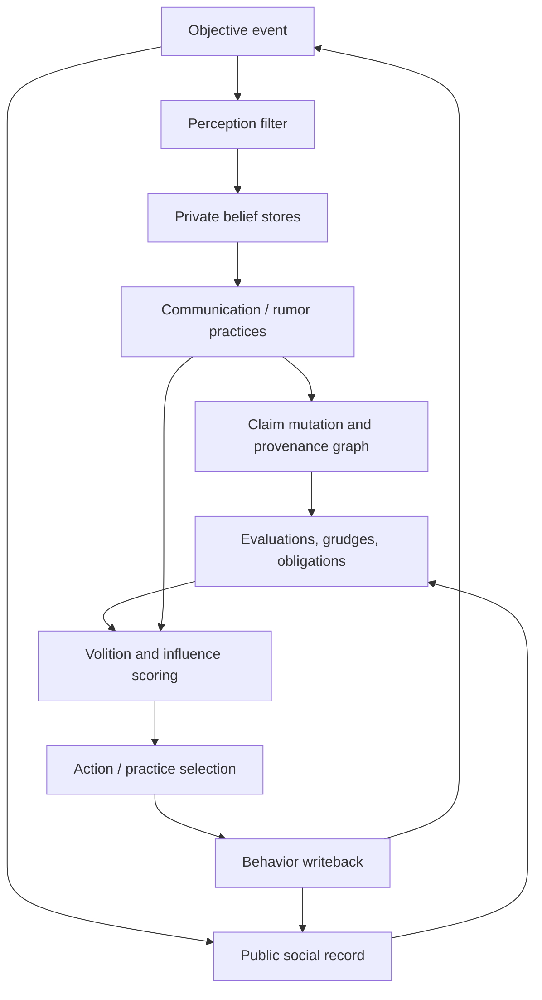

# Academic Social-Simulation Engines Beyond *The Sims*

**Research prompt 2:** *Comme il Faut, Prom Week, Ensemble, Versu, and City of Gangsters*  
**Audit date:** 7 September 2026  
**Decision context:** Chronicle, a social simulation design centered on private beliefs, belief provenance, rumor mutation, grudges and obligations, third-party inference, and behavior writeback in a Skyrim-like world.

---

## Executive verdict

None of the five systems is a drop-in implementation of Chronicle. They solve adjacent—but different—problems:

1. **Comme il Faut (CiF)** is the strongest precedent for *authored social-exchange scoring and social fallout*. Its Social Facts Database (SFDB) is an omniscient public history, not a private belief store: the authors state explicitly that CiF “does not simulate hidden information” and that all events are immediately known to all characters ([McCoy et al., 2014](http://www.ben-samuel.com/wp-content/uploads/2015/09/TCIAIG-social-story-worlds-with-comme-il-faut.pdf)).
2. **Prom Week** proves that CiF could support a complete, shipped, highly replayable social game, but it is a small-cast, turn-based Flash game rather than an open-world NPC simulation. Its public repository is inspectable, including the SWF, ActionScript CiF implementation, XML libraries, and final content; however, the repository has no project-wide license grant, so it should be treated as source-visible research material rather than safely reusable open source ([Expressive Intelligence Studio repository](https://github.com/ExpressiveIntelligence/PromWeek)).
3. **Ensemble** is CiF’s genuine second-generation successor. It generalizes CiF’s hard-coded categories into an author-defined schema, supports arbitrary rule roles, multi-character actions, and hierarchical actions, and ships with a BSD-4-Clause license. It is the safest CiF-family system for line-by-line study, although the repository is stale and the engine is not itself a large shipped world simulation ([Samuel et al., 2015](http://www.fdg2015.org/papers/fdg2015_paper_07.pdf); [Ensemble repository](https://github.com/ensemble-engine/ensemble)).
4. **Versu** is architecturally the most conceptually sophisticated of the group. Its concurrent, role-agnostic social practices, Exclusion Logic database, norm-violation practices, role evaluations with reasons, and speculative actual-consequence action scoring are all highly relevant to Chronicle. The original implementation and playable builds are effectively unavailable, however; Emily Short reports that Linden Lab refused to sell the codebase and IP. Versu is therefore citable, but not inspectable. The MIT-licensed **Praxish** project is the meaningful open reconstruction, but it is explicitly partial ([Evans and Short, 2014](https://cs.uky.edu/~sgware/reading/papers/evans2014versu.pdf); [Short, “Versu Outcome”](https://emshort.blog/2014/03/08/versu-outcome/); [Dameris et al., 2023](https://ojs.aaai.org/index.php/AIIDE/article/view/27537)).
5. **City of Gangsters** is the best shipped-scale precedent. It demonstrates symbolic social inference over roughly 1,200 active NPCs, second-order propagation through family and acquaintance links, directed relationship histories, player-legible explanations, and a performance-conscious logic-programming runtime. It does not implement private false beliefs or rumor mutation; it propagates objective event records and relationship-valence deltas. The MIT-licensed **MicroCoG** demo is an unusually valuable implementation-level proxy because it loads a real 40 MB save and exposes concrete reaction rules ([Zubek et al., 2021](https://ojs.aaai.org/index.php/AIIDE/article/view/18912); [MicroCoG repository](https://github.com/ianhorswill/MicroCoG)).

**Recommended study order for Chronicle:**

| Priority | Artifact | How to use it | Verdict |
|---:|---|---|---|
| 1 | **Ensemble source** | Read line by line for data-driven schema, volition rules, action trees, triggers, and social-record updates. | **Direct source study** |
| 2 | **MicroCoG source** | Read line by line for scalable action → relationship-filter → reactor → summed-valence propagation. | **Direct source study** |
| 3 | **Praxish source** | Read for practices, affordances, Exclusion-Logic-like state, and Swaygent’s hybrid with Ensemble-style volitions. | **Direct but partial reconstruction** |
| 4 | **Prom Week / CiF source and XML** | Inspect as a complete shipped CiF domain; study the SFDB and content organization, but do not reuse code without permission. | **Source-visible, not clean open source** |
| 5 | **Versu papers and design posts** | Use as architectural doctrine: practices, norms, reasons, concurrent situations, speculative scoring. | **Citable, not inspectable** |
| 6 | **City of Gangsters papers** | Use as shipped-scale validation and performance guidance; combine with MicroCoG for implementation details. | **Citable plus proxy source** |


The capability map is an analytic coding, not a benchmark. “Third-party inference” means reasoning about actions involving people other than the current dyad; it does **not** mean that every character has a separate, potentially false epistemic state.

---

## Method and evidence trail

The audit used thirteen evidence rounds: prompt scoping; CiF literature; Prom Week primary sources; Prom Week repository and XML analysis; CiF source audit; Ensemble paper and repository; Versu papers and author documentation; Exclusion Logic literature; Versu availability and Praxish reconstruction; City of Gangsters technical and design papers; BotL and CatSAT source audits; MicroCoG source/save analysis; and cross-system synthesis.

| Round | Target | Concise outcome |
|---:|---|---|
| 1 | Uploaded prompt file | Confirmed that “research prompt 2” selects the five-system academic social-simulation study. |
| 2 | CiF papers | Established exchanges, intents, influence rules, microtheories, SFDB, and selection pipeline. |
| 3 | Prom Week papers and official materials | Confirmed shipped scope, CiF integration, release history, and gameplay design. |
| 4 | Prom Week repository/XML | Parsed the public master library, per-game libraries, and character state; quantified shipped content. |
| 5 | CiF ActionScript source | Audited `SocialFactsDB.as`, predicates, rules, influence rules, microtheories, triggers, and selection classes. |
| 6 | Ensemble paper/repository | Confirmed successor status, schema generalization, arbitrary roles, hierarchical actions, license, and maintenance state. |
| 7 | Versu primary paper and project documentation | Recovered practices, Exclusion Logic, concurrent affordances, norm handling, and speculative action scoring. |
| 8 | Exclusion Logic scholarship | Distinguished the modal/deontic formalism from the broader Versu agent architecture. |
| 9 | Versu availability and Praxish | Confirmed original-code loss and identified the MIT-licensed partial reconstruction. |
| 10 | City of Gangsters papers | Established relationship tuples, history elements, second-order inference, BotL, CatSAT, and shipped status. |
| 11 | BotL and CatSAT repositories | Separated runtime social inference from personality/character PCG. |
| 12 | MicroCoG repository and bundled save | Inspected concrete C#/TELL reaction rules and parsed a real 40 MB save. |
| 13 | Epistemics and synthesis | Compared public social state against Chronicle’s private belief/provenance/rumor design. |

The strongest claims below are grounded in peer-reviewed papers, official repositories, official project pages, and direct source inspection. Repository counts and save-file statistics marked “audit” are empirical results from this research session, not claims made by the original authors.

---

## 1. Comme il Faut: authored social exchanges over public social history

### 1.1 What CiF is

CiF is a “social physics” engine that represents a story world’s current social state, its public history, and a library of authored social exchanges. It was initially implemented in ActionScript 3 alongside *Prom Week* and later described in detail as a general architecture for social story worlds ([McCoy et al., 2011](https://ojs.aaai.org/index.php/AIIDE/article/view/12454); [McCoy et al., 2014](http://www.ben-samuel.com/wp-content/uploads/2015/09/TCIAIG-social-story-worlds-with-comme-il-faut.pdf)).

Its central unit is the **social exchange**: an attempt by an initiator to change some aspect of the social state involving a responder and sometimes a third party. An exchange is not merely a dialogue node. It is a reusable social move with:

- an **intent**, meaning the desired social-state change;
- hard **preconditions**;
- an **initiator influence rule set**, used to score the initiator’s desire;
- a **responder influence rule set**, used to determine acceptance or rejection;
- multiple **instantiations**, which are concrete performances;
- **effects**, which write social-state changes back into the world; and
- trigger rules that process broader social fallout after the exchange ([McCoy et al., 2014](http://www.ben-samuel.com/wp-content/uploads/2015/09/TCIAIG-social-story-worlds-with-comme-il-faut.pdf)).

### 1.2 Social-state representation

CiF’s current social state combines several author-visible representations:

| Representation | Meaning | Chronicle relevance |
|---|---|---|
| **Traits** | Relatively permanent undirected character attributes, such as witty or competitive. | Useful as stable personality priors. |
| **Statuses** | Temporary directed or undirected states, such as angry-at, embarrassed, or popular. | Can encode short-lived social emotion, but not by itself a provenance-bearing belief. |
| **Relationships** | Binary/reciprocal states such as friends, dating, or enemies. | Useful for obligations and social roles. |
| **Social networks** | Directed scalar values such as buddy, romance, or cool; one character’s value toward another need not be reciprocated. | Strong precedent for asymmetric regard, trust, attraction, or resentment. |
| **Cultural Knowledge Base (CKB)** | Culturally categorized objects and characters’ likes, dislikes, wants, and possessions. | Useful for shared tastes and conversation topics. |
| **Social Facts Database (SFDB)** | Timestamped records of performed exchanges, labels, participants, and natural-language realization strings. | Strong public-event substrate; weak epistemic substrate. |

The 2014 paper’s *Prom Week* model lists three relationships, three scalar networks, dozens of statuses and traits, thirteen SFDB labels, and CKB connection types. Those labels include cool, lame, romantic, failed romance, gross, funny, bad-ass, mean, nice, taboo, rude, embarrassing, and misunderstood ([McCoy et al., 2014](http://www.ben-samuel.com/wp-content/uploads/2015/09/TCIAIG-social-story-worlds-with-comme-il-faut.pdf)).

### 1.3 Rule representation and evaluation

CiF rules query the social world through predicates. The detailed 2014 account distinguishes several evaluation modes:

- **True now:** evaluate against current social state.
- **True in history:** determine whether a state or state change occurred in the past.
- **Times true:** count how many bindings satisfy a predicate pattern.
- **Time-ordered:** match temporally ordered sequences of social facts or state changes.

CiF then uses rules in different structural roles:

| Rule structure | Function |
|---|---|
| **Influence rules** | Add or subtract weight from a character’s volition or from a responder’s acceptance score. |
| **Trigger rules** | Execute after state changes to enforce broad social consequences, such as marking a character who dates two people as a two-timer. |
| **Microtheories** | Named bundles of rules unified by a social concept or authorial theory, reducing the “big bag of rules” problem. |
| **Instantiation condition/change rules** | Select and customize concrete performances and their effects. |

This is an important design point: CiF’s rules are not a general theorem prover trying to derive all social truth. They are authorial scoring and selection devices. Their practical purpose is to choose socially apt actions and performances, not to maintain a logically complete model of what every agent knows.

### 1.4 Interaction selection and scoring

The canonical CiF loop is:

1. **Volition formation.** For each character, evaluate candidate social exchanges against other characters. Sum the weights of all true initiator influence rules.
2. **Exchange selection.** The host game chooses or lets the player choose an exchange from the volition-ranked affordances.
3. **Role binding.** Bind initiator, responder, and, when required, a third party. CiF can select the third party for whom the greatest number of third-party influence rules are true.
4. **Response determination.** Evaluate the responder rule set. If the summed responder score is non-negative, the responder accepts; otherwise, the exchange is rejected.
5. **Instantiation selection.** Choose the most salient concrete performance whose preconditions match current state and history.
6. **Instantiation customization.** Use natural-language templates and SFDB/CKB references to tailor the performance to this playthrough.
7. **Effect processing.** Apply the selected effect’s social-state changes and add an SFDB record.
8. **Trigger execution.** Run universal social-fallout rules, which may create further state changes and set up the next round ([McCoy et al., 2014](http://www.ben-samuel.com/wp-content/uploads/2015/09/TCIAIG-social-story-worlds-with-comme-il-faut.pdf)).

The source audit is consistent with this paper-level loop. The public CiF code contains separate classes for `Rule`, `InfluenceRule`, `InfluenceRuleSet`, `Microtheory`, `Trigger`, `Predicate`, `SocialGame`, `SocialGameContext`, `SFDBContext`, and `SocialFactsDB`. `SocialFactsDB.as` exposes vectors of contexts and trigger types, time-windowed context queries, predicate-history lookup, and first/second/third-character label search.

### 1.5 The SFDB and third-party social fallout

The SFDB is richer than a flat event log. A stored event can carry:

- timestamp;
- initiator, responder, and optional other character;
- a performance-realization string;
- author-defined labels; and
- a natural-language description that can be rendered from different speakers’ perspectives.

CiF can therefore ask questions such as:

- “Has this character done something embarrassing recently?”
- “Find a kind act by the initiator toward the responder within the last twenty turns.”
- “Find an event involving this third party that can be referenced in dialogue.”
- “How many cruel acts has this character performed?”
- “Did this sequence of social events occur in this order?”

That is real third-party social reasoning. It supports gossip-like references and indirect consequences. But it is **not** Chronicle-style belief provenance. The paper is explicit: CiF does not simulate hidden information, and all events are immediately known by all characters ([McCoy et al., 2014](http://www.ben-samuel.com/wp-content/uploads/2015/09/TCIAIG-social-story-worlds-with-comme-il-faut.pdf)).

Consequently:

- CiF can represent “the public record contains a rude act by X toward Y.”
- It can score Z’s response to that public act.
- It can retrieve the act later as dialogue.
- It cannot natively represent “Z believes a distorted version of the act because W told Z, while Y believes it never happened.”
- It cannot natively track confidence, source reliability, witness status, or mutation across a chain of tellers.

### 1.6 CiF versus Chronicle

| Chronicle requirement | CiF support | Gap |
|---|---|---|
| Private beliefs | **Absent by design.** | Add per-agent epistemic stores outside the SFDB. |
| Belief provenance | **Absent as epistemic provenance.** SFDB events have participants and time, but not “who learned this from whom.” | Add source, witness, teller, confidence, and chain metadata. |
| Rumor mutation | **Absent.** SFDB records are stable public records. | Add versioned belief instances or claim transformations. |
| Grudges | **Partial.** Trigger rules and persistent statuses/network changes can implement grudges. | Add explicit obligation/grudge objects with causes and settlement conditions. |
| Obligations | **Partial.** Relationships, statuses, and authored rules can imply them. | Make obligations queryable first-class facts with provenance and expiry. |
| Third-party inference | **Strong for public social fallout.** | Restrict inference by what each agent believes, not by omniscient history. |
| Behavior writeback | **Strong.** Effects and triggers alter social state and future volitions. | Reuse the pattern, but write belief-dependent outcomes too. |
| Skyrim-like scale | **Weak as shipped.** Prom Week uses a small cast and turn structure. | Decouple scoring from full-cast pairwise evaluation and use spatial/social indexing. |

### 1.7 CiF inspectability verdict

**Verdict: inspect the architecture and selected implementation files; do not treat it as a clean reusable library.**

Reasons:

- The complete ActionScript source is publicly visible inside the Prom Week repository.
- The XML content libraries are large and instructive.
- The code is old Flash/AIR-era ActionScript, not a modern portable engine.
- No project-wide license was found in the repository audit.
- CiF’s core epistemic limitation is explicit and architectural: it assumes public knowledge.

For Chronicle, CiF is most valuable as a pattern for **exchange candidate scoring, responder acceptance, performance selection, and trigger-based fallout**—not as the belief engine.

---

## 2. Prom Week: the shipped CiF proof of concept

### 2.1 Shipped scope and completeness

*Prom Week* is a complete social-puzzle/interactive-narrative game built by the Expressive Intelligence Studio at UC Santa Cruz and released in February 2012. The official UCSC release coverage describes it as a game in which players manipulate high-school social relationships in the week before prom ([UCSC release article](https://news.ucsc.edu/2012/02/prom-week/); [official play page](https://promweek.soe.ucsc.edu/play/)).

The game is turn-based and player-directed. The player selects pairs of characters and chooses among social exchanges that CiF has scored as desirable or plausible. The system determines acceptance or rejection, selects a performance, applies effects, and updates the social state. Goals concern social outcomes—friendships, dating, enemies, popularity, humiliation, and story-specific states—rather than conventional combat or quest completion ([McCoy et al., 2013](http://www.fdg2013.org/program/papers/paper13_mccoy_etal.pdf)).

The release-era design paper describes an 18-character cast and a rich social model. The public character-state XML audit confirms 18 `Character` elements: Doug, Simon, Monica, Zack, Oswald, Nicholas, Lil, Naomi, Buzz, Jordan, Chloe, Cassandra, Lucas, Edward, Mave, Gunter, Phoebe, and Kate. The same file contains 3 networks, 51 relationship declarations, 141 trait declarations, 19 status declarations, 392 propositions, 491 network edges, and 80 backstory contexts.

The game’s public release centered on the campaign protagonists Doug, Oswald, Simon, Monica, Edward, and Lil; the evaluation paper’s wording is internally awkward (“five playable stories” followed by six names) and also says Naomi’s story was briefly playable after release. The safest interpretation is that the shipped scope included six principal campaigns, with versioned post-release variation around Naomi ([McCoy et al., 2013](http://www.fdg2013.org/program/papers/paper13_mccoy_etal.pdf)).

### 2.2 Actual use of CiF

Prom Week is not merely “inspired by” CiF; the public repository contains the ActionScript CiF implementation and the CiF content libraries used by the game. The design paper describes CiF as determining:

- what social games each character wants to play with each other character;
- whether a responder accepts or rejects;
- which concrete instantiation plays;
- which social effects apply;
- which SFDB records are stored; and
- which trigger rules fire afterward ([McCoy et al., 2013](http://www.fdg2013.org/program/papers/paper13_mccoy_etal.pdf)).

The paper also documents an important gameplay bridge: **Social Influence Points (SIP)**. Because CiF’s simulation could produce believable but hard-to-predict outcomes, SIP lets the player push a character out of their comfort zone without turning characters into direct puppets. This is a useful lesson for Chronicle: if NPC behavior is strongly autonomous, the player needs legible levers for exceptional influence.

### 2.3 Empirical content audit

The repository’s `trunk/CiF/bin/libraries (master).xml` is a roughly 6 MB final/master content library. Direct XML parsing found:

| Element | Count in public master library |
|---|---:|
| `Predicate` | 9,470 |
| `Rule` | 5,938 |
| `InfluenceRule` | 4,214 |
| `LineOfDialogue` | 2,821 |
| `PartialChange` | 2,821 |
| `ChorusRule` | 2,821 |
| `Effect` | 504 |
| `PerformanceRealization` | 504 |
| `ConditionRule` | 504 |
| `ChangeRule` | 504 |
| `Instantiation` | 498 |
| `InitiatorInfluenceRuleSet` | 165 |
| `ResponderInfluenceRuleSet` | 165 |
| `Microtheory` | 126 |
| `SocialGame` | 39 |


These counts explain an apparent discrepancy in the literature. Earlier CiF descriptions mention “over 30” exchanges and roughly 4,900 influence rules; later Prom Week accounts say “over 5,000 rules.” The public final master XML contains 39 `SocialGame` elements and 4,214 explicit `InfluenceRule` elements, plus thousands of dialogue, condition, change, chorus, and other rule structures. The exact number therefore depends on what is being counted and which build snapshot is being described.

The separate `trunk/CiFStates/Games/` directory contains 46 valid XML files with 45 `SocialGame` entries and 5,142 `InfluenceRule` elements in aggregate. These are separate per-game/library snapshots and should **not** simply be added to the master library as unique content.

### 2.4 Play-trace evidence of completeness and replayability

The design paper reports 13,003 traces generated between the official 14 February 2012 release and 17 May 2012, of which 5,425 were story play traces used in the evaluation. It reports extensive path diversity: in one analysis of Simon’s final level, 263 analyzed playthroughs were all distinct, and n-gram analysis found thousands of distinct longer move sequences ([McCoy et al., 2013](http://www.fdg2013.org/program/papers/paper13_mccoy_etal.pdf)).

This matters because Prom Week is not a prototype that merely demonstrates one scripted social exchange. It is a shipped domain in which the social model is the game.

### 2.5 Source availability and licensing

The public repository includes:

- `PromWeek.swf`;
- the ActionScript game and engine source;
- CiF test code;
- character/state XML;
- per-game XML libraries; and
- the final/master content library.

The repository metadata inspected during the audit reports ActionScript as the dominant language, 13 stars, 8 forks, one open issue, and no GitHub license metadata. A manual audit found no project-wide `LICENSE` file; the only obvious license file belonged to bundled third-party FirePHPCore code. The repository was pushed to GitHub in 2019, long after the game’s 2012 release ([Prom Week repository](https://github.com/ExpressiveIntelligence/PromWeek)).

**Legal conclusion:** public visibility is not an open-source license. Prom Week can be studied, cited, and used as an architectural reference, but code or content should not be copied into Chronicle without permission from the rights holders.

**Practical conclusion:** even if licensing were resolved, the Flash/AIR/ActionScript stack is obsolete. The official play page still exposes the SWF, but normal modern-browser Flash execution is no longer a practical distribution path ([official play page](https://promweek.soe.ucsc.edu/play/)).

### 2.6 Prom Week versus Chronicle

| Chronicle requirement | Prom Week evidence | Lesson |
|---|---|---|
| Beliefs | No private belief store found; CiF assumes omniscient social history. | Chronicle needs a new epistemic layer. |
| Rumors | “Spread Rumors” is a social exchange, not a rumor-propagation substrate. | Do not mistake a named exchange for a mutation/provenance system. |
| Grudges | Statuses, networks, SFDB history, and triggers can produce persistent resentment. | Good precedent for social memory affecting later moves. |
| Third-party effects | Strong through public SFDB and third-party role binding. | Useful for witnessed/public actions. |
| Writeback | Strong: social effects and triggers alter later volitions. | Reuse the architecture, not the obsolete code. |
| Open-world relevance | Limited: 18 characters, authored high-school domain, turn-based. | Scale requires different indexing and update discipline. |

### 2.7 Prom Week inspectability verdict

**Verdict: inspect selectively as a complete shipped CiF domain; do not treat as reusable open source.**

Best files to study:

- `trunk/CiF/src/CiF/SocialFactsDB.as` for public history representation;
- `Predicate.as`, `Rule.as`, `InfluenceRule.as`, and `InfluenceRuleSet.as` for scoring;
- `SocialGame.as` and `SocialGameContext.as` for exchange structure and bindings;
- `Microtheory.as` and `Trigger.as` for social fallout;
- `libraries (master).xml` for final content shape; and
- `PromWeekCharacters.xml` for cast initialization.

Prom Week is citable and inspectable, but not a legally clean foundation and not a large-world architecture.

---

## 3. Ensemble: CiF’s genuine second-generation successor

### 3.1 Successor status

Ensemble is not merely another system in the same design family. Its authors describe it as the latest iteration of CiF and as a response to CiF’s limitations: hard-coded social categories, slow iteration, restricted two-person action structure, and difficult authoring. The 2015 paper explicitly presents Ensemble as “next-generation social physics” and as a freely available engine intended to make social simulation more broadly usable ([Samuel et al., 2015](http://www.fdg2015.org/papers/fdg2015_paper_07.pdf)).

The repository name and authorship continuity reinforce that lineage. It is maintained under `ensemble-engine`, with Ben Samuel and other UCSC social-physics contributors associated with the project ([Ensemble repository](https://github.com/ensemble-engine/ensemble)).

### 3.2 What Ensemble changes

CiF’s categories were shaped by Prom Week: traits, statuses, relationships, social networks, CKB, and SFDB. Ensemble replaces that fixed ontology with an **author-defined social schema**. The author declares categories and their properties, including:

- category and type names;
- Boolean or numeric values;
- undirected, directed, or reciprocal directionality;
- duration;
- minimum and maximum values;
- default values; and
- whether the category is actionable for volition formation.

The schema package also defines the cast, starting state or backstory, volition rules, trigger rules, and actions. Validation compiles this package into three runtime structures: the **Social Record**, **Action Library**, and **Rule Library** ([Samuel et al., 2015](http://www.fdg2015.org/papers/fdg2015_paper_07.pdf)).

This matters for Chronicle because beliefs, rumors, grudges, and obligations need not be forced into Prom Week’s categories. An Ensemble-like schema could define:

- `belief[holder, claim]` as a directed epistemic category;
- `trust[holder, source]` as a numeric directed category;
- `grudge[holder, target]` as a directed state with duration or intensity;
- `obligation[debtor, creditor]` as a first-class directed state; and
- `relationship[holder, target]` as a configurable social category.

Ensemble itself does not provide these epistemic semantics; it provides a cleaner substrate in which to author them.

### 3.3 Runtime architecture

The Ensemble runtime has three major processing elements:

1. **Volition calculation.** Bind rule roles, evaluate rule predicates against the Social Record, and update each character’s volitions.
2. **Action selection.** For a selected volition, traverse the relevant action hierarchy, bind roles, check preconditions, evaluate action-specific influence rules, expand subactions, and choose an action.
3. **Trigger calculation.** After actions change the Social Record, evaluate trigger rules and apply further updates ([Samuel et al., 2015](http://www.fdg2015.org/papers/fdg2015_paper_07.pdf)).

This preserves CiF’s useful loop while decoupling it from the Prom Week schema.

### 3.4 Rules and arbitrary role binding

An Ensemble rule still has a left-hand side of predicates and a right-hand side. Volition rules modify desire; trigger rules directly modify the Social Record. The major improvement is binding: a predicate involves at most two roles, but a rule can contain arbitrarily many roles.

The paper’s canonical example is “the enemy of my enemy is my friend”:

- X and Y are not enemies.
- X and Z are enemies.
- Y and Z are enemies.
- Therefore X’s volition to befriend Y increases.

This is directly relevant to Chronicle’s third-party reasoning. Unlike a simple dyadic reputation system, Ensemble can express multi-character patterns. It can search for multiple jokers, lovers, enemies, witnesses, or intermediaries and constrain each role with additional predicates.

### 3.5 Multi-character and hierarchical actions

CiF’s practical exchange structure was centered on initiator/responder, with an optional third role. Ensemble generalizes actions:

- actions can involve three or more participants;
- each action has conditions, influence rules, effects, and an accept/reject classification;
- actions can lead to subactions, forming a hierarchy;
- terminal actions can retain the lineage of higher-level choices; and
- action selection can recurse through that hierarchy.

The paper’s example is an action in which a character reveals a friend’s secret to a third party, damaging the friend’s reputation—precisely the kind of multi-party social situation Prom Week’s authors had difficulty expressing in CiF ([Samuel et al., 2015](http://www.fdg2015.org/papers/fdg2015_paper_07.pdf)).

For Chronicle, hierarchical actions are a better fit than flat dialogue choices. “Spread rumor” can decompose into selecting a claim, selecting a listener, choosing a distortion, making the utterance, applying the listener’s credibility judgment, and writing a new belief.

### 3.6 Social Record versus SFDB

Ensemble’s Social Record is a generalized social-state store, not simply a renamed SFDB. It holds schema-defined category values for characters and relationships. History viewing and backstory support exist, but the central abstraction is current social state plus rule-driven changes, not Chronicle-style versioned belief provenance.

This distinction is important:

- Ensemble is excellent for representing *the state that results from events*.
- It is not inherently a system for representing *how each agent came to believe a claim*.
- A rumor system would need a separate claim/belief event graph, even if its consequences were projected into Ensemble-like social-record values.

### 3.7 Repository, maintenance, and license

The public repository contains the JavaScript engine, Electron-based authoring tool, validation code, action and rule libraries, volition code, sample data, and documentation. The audited tree includes:

- `ensemble/ensemble.js`;
- `ensemble/socialRecord.js`;
- `ensemble/ActionLibrary.js`;
- `ensemble/RuleLibrary.js`;
- `ensemble/Validate.js`;
- `ensemble/Volition.js`; and
- `ensembletool/main.js`.

Repository metadata inspected during the audit showed creation in July 2016, last push in November 2022, 63 stars, 10 forks, 85 open issues, and no archived flag. It should therefore be considered **public and inspectable but stale**, not actively maintained.

The project is licensed under a University of California-specific **BSD-4-Clause** license. Unlike the more common BSD-3-Clause license, it retains an advertising/acknowledgement clause requiring the statement: “This product includes software developed by the University of California, Santa Cruz and its contributors” ([Ensemble license](https://github.com/ensemble-engine/ensemble/blob/master/LICENSE.md)).

That is a real open-source license, but the advertising clause is awkward for combined commercial works and should be reviewed before direct reuse. Reading and reimplementing the architecture carries fewer issues than copying substantial code or content.

### 3.8 Ensemble versus Chronicle

| Chronicle requirement | Ensemble support | Required Chronicle extension |
|---|---|---|
| Private beliefs | No built-in private epistemic store; the Social Record is global simulation state. | Add per-agent belief stores or belief objects keyed by holder. |
| Belief provenance | Not first-class. | Add claim source, teller, witness, timestamp, confidence, and parent claim. |
| Rumor mutation | Not first-class. | Add claim versions and transformation rules. |
| Grudges | Schema can define persistent directed states and trigger rules. | Define cause, intensity, decay, and settlement semantics. |
| Obligations | Schema can define directed obligations. | Define creditor/debtor, due conditions, breach, and fulfillment. |
| Third-party inference | Strong arbitrary-role rules. | Gate rules by what each role knows or believes. |
| Behavior writeback | Strong: action effects and triggers update Social Record. | Write both public outcomes and private belief updates. |
| Skyrim-like scale | Unproven at hundreds or thousands of NPCs. | Add spatial activation, incremental evaluation, and rule indexing. |

### 3.9 Ensemble inspectability verdict

**Verdict: the safest and most useful CiF-family codebase for line-by-line study.**

Study it for:

- schema-driven social categories;
- role binding;
- volition calculation;
- hierarchical action selection;
- trigger-rule writeback;
- validation and author tooling.

Do not assume it solves Chronicle’s epistemics. Treat it as the **social scoring and state-management substrate**, not the rumor engine.

---

## 4. Versu: concurrent social practices, norms, and agent-indexed evaluation

### 4.1 What Versu is

Versu is a simulationist interactive-drama platform developed by Richard Evans, Emily Short, and a team at Linden Lab. The peer-reviewed system paper describes it as a text-based interactive drama built around autonomous agents and social practices. The player can choose different characters, recast roles, and replay episodes from different perspectives because practices are authored to be role-agnostic rather than bound to fixed NPCs ([Evans and Short, 2014](https://cs.uky.edu/~sgware/reading/papers/evans2014versu.pdf)).

Versu shipped as an iPad platform with episodes in multiple genres, including Regency England, modern office comedy, and fantasy. *Blood and Laurels*, an ancient-Rome Versu work, was also released. The original platform is now effectively unavailable; Emily Short reports that Linden Lab stopped supporting Versu and refused her attempt to buy the codebase and IP ([Short, “Versu Outcome”](https://emshort.blog/2014/03/08/versu-outcome/)).

### 4.2 Social-practice architecture

A **social practice** is a first-class, parameterized model of a recurring social situation: a greeting, dinner, conversation, courtship, family, moral community, game, or other structured activity. Practices coordinate participants through roles but do not directly control agents. They provide affordances; each agent independently chooses among them using utility-based reactive action selection ([Evans and Short, 2014](https://cs.uky.edu/~sgware/reading/papers/evans2014versu.pdf)).

Key properties:

| Property | Meaning | Chronicle relevance |
|---|---|---|
| **Role-agnostic** | A practice defines roles such as greeter/recipient or host/guest, not fixed characters. | Rumor, accusation, mediation, debt collection, and revenge can be reusable practices. |
| **Concurrent** | Multiple practices can run at once; a dinner, a flirtation, and a conversation can coexist. | Open-world social scenes involve overlapping obligations and audiences. |
| **Parameterized** | The same practice type can be instantiated with different arguments. | A rumor practice can be instantiated for different claims, tellers, listeners, and targets. |
| **Affordance-producing** | Practices make contextually meaningful actions available. | Avoids presenting every possible speech act everywhere. |
| **Non-controlling** | Agents still choose what to do. | Preserves personality, belief, and desire differences. |
| **Persistent** | Practices can store arbitrary state, not just a finite-state-machine state. | A grudge or negotiation practice can retain history and settlement state. |

Emily Short’s implementation article gives a concrete example: during dinner, one practice can model eating and drinking while another models conversational turn-taking. A character can simultaneously be a dinner guest, a conversation participant, a romantic prospect, and a family member, with separate role evaluations in each practice ([Short, “Versu: Conversation Implementation”](https://emshort.blog/2013/02/26/versu-conversation-implementation/)).

### 4.3 Exclusion Logic as world representation

Versu’s underlying Praxis layer represents simulation state as a set of sentences in **Exclusion Logic**. Literals use tree-like paths and two operators:

- `A.B`: B is one of the ways A is the case;
- `A!B`: B is the unique way A is the case.

Examples from the paper include:

```text
brown.sex!male
brown.class!upper
process.dinner.dining_room.participant.brown
process.dinner.dining_room.participant.lucy
```

The `!` operator supports uniqueness and automatic removal of stale data. If a practice is in state `a` and then enters state `b`, data scoped under the old state can be removed automatically. Exclusion Logic therefore simplifies postconditions and avoids manually deleting every obsolete fact ([Evans, 2010](https://link.springer.com/chapter/10.1007/978-3-642-14183-6_14); [Evans and Short, 2014](https://cs.uky.edu/~sgware/reading/papers/evans2014versu.pdf)).

The simulation loop is:

1. true sentences make agents and practices active;
2. active practices instantiate possible actions;
3. agents or the player select actions;
4. action postconditions add and remove sentences;
5. the changed database activates different practices and affordances.

This is a more uniform world model than CiF’s separate state structures. It is highly inspectable in principle: the original system’s inspector could query what was true, inspect facts about an agent or process, determine why preconditions failed, and identify what caused a fact to become true ([Evans and Short, 2014](https://cs.uky.edu/~sgware/reading/papers/evans2014versu.pdf)).

### 4.4 Deontic and norm model

Exclusion Logic has a deontic interpretation, and Evans’s earlier work explicitly introduces it as a deontic logic and applies it to modeling social practices ([Evans, 2010](https://link.springer.com/chapter/10.1007/978-3-642-14183-6_14); [Evans, 2011](https://link.springer.com/chapter/10.1007/978-3-642-18181-8_12)).

But Versu’s runtime behavior should not be reduced to static permitted/obligated/forbidden labels. The full architecture is more dynamic:

1. Practices define expected behavior.
2. Norm-violating actions remain available, especially to the player.
3. Postconditions mark violations or fulfilled requirements.
4. Agents usually have strong desires to respect norms.
5. Agents evaluate the actual consequences of candidate actions.
6. A violation can spawn a responsive subpractice.
7. Other characters receive affordances to disapprove, forgive, become angry, or evict the violator ([Evans and Short, 2014](https://cs.uky.edu/~sgware/reading/papers/evans2014versu.pdf); [Short, “Versu: Conversation Implementation”](https://emshort.blog/2013/02/26/versu-conversation-implementation/)).

This is directly relevant to Chronicle. A theft accusation should not simply set `crime_witnessed=true`. It can instantiate or strengthen practices such as:

- `accusation(accuser, accused, claim)`;
- `demand_apology(accuser, accused)`;
- `mediate_dispute(mediator, party_a, party_b)`;
- `collect_debt(creditor, debtor)`;
- `avenge_wrong(avenger, offender, victim)`; and
- `spread_rumor(teller, listener, claim)`.

Each practice can provide different affordances to different roles while agents decide whether to cooperate.

### 4.5 Action selection through actual consequences

Versu agents use utility-based reactive action selection rather than a long-horizon planner. The distinctive feature is that they evaluate the **actual consequences** of an action:

1. enumerate available action instances;
2. tentatively execute each action’s postconditions;
3. evaluate the resulting database state against the agent’s desires;
4. undo the speculative changes;
5. execute the highest-scoring action.

The paper contrasts this with systems such as *The Sims*, where an agent’s simplified expected effect can diverge from the action’s actual conditional effects. Versu avoids that mismatch by using reversible action execution for scoring ([Evans and Short, 2014](https://cs.uky.edu/~sgware/reading/papers/evans2014versu.pdf)).

For Chronicle, this is a strong design precedent. A character deciding whether to repeat a rumor could speculatively evaluate:

- whether the listener will believe it;
- whether the listener’s opinion of the target will decrease;
- whether the listener’s opinion of the teller will decrease;
- whether the rumor violates a loyalty obligation;
- whether it creates a new grudge; and
- whether it triggers a socially desirable practice.

Chronicle should nevertheless avoid speculative writes into persistent rumor state. Use a copy-on-write overlay or transaction log, then discard the overlay after scoring.

### 4.6 Relationships as role evaluations with reasons

Versu does not reduce relationships to one affinity scalar. It uses **role evaluations** based on Membership Categorization Devices: characters evaluate how well others perform socially relevant roles. Examples include whether someone is well-bred, polite, attractive, generous, a good spouse, a good suitor, or a proper family member ([Evans and Short, 2014](https://cs.uky.edu/~sgware/reading/papers/evans2014versu.pdf)).

Crucially, evaluations can carry **reasons**. Short’s design article gives examples such as:

- Darcy is a loyal friend because he tries to look after Bingley’s interests.
- Darcy is a poor ball participant because he refuses to dance.
- A character may be judged rude because of a specific prior act.

Evaluations and reasons can be communicated. Short reports a debugging example in which the doctor was rude to the player because the player had been mean to the butler and the butler had gossiped about it in the kitchen ([Short, “Versu: Conversation Implementation”](https://emshort.blog/2013/02/26/versu-conversation-implementation/)).

This makes Versu more epistemically relevant than CiF:

- CiF has a public SFDB.
- Versu represents agent-indexed evaluations, beliefs, and reasons.
- Characters can hear an evaluation and decide whether to believe it.
- A factual or evaluative statement can change another character’s world view.

However, Versu still does not appear to implement Chronicle’s full rumor model as a versioned, source-chained, mutation-capable belief graph. Its reasons are explanatory and communicable, but the primary sources do not show a general mechanism for tracking distortion across multiple tellers.

### 4.7 Versu versus CiF

| Dimension | CiF | Versu |
|---|---|---|
| Core unit | Social exchange | Concurrent social practice |
| World model | Separate social-state structures plus SFDB/CKB | Uniform Exclusion Logic sentence database |
| Agent control | Exchange scoring and responder determination | Practice supplies affordances; agent chooses autonomously |
| Roles | Primarily initiator/responder/other; Ensemble later generalized this | Role-agnostic and multi-perspective by design |
| Concurrency | Mostly one exchange at a time | Multiple practices simultaneously |
| Norms | Influence rules, labels, and trigger fallout | Deontic/normative practice state plus responsive subpractices |
| Relationship model | Relationships, scalar networks, statuses | Multiple role evaluations with reasons |
| Beliefs | No hidden information; public SFDB | Agent-indexed beliefs/evaluations, though not full Chronicle rumor provenance |
| Performance choice | Instantiations and NLG templates | Practice actions and generated text |
| Code availability | Public in Prom Week repo, no project license | Original unavailable; Praxish partial reconstruction |

### 4.8 Original availability and licensing

The original Versu code and content are not available under an open license. Short’s 2014 post says Linden Lab gave a “definite no” to selling her the codebase and IP, and that Linden was no longer supporting Versu ([Short, “Versu Outcome”](https://emshort.blog/2014/03/08/versu-outcome/)).

The original iOS builds should therefore be treated as historical artifacts. Normal new installation is not a reliable research path, and no original source repository is available for audit.

**Inspectability verdict for original Versu: citable but not inspectable.**

### 4.9 Praxish: the open partial reconstruction

Praxish is an open-source rational reconstruction of Versu’s low-level Praxis layer. The AIIDE paper is explicit that Versu was lost and that Praxish reconstructs the exclusion-logic language from public documentation rather than original code ([Dameris et al., 2023](https://ojs.aaai.org/index.php/AIIDE/article/view/27537)).

The repository is MIT-licensed and contains:

- `db.js`: exclusion-logic-style tree database;
- `praxish.js`: practice definitions, queries, actions, and state transitions;
- `planner.js`: forward-looking action selection;
- `swaygent.js`: a hybrid decision module using Ensemble-like influence and volition rules; and
- test, PWIM, Sway, and Bauprobe demos ([Praxish repository](https://github.com/mkremins/praxish)).

The repository metadata inspected during the audit showed an initial 2023 creation date, development continuing into 2026, and an MIT license. The project README itself describes ongoing development and explicitly calls Swaygent a module that combines practices with Ensemble-like influence and volition rules ([Praxish repository](https://github.com/mkremins/praxish)).

#### What `db.js` demonstrates

The exclusion operator is implemented by replacing the subtree at a path segment:

```javascript
if (lastChar === "!") {
  const nonPunctPart = part.slice(0, -1);
  subtree[nonPunctPart] = {}; // overwrite with a fresh subtree
  subtree = subtree[nonPunctPart];
}
```

The source includes a comment noting uncertainty about whether always-overwrite behavior is a subtle bug. That comment is important: Praxish is a rational reconstruction, not recovered Versu source, and some original semantics remain inferred.

#### What Swaygent demonstrates

Swaygent’s scoring pattern is directly relevant to Chronicle because it combines practice-generated affordances with social scoring:

1. compute influences for a possible action;
2. clone or save the current database;
3. tentatively perform the action;
4. compute resulting volitions;
5. sum symbolic sways into a utility score;
6. restore the previous database; and
7. sort by symbolic priority, then score.

This is a modern, inspectable hybrid of the Versu and Ensemble lineages. It is arguably the single best codebase for studying how to combine:

- practice-scoped affordances;
- speculative action consequences;
- social influence rules; and
- agent utility selection.

### 4.10 Versu/Praxish versus Chronicle

| Chronicle requirement | Versu / Praxish support | Gap |
|---|---|---|
| Private beliefs | **Strong conceptually in original Versu**: beliefs, desires, and evaluations are agent-indexed. Praxish can represent them but does not provide a full epistemic subsystem. | Need explicit per-agent belief claims and visibility rules. |
| Belief provenance | **Partial.** Evaluations carry reasons; communicated evaluations can explain change. | Need source chains, teller reliability, witness type, and timestamps. |
| Rumor mutation | **Partial at design level.** Interpretation and communication can transform views, but no general versioned mutation engine is documented. | Add explicit mutation operators and claim lineage. |
| Grudges | **Strong.** Negative evaluations, emotions, norm violations, and responsive practices can persist. | Add formal grudge objects and settlement behavior. |
| Obligations | **Strong.** Practices and deontic norms model role obligations. | Add concrete debtor/creditor state and expiry. |
| Third-party inference | **Strong.** Multiple concurrent roles and evaluations support indirect social consequences. | Gate propagation by private knowledge. |
| Behavior writeback | **Strong.** Action postconditions alter the sentence database and future affordances. | Separate speculative scoring from committed writes. |
| Open inspectability | Original: absent. Praxish: strong but partial. | Study Praxish, cite Versu. |

### 4.11 Versu inspectability verdict

**Original Versu: citable, not inspectable.**  
**Praxish: inspectable line by line, MIT licensed, actively developed, but a partial rational reconstruction.**

For Chronicle, use Versu as the conceptual model for **social practices, norm-violation responses, reasons for evaluations, and speculative consequence scoring**. Use Praxish to understand how those ideas can be implemented today.

---

## 5. City of Gangsters: shipped social inference at open-world scale

### 5.1 Shipped status

*City of Gangsters* is a commercial Prohibition-era management/tycoon game developed by SomaSim and collaborators. The technical paper describes it as a game in which the player works social connections with roughly 1,200 active NPCs, while NPC opinions modulate the player’s ability to succeed ([Zubek et al., 2021](https://ojs.aaai.org/index.php/AIIDE/article/view/18912)). The game remains commercially listed on Steam and Epic/Kasedo channels ([Steam page](https://store.steampowered.com/app/1386780/City_of_Gangsters/); [SomaSim page](https://www.somasim.com/games/city-of-gangsters/)).

This is the only system in the report that combines:

- a commercial open-world-scale game;
- more than a thousand socially active NPCs;
- procedural population generation;
- symbolic social inference;
- second-order social consequences; and
- player-facing explanations.

### 5.2 Relationship graph model

The game represents social knowledge as a labeled, directed graph. Each relationship edge has the approximate form:

```text
r = ⟨x, y, t, v, H, c⟩
```

Where:

- `x` and `y` are characters;
- the edge models how `x` feels about `y`;
- `t` is a relationship type, such as brother or friend;
- `v` is scalar valence;
- `H` is the relationship history; and
- `c` is additional game context.

Edges are dyadic and unidirectional. When two characters know each other, the game can maintain both `x → y` and `y → x`, allowing asymmetric opinions. Edges are added only for characters who know each other, either through generated family/social connections or runtime acquaintance ([Zubek et al., 2021](http://robert.zubek.net/publications/social-modeling-via-logic-programming-in-city-of-gangsters.pdf)).

### 5.3 Relationship histories and explanation

Each edge contains history elements approximately of the form:

```text
h = ⟨Δv, actor, target, expiration, explanations, context⟩
```

The scalar relationship valence is calculated as the sum of active history deltas:

```text
v = Σ Δvᵢ
```

Some history elements are simple buffs, such as a temporary modifier caused by personality. Others are external-action elements that name an actor and target. This allows a nominally dyadic edge to record an n-ary history: “Alice dislikes Bob because Bob harmed Alice’s brother Chris.” The design paper emphasizes that legible, reversible, concise social actions were essential to making the simulation understandable to players ([Robison et al., 2021](https://ojs.aaai.org/index.php/AIIDE/article/view/18911)).

This is highly relevant to Chronicle’s grudges:

- a grudge can be a persistent negative history element;
- expiration can model cooling off;
- immutable elements can model unforgivable wrongs;
- explanations can tell the player why an NPC refuses service;
- actor/target fields allow revenge and reciprocity; and
- context can connect a modifier to a quest, crime, or rumor.

### 5.4 Second-order social propagation

The technical paper’s motivating example is direct: the player extorts someone, travels elsewhere, and is later attacked by a previously unknown hooligan. The hooligan turns out to be the victim’s brother; the extortion propagated through the family relationship and created a one-sided negative relationship toward the player ([Zubek et al., 2021](http://robert.zubek.net/publications/social-modeling-via-logic-programming-in-city-of-gangsters.pdf)).

The inference process has three stages:

1. **Query the graph.** Find relationship patterns relevant to an action.
2. **Determine response.** Choose the appropriate normative reaction and valence change.
3. **Modify relationships.** Add history elements to the reactor’s relationship toward the actor and possibly inform the player.

The published BotL examples show the shape:

```prolog
socialInference(Interlocutor, Target, Human, Family,
                "violence", "violence-inf") :-
    linkedVia(Interlocutor, Target, Family),
    historyIncludes(Target, Human, "violence").

socialInference(Interlocutor, Target, Human, AnyLink,
                "quest-complete", "quest-complete-inf") :-
    linkedVia(Interlocutor, Target, AnyLink),
    historyIncludes(Target, Human, "quest-complete").
```

These are not full rumor beliefs. They are **objective event propagators**: the game knows the violent act occurred, finds socially connected reactors, and writes new relationship history. The system does not appear to model whether a reactor heard a false, incomplete, or mutated version.

### 5.5 Performance and scaling architecture

The social-inference language is **BotL**, a game-oriented logic-programming language designed for Unity/CLR interoperability and real-time use. The paper describes several performance decisions:

- BotL and the game share the CLR object system and memory manager.
- Compound objects are opaque to unification, producing a Datalog-like limitation.
- Higher-order predicates are compile-time macros rather than runtime homoiconic code.
- Functional expressions call host-language functions.
- the VM uses statically allocated stacks;
- calls avoid dynamic allocation and garbage collection;
- the VAM2P-inspired virtual machine dispatches caller and callee operations in lock step; and
- failed pattern matches can exit early before later arguments are computed ([Zubek et al., 2021](http://robert.zubek.net/publications/social-modeling-via-logic-programming-in-city-of-gangsters.pdf); [BotL repository](https://github.com/ianhorswill/BotL)).

The broad lesson is that City of Gangsters scales not because it has a richer epistemic model, but because it has a **narrow one**:

- one social graph;
- scalar relationship valence;
- small history tuples;
- tens rather than thousands of inference rules;
- C# primitive predicates isolating native game data;
- early query failure;
- event-triggered rather than continuous full-world inference; and
- no general rumor-mutation search.

### 5.6 BotL versus CatSAT

The City of Gangsters AI stack used two distinct logic-based systems:

| System | Role | What it is not |
|---|---|---|
| **BotL** | Runtime social inference over relationships and histories. | Not the personality generator and not a general rumor engine. |
| **CatSAT** | Embedded ASP-like randomized constraint solver used for personality-trait generation and PCG experiments. | Not the runtime social-inference engine. |

CatSAT successfully generated personality traits under incompatibility, implication, and inheritance constraints. An attempt to generate the entire population with the solver was too slow, so family generation was reimplemented as forward simulation. This distinction matters because summaries of the game sometimes collapse “logic programming” into one system ([Zubek et al., 2021](http://robert.zubek.net/publications/social-modeling-via-logic-programming-in-city-of-gangsters.pdf); [CatSAT repository](https://github.com/ianhorswill/CatSAT)).

### 5.7 Source and license availability

The full City of Gangsters game source is not public. Three related artifacts are available:

| Artifact | Availability | License/audit result | Research value |
|---|---|---|---|
| **BotL** | Public C# source | No repository-level license metadata found; individual files carry MIT-style permission headers. | Architecture of the original runtime language. |
| **CatSAT** | Public C# source | `LICENSE.txt` exists and source files carry MIT-style headers. | PCG constraint solving, not social inference. |
| **MicroCoG** | Public C#/TELL demo with real save | MIT license. | Best implementation-level proxy for social propagation. |

BotL illustrates the same licensing caution as Prom Week: visible source is not necessarily a clean reusable open-source project. Treat it as inspectable unless the rights holder confirms reuse terms ([BotL repository](https://github.com/ianhorswill/BotL)).

### 5.8 MicroCoG: the concrete implementation proxy

MicroCoG is an MIT-licensed social-inference demo for City of Gangsters save files, implemented in C# with TELL. The README says it loads a real 40 MB game save and lets the user select an agent, action, and target to see how other characters react ([MicroCoG repository](https://github.com/ianhorswill/MicroCoG)).

Its `SocialInference.cs` exposes the core rule shape:

```csharp
var ReactionToAction = Predicate("ReactionToAction",
    agent, action, target, reactor, reaction, buffTotal)
    .If(ReactionType[action, reaction, relationshipClass],
        RelationshipOf[target, rel],
        RelationshipClass[rel, relationshipClass],
        RelationshipType[rel, relationshipType],
        RelationshipTo[rel, reactor],
        Sum[buff,
            ReactionBuff[reaction, relationshipClass, relationshipType, buff],
            buffTotal])
    .Documentation(
        "If agent performs action on target, the reactor reacts with response and the specified buff to their trust of the agent.");
```

The data tables make the model concrete:

```csv
"violence","violence-reaction",Family
"killing","killing-reaction",Family
"propdamage","propdamage-reaction",Family
"quest-complete","quest-complete-reaction",_
```

And the reaction buffs show additive generic and specific rules:

```csv
violence-reaction,_,_,-1
violence-reaction,family,_,-1
killing-reaction,_,_,-2
killing-reaction,family,_,-2
killing-reaction,family,mother,-2
killing-reaction,family,father,-2
killing-reaction,family,child,-2
quest-complete-reaction,_,_,1
```

This is the clearest implementation template for Chronicle propagation:

```text
objective action
  → action type
  → target’s outgoing relationship edges
  → eligible reactor class/type
  → applicable reaction rules
  → sum of all buffs
  → directed relationship writeback from reactor to actor
  → explanation/context
```

### 5.9 Empirical save-file audit

The MicroCoG repository bundles `savedata.sim`, a roughly 40 MB SION-serialized City of Gangsters save. An ad hoc parser written for this audit found:

| Metric | Parsed count |
|---|---:|
| Total serialized entities | 46,397 |
| Person entities | 13,241 |
| Apparently living persons | 11,196 |
| Relationship edges | 350,200 |
| Social-history items | 1,906 |
| Distinct history action IDs | 19 |

The apparent discrepancy with “roughly 1,200 NPCs” is not a contradiction. The paper counts active interactive NPCs; the save also serializes a much larger population, genealogy, and window-dressing graph ([Zubek et al., 2021](http://robert.zubek.net/publications/social-modeling-via-logic-programming-in-city-of-gangsters.pdf)).

Relationship-edge distribution in the parsed save:

| Relationship type | Directed edges |
|---|---:|
| Cousin | 139,622 |
| Sibling’s child | 54,500 |
| Sibling | 39,358 |
| Mother’s sibling | 27,389 |
| Father’s sibling | 27,111 |
| Child | 22,962 |
| Mother | 11,481 |
| Father | 11,481 |
| Acquaintance | 9,098 |
| Spouse | 7,058 |
| Self | 140 |


Top social-history action IDs in the save were vandalism (374), violence (339), burglary (325), gang trespass (270), gang injury (251), extortion (130), quest completion influence (47), violence influence (43), killing (42), gang death (42), and killing influence (15).

This supports the shipped architecture’s practical shape: the dense static graph is large, but the dynamic social-history layer is comparatively sparse. Chronicle should copy that asymmetry. Do not create a rumor object for every NPC about every event; create claims only when perception or communication rules say they matter.

### 5.10 City of Gangsters versus Chronicle

| Chronicle requirement | City of Gangsters support | Gap |
|---|---|---|
| Private beliefs | **Absent.** The system propagates objective social facts into relevant relationships. | Add per-agent belief stores and visibility filters. |
| Belief provenance | **Partial.** History elements name actor, target, explanation, and context. | Add communication source and chain, not just original actor/target. |
| Rumor mutation | **Absent.** The same event type propagates as a known action. | Add claim variants and distortion rules. |
| Grudges | **Strong.** Negative history elements, expiration, and revenge norms support persistent resentment. | Make grudges queryable as first-class obligations, not only valence. |
| Obligations | **Strong.** Favors, reciprocity, and social economy are central. | Distinguish social debt from generic positive valence. |
| Third-party inference | **Strong.** Family/friend links produce second-order effects. | Gate by hearsay, credibility, and audience. |
| Behavior writeback | **Strong.** Relationship history gates business, introductions, favors, combat, and quests. | Add belief-dependent dialogue and practice affordances. |
| Skyrim-like scale | **Strongest precedent.** Roughly 1,200 active NPCs in a commercial game. | Add streaming, location-based activation, and claim indexing. |

### 5.11 City of Gangsters inspectability verdict

**Game itself: shipped and citable, but closed source.**  
**BotL: inspectable, but no clean repository-level license found.**  
**MicroCoG: MIT-licensed, directly inspectable, and the best practical proxy.**

For Chronicle, study MicroCoG line by line for the propagation rule shape and City of Gangsters’ paper for performance discipline. Do not copy its epistemic assumption: Chronicle needs to propagate *claims*, not just objective actions.

---

## 6. Cross-system comparison

### 6.1 Architecture and state model

| System | Core abstraction | Social state | History / memory | Decision procedure | Scale model |
|---|---|---|---|---|---|
| **CiF** | Social exchange | Traits, statuses, relationships, directed networks, CKB | Omniscient timestamped SFDB | Weighted initiator/responder influence rules; instantiation selection | Tens of characters; Prom Week used 18 |
| **Prom Week** | Player-selected social puzzle | CiF social state | CiF SFDB plus backstory | CiF plus Social Influence Points | Complete small-cast game |
| **Ensemble** | Schema-defined action and volition | Author-defined Social Record categories | Backstory and social-record history/tooling | Volition rules, action influence rules, trigger rules | Research engine; no shipped large-world proof |
| **Versu** | Concurrent social practice | Uniform Exclusion Logic sentence database | Agent/practice-scoped facts, evaluations with reasons | Utility-based reactive selection using speculative actual consequences | Small authored interactive dramas |
| **Praxish** | Reconstructed practice/action DSL | Exclusion-logic-style tree database | Database insert/retract and diff | Planner or Swaygent reactive scoring | Small demos; active research code |
| **City of Gangsters** | Directed social graph and social norm rules | Directed edges, type, valence, context | Edge-local history tuples with expiry and explanations | BotL logic queries triggered by actions | Roughly 1,200 active NPCs in shipped game |

### 6.2 License, source, maintenance, and shipped status

| System | Shipped/theoretical status | Source availability | License | Maintenance | Line-by-line verdict |
|---|---|---|---|---|---|
| **CiF** | Engine shipped inside Prom Week and used in later projects | Public inside Prom Week repository | No project-wide license found | Obsolete ActionScript/Flash stack | **Study selected files; do not reuse directly** |
| **Prom Week** | Complete publicly released game shipped in 2012 | SWF, source, XML, content publicly visible | No project-wide license found | Obsolete Flash runtime | **Inspectable but not clean open source** |
| **Ensemble** | Open research engine and authoring tool | Complete JavaScript source | BSD-4-Clause, UC advertising clause | Public but stale; last audited push 2022 | **Best CiF-family source study target** |
| **Versu** | Original iOS platform shipped; now unavailable | Original source unavailable | Closed/unavailable | Unsupported after Linden decision | **Citable, not inspectable** |
| **Praxish** | Open research reconstruction and demos | Complete JavaScript source | MIT | Development resumed and active into 2026 | **Inspect line by line, remembering partial fidelity** |
| **City of Gangsters** | Commercial game shipped in 2021 | Game source closed; BotL/CatSAT/MicroCoG related code public | MicroCoG MIT; BotL has file headers but no root license; CatSAT has license file | Mixed; MicroCoG is a demo, BotL old, CatSAT public | **Use MicroCoG as proxy; cite shipped paper** |

### 6.3 Epistemics, provenance, and rumor support

| Capability | CiF / Prom Week | Ensemble | Versu | Praxish | City of Gangsters |
|---|---|---|---|---|---|
| **Private beliefs** | No; SFDB is omniscient | No built-in private epistemic layer | Yes conceptually: agent-indexed beliefs/evaluations | Expressible, not a full subsystem | No; objective action propagation |
| **Belief provenance** | No teller-chain provenance | Not first-class | Partial: evaluations have reasons | Not first-class | Partial: actor/target/explanation/context |
| **False belief** | No | Not built in | Possible through agent-indexed state, but not the central documented mechanism | Expressible manually | No |
| **Rumor mutation** | No | Not built in | Interpretive communication, but no general mutation graph | Not built in | No |
| **Third-party inference** | Strong over public history | Strong arbitrary-role rules | Strong through concurrent practices/evaluations | Strong via queries and Swaygent | Strong through relationship graph |
| **Grudges** | Persistent statuses/networks/triggers | Schema-defined states/triggers | Norm violations and evaluations | Expressible | Strong history deltas and revenge norms |
| **Obligations** | Authored rules and relationships | Schema-defined | Practices and deontic norms | Practice definitions | Favors and reciprocity central |
| **Behavior writeback** | Effects and triggers | Action effects and triggers | Sentence insert/retract and practice activation | DB updates | Relationship history gates gameplay |

### 6.4 What each system contributes to Chronicle

| Chronicle subsystem | Best precedent | Why |
|---|---|---|
| Candidate social-action scoring | **CiF / Ensemble** | Weighted rules over social state are mature and authorable. |
| Arbitrary multi-party patterns | **Ensemble** | Arbitrary role binding can express witnesses, intermediaries, enemies, and kin. |
| Rumor conversation affordances | **Versu / Praxish** | Practices scope socially meaningful speech acts without scripting agents. |
| Norm violation and response | **Versu** | Violations spawn responsive practices rather than simply changing a number. |
| Reasons for opinions | **Versu** | Evaluations can carry reasons and be communicated. |
| Scalable second-order fallout | **City of Gangsters / MicroCoG** | Shipped graph propagation over roughly 1,200 active NPCs. |
| Explanation-backed relationship memory | **City of Gangsters** | History elements combine delta, actor, target, expiry, explanation, context. |
| Data-driven schema | **Ensemble** | Lets Chronicle define beliefs, grudges, and obligations as first-class categories. |
| Speculative behavior evaluation | **Versu / Praxish Swaygent** | Tentatively execute effects, score, then roll back. |
| Shipped content proof | **Prom Week** | Shows a complete social-simulation game can be built around rule-scored exchanges. |

---

## 7. The central architectural distinction: public social facts versus private claims

Chronicle should not treat “social state,” “event history,” “belief,” and “rumor” as synonyms.

| Layer | Ownership | Truth status | Example |
|---|---|---|---|
| **Objective event log** | World/simulation | Authoritative within the simulation | “At 21:12, A stole B’s sword.” |
| **Public social record** | Community/faction/world | Socially recognized, not necessarily objectively complete | “A is wanted by the guard faction.” |
| **Private belief** | One agent | May be true, false, stale, or distorted | “C believes A stole the sword.” |
| **Claim / rumor instance** | A communication act or held proposition | Versioned and source-linked | “C heard from D that A murdered B over a debt.” |
| **Evaluation** | One agent toward another | Normative/affective interpretation | “C considers A dishonorable.” |
| **Grudge** | One agent toward another | Persistent grievance with cause and settlement terms | “C wants revenge because A killed C’s brother.” |
| **Obligation** | Directed social commitment | Can be owed, fulfilled, breached, forgiven | “C owes D protection for hiding them.” |
| **Practice** | Shared situation model | Contextually active roles and affordances | “C and D are in an accusation practice about A.” |

CiF and Ensemble mainly operate at the **social state/public event** layers. City of Gangsters operates at the **objective event + relationship history** layers. Versu reaches further into **private evaluation and reasons**, but still does not provide a full source-chained rumor-mutation substrate.

Chronicle’s distinctive contribution should be the missing middle layer:

```text
objective event
  → perception
  → private belief
  → communicated claim
  → mutated claim
  → evaluation / grudge / obligation
  → practice affordance
  → behavior
  → new objective event
```

---

## 8. Recommended Chronicle architecture

### 8.1 Hybrid architecture

Chronicle should combine four precedents rather than imitate one:

1. **Ensemble-like schema and volition rules** for author-defined social categories.
2. **Versu/Praxish-like practices** for concurrent social situations and speech affordances.
3. **City of Gangsters/MicroCoG-like graph propagation** for scalable third-party reactions.
4. **A new epistemic claim graph** for private beliefs, provenance, and rumor mutation.



### 8.2 Proposed data model

A Chronicle claim should be separate from both the objective event and the relationship consequence:

```text
Claim {
  id
  claim_type
  subject
  object
  predicate
  qualifiers
  polarity
  confidence
  salience
  created_at
  expires_at
}

Belief {
  holder
  claim_id
  confidence
  source_type          // witnessed, told, inferred, assumed
  source_agent         // optional teller
  parent_belief_id     // optional provenance link
  acquired_at
  last_confirmed_at
  emotional_charge
}

RumorMutation {
  parent_claim_id
  child_claim_id
  mutation_type        // exaggeration, minimization, misattribution,
                       // target substitution, detail loss, embellishment
  mutation_strength
  cause                // teller trait, listener bias, faction frame, noise
}

Evaluation {
  holder
  target
  role_or_dimension
  score
  reasons[]            // links to beliefs/claims/events
}

Grudge {
  holder
  target
  cause_claim_or_event
  intensity
  created_at
  decay_rule
  settlement_conditions
  revenge_desire
}

Obligation {
  debtor
  creditor
  obligation_type
  cause_claim_or_event
  due_conditions
  breach_conditions
  fulfillment_conditions
  expiry
}
```

The public social record should remain separate:

```text
PublicSocialRecord {
  holder_or_scope
  target
  category
  value
  source_authority
  visibility
  evidence_links[]
}
```

This avoids a common failure mode: changing a global reputation value when only one NPC heard a rumor.

### 8.3 Event-to-belief pipeline

For a Skyrim-like world, use this pipeline:

1. **Commit objective event.** Example: player steals from a merchant.
2. **Compute witnesses.** Use line of sight, hearing, lighting, disguises, faction awareness, and prior attention.
3. **Create private witness beliefs.** Witnesses receive high-confidence claims.
4. **Create public facts only when appropriate.** A guard report, bounty, or faction notice may become public; a private witness belief should not automatically become global knowledge.
5. **Schedule communication.** Witnesses may tell others based on traits, relationships, practices, location, and opportunity.
6. **Mutate the claim.** The teller’s version can lose details, exaggerate severity, substitute a target, or reinterpret motive.
7. **Evaluate credibility.** Listener considers source trust, prior beliefs, evidence, personality, and faction frames.
8. **Write private belief.** Accepted claims enter the listener’s belief store with provenance.
9. **Update evaluations.** Beliefs produce role evaluations: thief, dangerous, honorable, victim, betrayer.
10. **Create grudges/obligations.** A wrong against family may create a grudge; help may create an obligation.
11. **Activate practices.** Accusation, avoidance, revenge, apology, blackmail, debt collection, or warning practices become available.
12. **Score behavior.** Ensemble/CiF-like influence rules and Versu-like utility selection choose actions.
13. **Commit behavior writeback.** Dialogue, refusal, combat, reporting, or gossip creates new objective events.

### 8.4 Rumor mutation model

Rumor mutation should be rule-based and inspectable, not purely random. Mutation rules can condition on:

- teller’s relationship to subject and object;
- teller’s traits, faction, and role;
- teller’s confidence and emotional charge;
- number of transmission hops;
- source reliability;
- listener’s prior beliefs;
- claim age and salience; and
- local narrative frame.

Example mutation rules:

| Rule | Input | Output |
|---|---|---|
| Exaggeration | Low-confidence negative claim + hostile teller | Increase severity or valence |
| Misattribution | Similar actors + low confidence | Replace subject with socially plausible actor |
| Detail loss | Each transmission hop | Drop qualifiers, time, place, or evidence |
| Motive inference | Action claim + cultural schema | Add “because” motive not present in source |
| Faction framing | Teller faction has hostile frame | Recast action as betrayal, heroism, or crime |
| Self-serving distortion | Teller is implicated | Shift blame or minimize role |
| Repair | New direct evidence | Replace or supersede stale claim |

Each mutation should create a **child claim** linked to its parent. Do not overwrite the parent. This preserves provenance and lets different NPCs hold incompatible versions.

### 8.5 Third-party inference with epistemic gating

City of Gangsters asks:

```text
Did actor A perform action X against target T,
and is reactor R connected to T by relationship L?
```

Chronicle should ask:

```text
Does reactor R believe a claim C
in which actor A allegedly performed X against T,
does R care about T or X,
and does R’s interpretation create an evaluation,
grudge, obligation, or practice?
```

A suitable rule shape is:

```prolog
reaction(R, A, C, Reaction, Weight) :-
    believes(R, C, Confidence),
    claim_about(C, A, Action, Target),
    action_valence(Action, BaseValence),
    relationship(R, Target, RelType),
    reaction_rule(Action, RelType, Reaction, RuleWeight),
    credibility_modifier(R, C, Credibility),
    Weight is BaseValence * Confidence * Credibility * RuleWeight.
```

This preserves CoG’s scalable graph filtering while replacing objective knowledge with belief-aware reasoning.

### 8.6 Grudges and obligations

Do not represent a grudge only as `-20 relationship`. A scalar cannot explain:

- what caused it;
- whether the holder believes the cause;
- what would settle it;
- whether it transfers to family;
- whether it decays;
- whether it can be manipulated by rumor; or
- why behavior changes.

Use a first-class object:

```text
Grudge(
  holder=WhiterunGuard_17,
  target=Player,
  cause=belief(claim_918),
  intensity=0.72,
  settlement=[
    apology,
    compensation >= 200 gold,
    public punishment
  ],
  propagation=[
    family +0.35,
    faction +0.15
  ]
)
```

Obligations should be symmetrical but not necessarily reciprocal:

```text
Obligation(
  debtor=Player,
  creditor=MavenBlackBriar,
  type=protection_debt,
  cause=quest_event_441,
  fulfillment=[pay 500 gold, eliminate rival],
  breach=[public refusal, timeout],
  visibility=private
)
```

Relationship valence can then be a **derived projection** of active evaluations, grudges, and obligations rather than the sole source of truth.

### 8.7 Behavior writeback

Chronicle needs writeback at three levels:

| Level | Example | Downstream effect |
|---|---|---|
| **Epistemic** | NPC hears and believes a claim. | New dialogue options, suspicion, further gossip. |
| **Social** | NPC forms grudge or obligation. | Refusal, price change, ambush, protection, favor. |
| **Public/world** | Guard issues bounty; faction marks player hostile. | Broad access changes and systemic responses. |

CiF’s effect/trigger split remains useful:

- **Immediate effects** write the direct result of an action.
- **Trigger rules** scan the new state for derived fallout.
- **Practices** turn fallout into playable affordances.
- **Volition rules** decide what agents want to do next.

### 8.8 Skyrim-like scaling strategy

A Skyrim-like implementation cannot evaluate every belief rule for every NPC every frame. Use a staged architecture:

| Stage | Scope | Frequency |
|---|---|---|
| **Hot simulation** | NPCs near the player or in active scenes | Every frame or frequent tick |
| **Warm simulation** | NPCs in the current settlement/cell or socially relevant to active claims | Event-driven or seconds-scale tick |
| **Cold simulation** | Distant NPCs and inactive claims | Batch updates on region load, time skip, or quest wake |
| **Archive** | Old claims, resolved grudges, expired rumors | Serialized summary or eviction |

Indexing should include:

- `claims_by_subject`;
- `claims_by_target`;
- `beliefs_by_holder`;
- `beliefs_by_claim`;
- `relationships_from[target]`;
- `relationships_to[actor]`;
- `grudges_by_holder`;
- `obligations_by_debtor`;
- `practices_by_location`; and
- `practices_by_participant`.

Borrow City of Gangsters’ asymmetry:

- static social graph can be large;
- active rumor/belief set should be sparse;
- inference should be event-triggered;
- failed patterns should exit early;
- expensive propagation should be queued; and
- only high-salience claims should travel far.

### 8.9 Debugging and author tooling

Versu’s strongest tooling lesson is that the whole simulation state should be inspectable. Chronicle needs tools for:

- claim lineage visualization;
- “why does NPC X believe this?”;
- “why did NPC Y hear this rumor?”;
- “which mutation rule created this version?”;
- “why is this grudge active?”;
- “which practice supplied this dialogue option?”;
- speculative action scoring traces;
- belief/confidence heat maps;
- rumor-diff comparison between NPCs; and
- deterministic replay.

Prom Week’s SFDB and Ensemble’s history/rule viewers are useful precedents, but Chronicle should make provenance a first-class debug view rather than an XML archaeology exercise.

---

## 9. Final system-by-system verdicts

### Comme il Faut

**Architectural value:** very high for social-exchange scoring, instantiation selection, and trigger fallout.  
**Epistemic value:** low; explicitly omniscient SFDB.  
**Code value:** moderate; public ActionScript source, obsolete stack, no project license.  
**Shipped proof:** strong through Prom Week.  
**Chronicle role:** design vocabulary and scoring loop, not belief engine.  
**Verdict:** **cite and inspect selected source; do not treat as open-source foundation.**

### Prom Week

**Architectural value:** high as the complete shipped CiF domain.  
**Epistemic value:** low; “Spread Rumors” is an exchange, not a rumor substrate.  
**Code/content value:** high for study, low for legal reuse.  
**Shipped proof:** complete and empirically replayable.  
**Chronicle role:** proof that authored social rules can carry a full game.  
**Verdict:** **source-visible case study, not a reusable library.**

### Ensemble

**Architectural value:** very high; clean successor to CiF.  
**Epistemic value:** low by default, but schema is easy to extend.  
**Code value:** highest in the CiF family.  
**Shipped proof:** engine and tooling, not a major shipped world.  
**Chronicle role:** social-record schema, arbitrary-role rules, volitions, triggers, and hierarchical actions.  
**Verdict:** **best line-by-line CiF-family study target.**

### Versu

**Architectural value:** highest conceptually.  
**Epistemic value:** strongest of the original five because of agent-indexed beliefs, evaluations, and reasons.  
**Code value:** none for the original.  
**Shipped proof:** shipped iOS works, now effectively lost.  
**Chronicle role:** practices, norm violation, role evaluation, concurrent situations, speculative consequence scoring.  
**Verdict:** **cite primary sources; do not expect source inspection.**

### Praxish

**Architectural value:** high as a modern reconstruction.  
**Epistemic value:** expressible but not a complete Chronicle-like belief system.  
**Code value:** high; MIT licensed and active.  
**Shipped proof:** research demos, not a commercial world.  
**Chronicle role:** inspectable practice engine and Swaygent hybrid.  
**Verdict:** **inspect line by line, but remember it is partial and reconstructed.**

### City of Gangsters

**Architectural value:** highest for shipped scale.  
**Epistemic value:** low for private belief, high for provenance-like explanations.  
**Code value:** MicroCoG is high; BotL is useful but licensing is ambiguous.  
**Shipped proof:** strongest in the set.  
**Chronicle role:** second-order propagation, sparse history, explanation-backed valence, performance discipline.  
**Verdict:** **cite the game/paper and inspect MicroCoG line by line.**

---

## 10. Bottom line for Chronicle

Chronicle’s opportunity is precisely the gap between these systems:

- **CiF/Prom Week** show how authored social exchanges can produce playable social consequences.
- **Ensemble** shows how to make that model data-driven and extensible.
- **Versu** shows how practices, norms, evaluations, and reasons can make social behavior rich and context-sensitive.
- **City of Gangsters** shows how symbolic social inference can scale to a commercial world.
- **None** provides the complete private-belief, provenance-chain, rumor-mutation, grudge/obligation, behavior-writeback stack.

The recommended architecture is therefore not “CiF plus rumors” or “City of Gangsters plus dialogue.” It is:

> **An Ensemble-like schema and scoring layer, a Versu-like practice layer, a City-of-Gangsters-like sparse relationship graph, and a new first-class epistemic claim graph that controls who believes what, why they believe it, how it changed in transmission, and how those beliefs write back into behavior.**

That combination preserves the strongest validated parts of each predecessor while making Chronicle’s defining mechanics—private false belief, source provenance, rumor mutation, grudges, obligations, and socially contingent behavior—the center of the simulation rather than surface labels.
