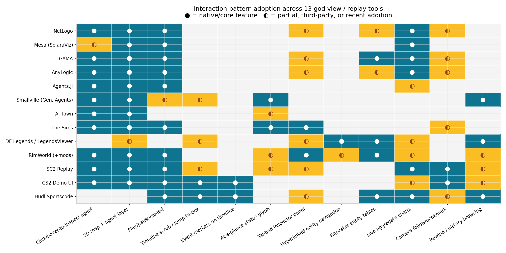

> Filed 2026-08-22 in `docs/research/dashboard-ui-prior-art/` — external
> research, not code-verified. One of two parallel broad surveys of
> god-view/replay UI prior art (the other is
> [godview-replay-abm-games-esports-survey.md](godview-replay-abm-games-esports-survey.md));
> this one's distinguishing artifact is an original interaction-pattern
> adoption matrix diagram (`figures/godview-replay-pattern-matrix/pattern-matrix.png`)
> scoring 13 tools against 8 recurring UI patterns. Feeds the dashboard
> design work, not any accepted ADR.

# God-View and Replay UI Prior Art for Agent Simulations

**A deep-research report for designing a web dashboard that observes and debugs a headless social simulation (beliefs with provenance, mutating rumors, grudges, schedules; ~25–1,000 NPCs; 2D god-view map, global tick scrubber, per-NPC inspector, play/pause/speed control).**

---

## Executive Summary

Four mature tool families have independently converged on the same interaction grammar for watching agent simulations, and none of them fully solves your problem — which is your opportunity. **Agent-based modeling (ABM) platforms** (NetLogo, Mesa, GAMA, AnyLogic) perfected *live* observation: a zoomable 2D world view, right-click/hover-to-inspect agent monitors, watch/follow/ride camera modes, and speed sliders that decouple render rate from sim rate — but they offer essentially **no rewind, no scrubbing, and no replay**  [(beta2 User Manual)](https://docs.netlogo.org/7.0.3/programming) . **Stanford's generative-agents (Smallville)** system pioneered the opposite: a per-step JSON snapshot log rendered through a Phaser town view with forward-only replay and a demo mode — documented as a debugging tool with known rough edges (identical sprites, storage bloat, start-at-step-N URLs)  [(Github)](https://github.com/joonspk-research/generative_agents) . **Games** (The Sims, Dwarf Fortress, RimWorld) solved *legibility at a glance*: the plumbob, thought/speech bubbles, tabbed inspect panes, need bars with traffic-light coloring, and hyperlink-style entity browsing of full simulation history  [(The Sims Wiki)](https://sims.fandom.com/wiki/Plumbob) . **Sports and RTS replay systems** (StarCraft II, CS2's demo UI, Hudl Sportscode, broadcast event markers) own the *timeline interaction grammar*: play/pause/speed presets, jump-to-tick, event icons embedded in the scrub bar, round/segment stepping, camera lock, and 15-second rewind  [(Liquipedia)](https://liquipedia.net/starcraft2/Replay_Features) .

The five-to-eight patterns that appear across multiple successful tools are: (1) **click/hover an agent → persistent inspector**, (2) **a single shared time control governing every view**, (3) **event markers on the timeline**, (4) **at-a-glance status glyphs over entities** (plumbob/emoji-bubble lineage), (5) **tabbed per-entity panels** organized by aspect (needs/health/social/history), (6) **hyperlinked entity-to-entity navigation** (the wiki pattern from Legends viewers), (7) **filterable sortable entity tables** as a complement to the map, and (8) **live aggregate charts docked beside the map**. The documented mistakes are equally consistent: coupling render rate to simulation rate (NetLogo's most-documented performance trap)  [(jasss.org)](https://www.jasss.org/20/1/3.html) , SVG/DOM rendering of thousands of per-entity marks (a hard ceiling around a few thousand nodes)  [(ApexCharts.js)](https://apexcharts.com/blog/svg-vs-canvas-charts/) , full-state snapshot-per-tick storage without delta compression (Smallville's compress step exists for a reason)  [(Github)](https://github.com/joonspk-research/generative_agents) , and shipping replay as an afterthought that can only start at a step and play forward  [(Github)](https://github.com/joonspk-research/generative_agents) .

---

## 1. Agent-Simulation Observation UIs (NetLogo, Mesa, GAMA, AnyLogic)

This family matters most for your *map + agents + live time* layer. These are the tools that have shipped "watch a running agent society" interfaces for two decades, and their communities have documented both the affordances that work and the ones that hurt.

### 1.1 NetLogo: the reference implementation of live god-view

NetLogo's Interface tab is the canonical layout: a large 2D (optionally 3D) **View** showing turtles, patches, and links, surrounded by widgets (sliders, switches, buttons, monitors, plots) that the modeler places  [(beta2 User Manual)](https://docs.netlogo.org/7.0.0/interfacetab.html) . The inspection grammar is well established: **right-click any turtle, patch, or link in the view → "inspect" opens an agent monitor** — a floating panel showing every agent variable with live values, an editable field for each variable (changing a value is equivalent to running `set` on the agent), a **mini-view** zoomed on the agent's neighborhood, and a **mini command center** scoped to that single agent so you can run code as that agent  [(The CCL)](https://ccl.northwestern.edu/netlogo/6.2.1/docs/interfacetab.html) . From the same right-click menu you can **watch, follow, or ride** a turtle — three camera-commitment levels: watch highlights and tracks the agent, follow pans the view to keep it centered, ride adopts its perspective  [(beta2 User Manual)](https://docs.netlogo.org/7.0.0/interfacetab.html) . Monitors can be closed individually, in bulk, or filtered to close only monitors of dead agents — an acknowledgment that observers accumulate many open inspectors  [(The CCL)](https://ccl.northwestern.edu/netlogo/6.2.1/docs/interfacetab.html) .

Time handling is NetLogo's most instructive design domain — mostly as a cautionary tale. NetLogo has a **tick counter** and a **speed slider**, but the slider does not control simulation speed directly; it controls *how often the view repaints*. On tick-based updates, slowing down inserts pauses between ticks; speeding up makes view updates *less frequent*, because repainting is the dominant cost  [(beta2 User Manual)](https://docs.netlogo.org/7.0.3/programming) . The frame-rate setting (default 30 fps) is a ceiling on updates per second, and at maximum speed several seconds may pass between repaints, which "may feel like the model has stopped" — the official FAQ has to reassure users to watch the tick counter instead  [(beta2 User Manual)](https://docs.netlogo.org/7.0.3/faq) . There is **no rewind, no history, no scrubber**: the view renders the live world, period. The view-update mode system (continuous vs. tick-based) exists precisely because intermediate rendering "can confuse the user of your model by letting them see things they aren't supposed to see, which may be misleading" — a direct precedent for your "every view renders as of tick T" consistency rule  [(beta2 User Manual)](https://docs.netlogo.org/7.0.3/programming) .

### 1.2 Mesa / SolaraViz: browser-native, but inspection is still a feature request

Mesa 3.x replaced its old Tornado-based browser viz with **SolaraViz**, a Solara (React-style Python) system that renders in the browser or Jupyter: you compose `make_space_component(agent_portrayal)` — a grid/continuous-space canvas where a portrayal function maps each agent to color/size/marker/zorder — with `make_plot_component(...)` time-series charts and model-parameter sliders, plus play/pause/step controls and a speed slider  [(Zenodo)](https://zenodo.org/records/14059185) . Two backends exist: Matplotlib-based space rendering and an Altair-based one, and portrayal styling is being consolidated into an `AgentPortrayalStyle` class  [(readthedocs.io)](https://mesa.readthedocs.io/latest/apis/visualization.html) . The architecture lesson from Mesa's history is churn: the visualization layer has been fully rewritten at least twice (Tornado modules → JupyterViz → SolaraViz), it sat in "experimental" status with breaking changes between minor releases, and Mesa's own docs still warn about API instability  [(Zenodo)](https://zenodo.org/records/14059185) .

The community criticism is explicit and on-point for you. **Clicking an agent to see its state is not built in**: issue #2795 ("Display info when clicking agents," May 2025) asks for exactly the inspector you plan — health, status, position on click — motivated by debugging and by mesa-llm wanting to "display the reasoning and the current discussions of an agent," i.e., LLM-agent internals  [(Github)](https://github.com/projectmesa/mesa/issues/2795) . A second issue (#3265, Feb 2026) requests an integrated analysis dashboard because data collection is separate from analysis and users must export to pandas/matplotlib to answer simple questions like "what is the average age of agents?"  [(Github)](https://github.com/mesa/mesa/issues/3265) . And there is **no replay or time scrubber at all** — SolaraViz renders the live model; stepping backward means re-instantiating. Mesa is proof that even a well-funded, actively maintained ABM framework in 2026 treats observation as "live map + plots" and leaves inspection, drill-down, and history to the user.

### 1.3 GAMA: declarative inspectors, browsers, and monitors

GAMA (Java/GAML, GIS-oriented, claims up to millions of agents) offers a **declarative UI**: modelers declare multi-layer 2D/3D displays, agent aspects (per-agent visual facets), user-controlled action panels, and "deep inspections on agents"  [(MIT Media Lab)](https://www.media.mit.edu/tools/gama-platform/) . Its inspection trinity is the most elaborate in the ABM family: the **agent inspector** (single agent: all variables, editable mid-simulation, with buttons to **highlight the agent across all displays**, focus it, or kill it), the **agent browser** (a table of *all* agents of a species with selectable attribute columns, right-click actions per row, and CSV export), and **monitors** (dashboard tiles that evaluate an arbitrary GAML expression every step — e.g., `length(prey) + length(predator)` — with inline compile feedback: red border while the expression is invalid, green when accepted)  [(gama-platform.org)](https://gama-platform.org/wiki/1.8.1/InspectorsAndMonitors) . Modelers can pre-declare inspectors as experiment outputs, with an important documented constraint: **only one `type: agent` inspector per experiment, but unlimited `type: table` browsers**, and inspecting large agent sets "can take a lot of time" — prefer the table for populations  [(gama-platform.org)](https://gama-platform.org/wiki/DefiningMonitorsAndInspectors) .

GAMA also ships participatory-simulation affordances — user panels that let a human take over an agent mid-run via a state-machine-specialized control architecture  [(jasss.org)](https://www.jasss.org/22/2/3.html)  — which is beyond your read-only scope but shows the platform treats the observer as an interactor. What GAMA shares with the rest of the family: everything is **live-state only**. There is no built-in scrubbing through history; the inspector shows "now." For your dashboard, GAMA's transferable ideas are the *highlight-across-all-views* selection model (select an NPC in a table → it highlights on the map and in the inspector simultaneously) and the *browser table with CSV export* as the population-scale complement to a map that stops being readable past a few hundred markers.

### 1.4 AnyLogic: polish, inspect windows, and the cost of commercial generality

AnyLogic's runtime UI is the most polished of the four: a single presentation canvas per agent type where animation, statecharts, charts, and controls coexist — "users can see both animation and model elements in the same window" and "analyze the whole state and behavior of the model at a glance"  [(AnyLogic)](https://www.anylogic.com/features/timeline/) . Two inspection idioms stand out. First, **inspect windows**: clicking any parameter or variable icon at runtime pops a small window with three modes — current value, edit value (interactively perturbing the model), and a **time plot of the variable's recent history**, backed by auto-created datasets with configurable recurrence time and sample limits  [(AnyLogic Help)](https://anylogic.help/anylogic/data/viewing.html) . Second, **view areas**: named rectangular regions of a large diagram that the user can jump between at runtime — essentially *camera bookmarks* for sprawling models  [(AnyLogic Help)](https://anylogic.help/anylogic/presentation/viewarea.html) . A recent chart-creation wizard auto-suggests per-element statistics (utilization, time-in-state, WIP, MTBF/MTTR) and assembles them into real-time dashboards  [(AnyLogic)](https://www.anylogic.com/blog/chart-creation-wizard-visualize-anylogic-model-statistics-easily/) .

The criticism pattern is also documented: per-agent detail inside a population is *not* automatic. A 2024 Stack Overflow thread asking how to view a *specific* agent's state at runtime is answered by the community's top AnyLogic expert with "build your own custom pop-up UI element… set its visibility on click" — i.e., the platform gives you the animation and the click event, but the per-agent inspector is DIY  [(Stack Overflow)](https://stackoverflow.com/questions/78118497/how-to-view-detailed-information-of-a-specific-agent-in-anylogic-model-at-runtim) . AnyLogic is also proprietary and general-purpose, so its agent-based affordances compete for UI space with discrete-event and system-dynamics tooling. The transferable patterns for you: the **three-mode inspect popover** (view → edit → history-sparkline) is a compact, proven interaction for per-variable time context, and **view areas** are a lightweight answer to "my town map is bigger than the viewport" without building a full minimap.

### 1.5 Bonus: Agents.jl — hover-to-inspect done right

Agents.jl (Julia) is worth citing because its interactive Makie-based apps implement the lightest-weight inspector in the family: with `add_controls` you get step/run/reset buttons, two sliders (steps-per-update and sleep time — an explicit decoupling of sim batch size from frame pacing), parameter sliders with an "update" commit button, and **agent inspection on mouse hover**: a tooltip at the cursor position listing the agent type, id, position, and every field's current value, concatenating agents when several share a position, with a documented customization hook (`agent2string`) for formatting  [(juliadynamics.github.io)](https://juliadynamics.github.io/Agents.jl/v5.9/agents_visualizations/) . This is the hover-tooltip alternative to NetLogo's floating monitor window — cheaper to open, no window management, but transient and not pinnable. Their own benchmark page also shows where the family stands on raw performance culture: the same models run 25×–300× slower in Mesa and NetLogo than in Agents.jl, which matters less for your *observer* than for the sim itself, but explains why these platforms lean so heavily on render-throttling tricks  [(juliadynamics.github.io)](https://juliadynamics.github.io/Agents.jl/v5.13/comparison/) .

### 1.6 What the ABM communities criticize — synthesis

Across forums, docs, and issue trackers, the recurring complaints about this family cluster into five buckets:

| Pain point | Evidence | Consequence for your design |
|---|---|---|
| **No rewind / no replay** — inspection is live-only | NetLogo view renders only current state; speed slider changes repaint cadence, not time travel  [(beta2 User Manual)](https://docs.netlogo.org/7.0.3/programming) ; Mesa has no time slider at all  [(readthedocs.io)](https://mesa.readthedocs.io/latest/apis/visualization.html)  | Your tick scrubber is the differentiator; treat "as of tick T" as the global invariant |
| **Per-agent inspection is missing or manual** | Mesa click-to-inspect is an open feature request  [(Github)](https://github.com/projectmesa/mesa/issues/2795) ; AnyLogic requires custom popups  [(Stack Overflow)](https://stackoverflow.com/questions/78118497/how-to-view-detailed-information-of-a-specific-agent-in-anylogic-model-at-runtim)  | Ship click→inspector as a first-class, always-available gesture |
| **Render/update coupling causes confusion** | NetLogo: fast slider → seconds between repaints → "seems stopped"  [(beta2 User Manual)](https://docs.netlogo.org/7.0.3/faq) ; continuous updates can show misleading mid-tick states  [(beta2 User Manual)](https://docs.netlogo.org/7.0.3/programming)  | Decouple sim rate, render rate, and *displayed tick* explicitly; never show mid-tick state |
| **Population-scale inspection doesn't scale** | GAMA: inspecting many agents is slow, use the table  [(gama-platform.org)](https://gama-platform.org/wiki/DefiningMonitorsAndInspectors) ; NetLogo closes monitors for dead agents in bulk  [(The CCL)](https://ccl.northwestern.edu/netlogo/6.2.1/docs/interfacetab.html)  | Provide the entity table as the scalable sibling of the map from day one |
| **Viz stacks churn and break** | Mesa's viz rewritten twice in ~5 years, still "experimental"  [(Zenodo)](https://zenodo.org/records/14059185)  | Keep your rendering layer boring and thin over a stable snapshot format |

The positive lesson is just as clear: the **right-click/hover → inspector** gesture and the **watch/follow/ride camera triad** are so proven across NetLogo, GAMA (highlight/focus), and AnyLogic (click → popup) that deviating from them needs a reason. NetLogo's editable inspector variables and per-agent command console also hint at a debugging power you may want later (mutation during pause), even if v1 is read-only  [(The CCL)](https://ccl.northwestern.edu/netlogo/6.2.1/docs/interfacetab.html) .

---

## 2. The Stanford Generative-Agents (Smallville) Replay UI and Its Successors

This is the closest shipped system to yours — an LLM-driven social sim of 25 agents in a 2D town — and its README and paper are unusually candid about the UI being a debugging scaffold rather than a product.

### 2.1 Architecture: per-step JSON, Django environment server, Phaser town view

Smallville's environment is a **Phaser** (HTML5 game framework) 2D sprite world — tile map, collision map, authored agent avatars — served by a Django "environment server"  [(ACM Digital Library)](https://dl.acm.org/doi/fullHtml/10.1145/3586183.3606763) . The runtime contract is a **JSON data structure holding each agent's current location, current-action description, and the sandbox object being interacted with**; at each sandbox time step the server parses the JSON for changes, moves agents to new positions, and updates object states (e.g., coffee machine "idle" → "brewing coffee"), then loops  [(arXiv.org)](https://arxiv.org/pdf/2304.03442) . One game step equals 10 seconds of game time; the simulation advances via a separate Python "reverie" backend server driven from a CLI (`run <step-count>`, `fin` to save, fork-name/new-name simulation management)  [(Github)](https://github.com/joonspk-research/generative_agents) . The crucial property for replay: the system persists the world's evolving state **per step** (movement files and environment frames in a simulation folder), which is exactly the "JSON-snapshot-per-tick" architecture you describe.

Observation UI specifics: on the live map each agent's current action is surfaced as **emoji in a speech bubble above the sprite** — an LLM translates the natural-language action ("Isabella is writing in her journal") into a small emoji set for glanceable overhead reading — and **clicking the avatar reveals the full natural-language action description**  [(ACM Digital Library)](https://dl.acm.org/doi/fullHtml/10.1145/3586183.3606763) . Agents perceive only entities within a preset visual range, and the same JSON channel powers both rendering and agent perception  [(arXiv.org)](https://arxiv.org/pdf/2304.03442) . This two-level pattern — *glyph for ambient awareness, click for the full sentence* — is the most directly stealable idea in the whole Smallville design, and note its lineage: it is functionally The Sims' thought bubble applied to machine agents.

### 2.2 Replay and demo modes: what's actually documented

The README documents three viewing modes with distinct purposes  [(Github)](https://github.com/joonspk-research/generative_agents) :

| Mode | URL shape | Purpose & documented behavior |
|---|---|---|
| Live | `/simulator_home` | Map + list of active agents; pan with keyboard arrows; updates as the backend runs steps  [(Github)](https://github.com/joonspk-research/generative_agents)  |
| Replay | `/replay/<sim>/<starting-step>` | "Primarily intended for debugging purposes"; all character sprites look identical; plays from the given step  [(Github)](https://github.com/joonspk-research/generative_agents)  |
| Demo | `/demo/<sim>/<starting-step>/<speed 1–5>` | Requires running `compress_sim_storage.py` first to shrink the folder and fix sprites; speed parameter 1 (slowest) to 5 (fastest)  [(Github)](https://github.com/joonspk-research/generative_agents)  |

Two facts in that table carry design weight. First, **replay is addressed by URL** — simulation name and starting step are route parameters — which makes a particular moment shareable and bookmarkable, a property your dashboard should keep (deep-linkable ticks). Second, replay is *start-at-step-N and play forward*: there is no documented scrub bar, no backward stepping, no pause-and-inspect-state-in-history. The persona-state endpoint spotted by users (`replay_persona_state/<sim>/<step>/<agent>`) renders one agent's full state at a step — the community noted it is unfiltered ("lots of 'X is idle' notes") and that memory streams mix the mundane with the meaningful with no salience surfacing  [(Hacker News)](https://news.ycombinator.com/item?id=35517649) . The same Hacker News thread flags the architectural gap you are explicitly planning to close: observers wanted to "enter into a single moment to do a comparison" and mused about operational transforms "to make rewind and effect tracking into first-class operations"  [(Hacker News)](https://news.ycombinator.com/item?id=35517649) .

### 2.3 Documented limitations

The README is blunt: replay "does not prioritize optimizing the size of the simulation folder or the visuals," identical sprites in replay mode, and a separate manual **compression step** is required before a simulation is presentable  [(Github)](https://github.com/joonspk-research/generative_agents) . Storage shape is the root cause: per-step environment frames and per-step movement JSON accumulate in the simulation folder, and fork-based save/restart means storage grows linearly with steps × agents  [(Github)](https://github.com/joonspk-research/generative_agents) . A derivative project (a hospital re-implementation) replaced the pile of per-step files with a **delta-encoded `master_movement.json`** and a single-file vanilla-JS canvas replayer — evidence that the fix practitioners reach for is delta compression plus a static replay artifact  [(Github)](https://github.com/georgia-max/hospital-generative-agents/blob/main/README.md) . Operational limitations compound the UI ones: runs "cost thousands of dollars in token credit and tak[e] multiple days" for 25 agents over two simulated days, the API can hang at rate limits, and the authors recommend saving often  [(Github)](https://github.com/joonspk-research/generative_agents) . For a 25–1,000 NPC sim, the lessons are: (a) snapshot-per-tick is fine as a *concept*, but store deltas or structured frames, not whole-world JSON per tick; (b) build the scrubber *against the log*, not against the live engine — Smallville's replay reads files, which is why it works at all; (c) unfiltered raw state dumps (the persona-state page) are a debugging dead end — surface salience, don't make the user read idle notes.

### 2.4 Successors and forks: what changed in the observation layer

The direct open-source successor worth studying is **AI Town** (a16z-infra): a TypeScript/MIT re-implementation of the generative-agents concept on Convex (game engine, DB, and vector search in one reactive backend), with **all rendering done in PixiJS** (WebGL) rather than Phaser  [(Github)](https://github.com/a16z-infra/ai-town) . AI Town's contribution to your question is mostly architectural: it demonstrates that the town view, agent interaction, and chat overlays can run as a *reactive query layer over a transactional database* — the UI subscribes to state rather than polling snapshot files — and that PixiJS/WebGL comfortably renders the town with animations and music in a browser  [(Github)](https://github.com/a16z-infra/ai-town) . It has no replay/scrubber either, confirming that **nobody in the Smallville lineage has shipped real time-travel observation** — the gap is still open.

At the other scale extreme, **OASIS** (CAMEL-AI et al.) runs up to **one million** LLM agents on simulated Twitter/Reddit, with an environment server (SQLite-backed state of posts/profiles/relationships), a time engine activating agents by hourly activity probabilities, and 23 action types  [(Github)](https://github.com/camel-ai/oasis) . Notably, OASIS's observation story is *post-hoc analysis of the database* (tutorials on "visualize and analyze social simulation data once your experiment concludes") rather than a live god-view  [(Github)](https://github.com/camel-ai/oasis)  — at million-agent scale the map metaphor dies and dashboards/SQL win, which brackets your design space: at 25–1,000 NPCs you are exactly at the largest scale where a spatial god-view remains the primary instrument. **AgentSociety** (Tsinghua) adds an online platform, needs/emotion-driven agents, and a research toolkit for interventions and data collection over a Ray-distributed engine  [(readthedocs.io)](https://agentsociety.readthedocs.io/)  — again with analysis-after-the-run rather than time-travel debugging. The summary judgment: the Smallville lineage proves the *content* model (speech bubbles, click-for-detail, per-step persistence) and the *storage pitfalls*, while deliberately under-investing in the *interaction* model — your timeline-scrubbed, every-view-as-of-T dashboard is a genuine step beyond all of them.

---

## 3. Game-Shipped God Views

Games are the only category here whose observation UIs were refined by millions of non-expert users. Their contribution is **legibility**: how to make hidden simulation state (mood, needs, relationships, grudges, history) readable in under a second.

### 3.1 The Sims: the plumbob, the bubbles, the panels

The Sims' genius is a strict three-tier information hierarchy mapped onto three UI elements. Tier 1, *ambient*: the **plumbob** — the colored diamond floating over the selected Sim — encodes overall mood on a traffic-light continuum (bright green good → pale → yellow/orange → deep red horrible), with the exact color scale varying per title but the semantics stable for 25 years; in The Sims 4 it reflects the *lowest* need, i.e., worst-case-first summarization  [(The Sims Wiki)](https://sims.fandom.com/wiki/Plumbob) . Alongside it, **thought and speech bubbles** above heads show *what the Sim is currently thinking about or discussing* — an icon of the topic (a broken toilet, another Sim, a holiday) — giving cause-level context without opening anything  [(GameSpot)](https://gamefaqs.gamespot.com/boards/927463-the-sims-2/41655139) . Tier 2, *summary*: the **Needs panel** — six bars (Bladder, Fun, Hunger, Social, Energy, Hygiene) that decay continuously, each bar color-coding its own urgency (green → yellow → orange → red as it empties), with the panel icon's background also changing color so alertness survives a collapsed panel; clicking a need's icon **auto-resolves** it (the Sim pathfinds to the nearest satisfier), turning inspection into action  [(IGN)](https://www.ign.com/wikis/the-sims-4/Interface) . Tier 3, *detail*: tabbed panels — **Skills** (level + progress + hover for benefits), **Relationships** (filterable by friends/family/romantic, sorted, with per-relationship bars)  [(IGN)](https://www.ign.com/wikis/the-sims-4/Interface) , and **moodlets** — stacked, color-coded icons next to the emotion word that collapse into vertical bars when numerous, expandable on click, each encoding *cause* (e.g., "Playful because watching the Romance Channel")  [(IGN)](https://www.ign.com/wikis/the-sims-4/Interface) .

Why it's legible: every element answers a different question at a different distance. The plumbob answers "is anyone in trouble?" from across the map; bubbles answer "what is this one doing/thinking right now?"; bars answer "which need will go critical first?"; moodlets answer "*why* does she feel this way?" — and the moodlet's colored background does the emotional-valence encoding so the icon itself can carry content  [(IGN)](https://www.ign.com/wikis/the-sims-4/Interface) . The **action queue** (icons for queued actions with hover-to-cancel red-X) makes *intent* visible, not just state  [(IGN)](https://www.ign.com/wikis/the-sims-4/Interface) . For your dashboard, the direct translations are: a per-NPC worst-case glyph over the map marker (plumbob), current-action emoji/text bubble (which Smallville already validated), a grudge/belief list styled like moodlets — *content icon + valence color + hover for provenance* — and a schedule/queue strip styled like the action queue. Note also the documented tension: players mod bubbles *off* for screenshots and ask for plumbobs to disappear in photo mode — ambient glyphs are glanceable precisely because they're optional chrome, so make them toggleable  [(youtube.com)](https://www.youtube.com/shorts/faXc0kVr-rE) .

### 3.2 Dwarf Fortress Legends mode and the third-party viewers: browsing simulation *history*

Dwarf Fortress is the existence proof that a consumer audience will browse deep simulation history if navigation is right. **Legends mode** is a read-only browser of the generated world: a category landing page (figures, sites, civilizations, artifacts, wars… with entry counts), each category opening a tab with a sortable list, each entry opening a page with title, description, **chronological event list**, and notable stats — and every highlighted phrase in an event is a **hyperlink to the related entity, colored by category**, opening in a new tab  [(Dwarf Fortress Wiki)](http://dwarffortresswiki.org/legends) . This is Wikipedia navigation over simulation output, and it scales to ~10,000-year worlds with gigabyte XML exports (the docs warn a large dump "can produce an XML up to a full gigabyte" and "may prove unwieldy")  [(Dwarf Fortress Wiki)](http://dwarffortresswiki.org/legends) . The built-in export tooling (XML dump, DFHack's `exportlegends info` producing the richer `legends_plus.xml`) exists because the community demanded the data *out* of the game  [(Github)](https://github.com/Kromtec/LegendsViewer/blob/master/README.md) .

The third-party viewers add the missing search and map layers. **LegendsViewer** (and its maintained successor LegendsViewer-Next) recreates Legends mode from the exported files with: browser-style tabs (Ctrl+Click opens a new tab), per-tab sorting and filtering, an Events sub-tab on every entity, advanced search over *sub-lists* (e.g., "historical figures with Kills > 10" or "kills where race = elf," with Min/Max/Sum/Avg ordering) — and a **map with a time dimension**: click-drag panning, wheel zoom, and **Ctrl+wheel / Shift+wheel / Ctrl+Shift+wheel scrub the map backward and forward by 1/10/100 years**, showing territory change over time  [(Github)](https://github.com/Kromtec/LegendsViewer/blob/master/README.md) . Documented performance guidance matters to you: "Bigger worlds will perform slower," busy pages take seconds, and selecting too many events over a long era "can result in GBs of memory being used"  [(Github)](https://github.com/Kromtec/LegendsViewer/blob/master/README.md) . **Legends Browser 2** (Go, serves a local web app at `localhost:58881`) takes the same data into a browser with pages-of-linked-objects plus statistics and overviews not in the base game, and its server mode lets people self-host legends for a livestream audience  [(Github)](https://github.com/robertjanetzko/LegendsBrowser2) . The transferable patterns: (a) **history as a hyperlinked entity graph** — your "belief X ← told by Y ← witnessed Z" chain is exactly a Legends event chain, and colored-by-type inline links are the proven rendering; (b) **modifier-key time scrubbing on the map** as an accelerator for power users (with a visible scrubber for everyone else); (c) every viewer is **file-offline**: they read an export, never the live game — again, observation built against a log.

### 3.3 RimWorld: the inspect pane and the mod ecosystem that completed it

RimWorld's core inspection pattern is the **inspect pane**: selecting any pawn, item, or structure pins a detail panel at the bottom-left; selecting multiple same-type objects auto-lists the quantity; when nothing is selected, a *cell info* readout shows whatever is under the cursor (terrain, objects, filth, light level) — zero-cost ambient inspection on hover  [(RimWorld Wiki)](https://rimworldwiki.com/wiki/User_interface) . Pawn inspection is **tabbed by aspect**: Bio, Needs, Health (with an iconic injury language — bleeding droplet sized by severity, open circle = needs tending, bandage shade = treatment quality), Gear, Social, Records, etc.  [(RimWorld Wiki)](https://rimworldwiki.com/wiki/Health) . The surrounding chrome is equally instructive: a **colonist bar** across the top (portrait-per-colonist as persistent selection shortcuts), an **alerts column** top-right pushing urgent state ("about to go insane," "needs rescue") so the player doesn't have to poll, and the **time-speed control** bottom-right — pause / normal / fast / faster — the Sims-like control you're already planning  [(RimWorld Wiki)](https://rimworldwiki.com/wiki/User_interface) .

The third-party layer tells you what the base UI failed to surface. **RimHUD** integrates a richer at-a-glance HUD into the inspect pane (resizable, or dockable as a floating window) with **visual warnings for life-threatening conditions, untended wounds, and imminent mental breakdowns** — i.e., the community re-added plumbob-style worst-case surfacing that vanilla lacked  [(Github)](https://github.com/Jaxe-Dev/RimHUD) . **Numbers** adds a fully customizable spreadsheet tab — any stat, skill, need, gear, or *queued job* as a column across all pawns, sortable headers, click-to-jump-to-pawn, drag-to-reorder, shareable presets  [(Github)](https://github.com/Mehni/kNumbers) . The lesson pair: (1) per-entity tabbed inspectors are necessary but not sufficient — at colony scale users need the **sortable cross-entity table** (your "which NPCs currently hold belief X?" question is a Numbers query), and (2) **proactive alerts beat passive panels**: for rumor flares and grudge formation in a 1,000-NPC town, an alert stream with click-to-focus will outperform any panel.

---

## 4. Sports and RTS Replay Conventions

This family owns the *interaction grammar of recorded time* — the thing your global scrubber must get right — and players worldwide already know it fluently.

### 4.1 RTS replays: StarCraft II

StarCraft II's replay system is the RTS reference: replays are tiny (~100 KB per 15-minute game — *input/event logs*, not video), and the viewer offers **jump-back to any point already seen** (forward requires fast-forward, up to 8×), a **15-second rewind hotkey (B)**, play/pause, and restart  [(Liquipedia)](https://liquipedia.net/starcraft2/Replay_Features) . Camera grammar: lock/follow camera on any unit (Ctrl+F), per-player first-person vision toggles (hold V to see a player's view while held), and team/unit color toggles  [(Liquipedia)](https://liquipedia.net/starcraft2/Replay_Features) . The observer-stat panels are the deep lesson: a hotkey-switched overlay (Resources, Income, Spending, Units, Units Lost, Production, Active Forces, APM) plus large top-center comparative panels (player name/supply, income, army vs. worker supply, kills) — **always-on aggregate context docked around the map**, each panel one keystroke away  [(Liquipedia)](https://liquipedia.net/starcraft2/Replay_Features) . HotS added "Take Command" — jumping *into* a replay to play from that moment — which is the game version of your possible future "fork simulation from tick T" feature  [(Liquipedia)](https://liquipedia.net/starcraft2/Replay_Features) .

Two caveats from the same source: SC2's rewind is *only* to points already seen (the engine re-simulates from the last checkpoint — a known trick when backward stepping isn't native), and going forward past your watched position is impossible without fast-forwarding  [(Liquipedia)](https://liquipedia.net/starcraft2/Replay_Features) . For your architecture this suggests the standard implementation choice: either store frames densely enough that any tick is cheap to render, or store periodic keyframes + event deltas and reconstruct on jump (the replay-engine compromise). Given your stated snapshot design, dense frames with delta encoding (the hospital fork's approach) is the right side of that trade  [(Github)](https://github.com/georgia-max/hospital-generative-agents/blob/main/README.md) .

### 4.2 FPS demos and 2D replay sites: CS2

Counter-Strike's demo UI (Shift+F2) is the most explicit timeline grammar in gaming: a **scrub bar with kill icons embedded directly on the timeline** — "icons representing kills on the replay UI timeline… use this timeline to navigate to specific in-game moments" — plus **round stepping** (jump to next/previous round start), ±15 s skip, speed presets from ¼× to 8×, highlight mode (auto-tour of key moments), tick-precise jumps (`demo_gototick`), per-player POV cycling, free camera, and X-ray overlay (see through walls — the god-view toggle)  [(Thunderpick)](https://thunderpick.io/blog/cs2-replay-controls-a-complete-guide) . The web-native descendants generalize this: scope.gg renders the whole demo as a **2D top-down replay in the browser**, "each round of the match separately as a timeline with key events — click on the desired time or event to jump to it," with kills visualized on both map and timeline  [(Scope.gg)](https://scope.gg/replay/) .

The transferable grammar for your scrubber, in order of importance: **event markers *in* the scrub bar** (rumor mutations, grudge formations, conversations as clickable icons — this is the single highest-value convention for you, since your research questions are event-anchored); **segment stepping** (rounds → your day/schedule-block boundaries); **speed presets** (¼×–8× is the proven range; users think in these terms, not in raw tick rates); **±N-seconds skip** for the "wait, what just happened?" reflex; and **X-ray as a reminder** that god-view overlays (belief-state coloring, rumor-state overlays) should be toggles on the map, not separate screens.

### 4.3 Sports video analysis and broadcast overlays

Professional sports tooling adds the *analyst workflow* layer. Hudl Sportscode's model: a **timeline of tagged instances** (every coded event is a draggable, labeled segment on the timeline), click any instance to jump the playhead, drag-select multiple instances, matrix/sorter views cross-tabulating tags, playlists assembled from instances, frame-accurate scrubbing (its release notes obsess over scrub smoothness during long captures — e.g., "smooth, responsive timeline scrubbing during long capture sessions, even after recording for over 60 minutes")  [(Hudl)](https://www.hudl.com/releases/sportscode) . The must-have feature list for coaching tools reads as your scrubber spec: tag key moments → filter an hour to a 5-minute playlist, telestration (draw on the view), slow-motion and frame-by-frame, shareable clips with notes  [(callplaybook.com)](https://blog.callplaybook.com/blog/coach-video-review-software-hudl-dartfish-alternatives) . On the broadcast side, real-time **event markers on the progress bar** (goals, penalties, red cards as interactive icons; "navigate the game like chapters") have shipped at scale and measurably increased usage — mainstream users navigate by *events*, not by timestamps  [(Big Blue Marble)](https://www.bigbluemarble.com/en/resources/post/great-sports-moments/) .

The synthesis for your timeline: the scrubber is not a position control, it is an **event index**. Every successful system in this family treats the timeline as a striped, icon-bearing, segment-aware object (kills/rounds/instances/goals), with click-to-jump as the primary interaction and dragging as secondary. A bare slider is the tell-tale of a prototype.

---

## 5. Performance with Hundreds of Entities on the Map

Your 25–1,000 NPC range sits exactly at the boundary where rendering technology choice stops mattering for correctness and starts mattering for headroom — the benchmarks below quantify where the walls are.

### 5.1 What the ABM platforms learned about rendering cost

NetLogo's documentation is the most honest accounting anywhere of map-rendering economics: "The more time NetLogo spends updating the view, the slower your model will run"  [(beta2 User Manual)](https://docs.netlogo.org/7.0.3/programming) . Its mitigations are all applicable to a web canvas: **update once per tick, not continuously** (tick-based updates are "consistent, predictable," avoid misleading mid-tick states, and are faster); **decouple the speed control from rendering** by dropping frames rather than slowing simulation; **cache glyph rasterizations** (NetLogo caches 2D renderings for turtle sizes 1/1.5/2); and let users **freeze the display entirely** while the model keeps running  [(beta2 User Manual)](https://docs.netlogo.org/7.0.3/programming) . The JASSS performance study quantifies it: with per-tick view updates, one profiled model spent ~12.9 s of a run in display-related code vs. 5.1 s with updates off — display work was over half the runtime — and per-agent color/shape *code* written for display purposes was itself a measurable cost  [(surrey.ac.uk)](https://jasss.soc.surrey.ac.uk/20/1/3/3.pdf) . Translation to your dashboard: render "as of tick T" from the frame log, at your own cadence, and never let rendering throttle scrubbing; if the user drags the scrubber, render only the settled frame (or a coarse intermediate), not every intermediate tick.

### 5.2 Canvas vs. SVG vs. WebGL: the actual numbers

Independent 2024–2026 benchmarks agree on the thresholds. SVG (one DOM node per mark) is fully interactive and accessible but hits a practical wall at **a few thousand individual marks**: one measured test shows 100 elements at 2 ms/60 fps, 1,000 at 15 ms/60 fps, **5,000 at 85 ms/35 fps, and 10,000 at 210 ms/12 fps**  [(SVG Genie)](https://www.svggenie.com/blog/svg-vs-canvas-vs-webgl-performance-2025) . Canvas (one bitmap) stays flat at scale: 1,000 elements at 3 ms, **10,000 at 18 ms/60 fps, 50,000 at 45 ms/55 fps**, 100,000 at 95 ms/40 fps  [(SVG Genie)](https://www.svggenie.com/blog/svg-vs-canvas-vs-webgl-performance-2025) . The nuance that most comparisons miss: cost tracks *node count*, not data count — a 20,000-point line is one `<path>` and fine in SVG; a 5,000-point scatter is 5,000 nodes and not  [(ApexCharts.js)](https://apexcharts.com/blog/svg-vs-canvas-charts/) . A common decision rule: **< ~1,000 marks → SVG is fine; low thousands of individual marks → measure; tens of thousands → canvas; hundreds of thousands or real-time → WebGL** (PixiJS for 2D)  [(ApexCharts.js)](https://apexcharts.com/blog/svg-vs-canvas-charts/) .

For your map, the practical reading: 1,000 NPC markers + rumor overlays is *borderline* for naive SVG-per-marker and trivial for canvas or WebGL — which is why both successful town renderers (Phaser for Smallville, PixiJS for AI Town) are canvas/WebGL engines  [(ACM Digital Library)](https://dl.acm.org/doi/fullHtml/10.1145/3586183.3606763) . The established hybrid pattern is **canvas/WebGL for the map and markers, DOM/SVG overlay for labels, tooltips, and the inspector**  [(SVG Genie)](https://www.svggenie.com/blog/svg-vs-canvas-vs-webgl-performance-2025) . Since canvas has no per-element hit testing, use a spatial index for picking (a quadtree, or the D3 hidden-canvas color-key trick: draw each marker in a unique color on an offscreen canvas and read the pixel under the cursor)  [(Observable)](https://observablehq.com/@bumbeishvili/svg-vs-canvas) . Budget-conscious extras from the same sources: scale the backing store by `devicePixelRatio` or accept blur on retina  [(SVG Genie)](https://www.svggenie.com/blog/svg-vs-canvas-vs-webgl-performance-2025) ; keep text (NPC names) in the DOM overlay rather than rasterizing it; and remember the interaction side of the trade — per-marker hover/click is free in SVG and must be built manually on canvas  [(ApexCharts.js)](https://apexcharts.com/blog/svg-vs-canvas-charts/) .

---

## 6. Convergent Interaction Patterns: What to Adopt

Reading across all four families, twelve candidate patterns recur (see the matrix figure above); the following eight appear in **at least three independent tool families** and carry documented user validation. They are the conventions to adopt as defaults, in priority order for your build.

| # | Pattern | Where it converged | Why it wins for your dashboard |
|---|---|---|---|
| 1 | **Click/hover entity → persistent inspector** (right-click menu in NetLogo; hover tooltip in Agents.jl; click avatar in Smallville; inspect pane in RimWorld) | ABM platforms, Smallville, Sims-likes  [(The CCL)](https://ccl.northwestern.edu/netlogo/6.2.1/docs/interfacetab.html)  | Your per-NPC inspector is the heart of debugging provenance; make it pinnable and always one click away |
| 2 | **One global time control governing all views** (replay systems' scrub bar; LegendsViewer map-year wheel; NetLogo's tick counter as source of truth) | RTS/FPS/sports replays, DF viewers, ABM (partially)  [(Thunderpick)](https://thunderpick.io/blog/cs2-replay-controls-a-complete-guide)  | "Every view renders as of tick T" *is* this pattern; the scrubber should be global chrome, not per-panel |
| 3 | **Event markers embedded in the timeline** (CS2 kill icons, scope.gg round events, Hudl instances, broadcast goal markers) | FPS demos, 2D replay sites, sports analysis, broadcast  [(Thunderpick)](https://thunderpick.io/blog/cs2-replay-controls-a-complete-guide)  | Your questions are event-anchored (rumor born/mutated, grudge formed); stripe the scrub bar with clickable typed icons |
| 4 | **At-a-glance status glyph over the entity** (plumbob; Sims thought bubbles; Smallville emoji speech bubbles; RimHUD warnings) | Sims, Smallville, RimWorld mods  [(The Sims Wiki)](https://sims.fandom.com/wiki/Plumbob)  | Encode worst-case NPC state (e.g., strongest active grudge / newest rumor believed) on the map marker itself; toggleable |
| 5 | **Tabbed per-entity panels by aspect** (Sims Needs/Skills/Relationships; RimWorld Bio/Needs/Health/Social; Legends entry pages with event tabs) | Sims, RimWorld, DF viewers  [(IGN)](https://www.ign.com/wikis/the-sims-4/Interface)  | Beliefs / schedule / relationships / event history are natural tabs; keep the tab set stable across NPCs |
| 6 | **Hyperlinked entity-to-entity navigation** (Legends mode inline category-colored links; LegendsViewer Ctrl+Click new tab) | DF Legends ecosystem  [(Dwarf Fortress Wiki)](http://dwarffortresswiki.org/legends)  | Provenance chains ("told by Y ← witnessed Z") should render as inline colored links you can walk like a wiki |
| 7 | **Filterable, sortable cross-entity table as the map's sibling** (GAMA agent browser + CSV; RimWorld Numbers mod; LegendsViewer advanced search over sub-lists) | GAMA, RimWorld mods, DF viewers  [(gama-platform.org)](https://gama-platform.org/wiki/1.8.1/InspectorsAndMonitors)  | "All NPCs who believe variant X of rumor R" is a table query, not a map query; add click-to-focus-on-map per row |
| 8 | **Live aggregate charts docked beside the map** (NetLogo/ Mesa plot widgets; SC2 observer stat panels; AnyLogic chart wizard) | ABM platforms, RTS observer UI, AnyLogic  [(Zenodo)](https://zenodo.org/records/14059185)  | Rumor adoption curves, belief-count histograms, grudge-graph density over time — always visible, hotkey-toggleable |

Two honorable mentions that fall just short of three-family convergence but fit you unusually well: **camera follow/watch modes** (NetLogo watch/follow/ride; SC2 unit lock; AnyLogic view areas as bookmarks)  [(beta2 User Manual)](https://docs.netlogo.org/7.0.0/interfacetab.html)  — cheap to build on a pannable map and invaluable when tracking one NPC through a scrub; and the **three-mode inspect popover** (AnyLogic's value → edit → history-sparkline)  [(AnyLogic Help)](https://anylogic.help/anylogic/data/viewing.html) , which suggests giving every scalar in your inspector an inline sparkline across ticks.

---

## 7. Documented Mistakes to Avoid

These are failure modes with an explicit paper trail — not speculation. Each is phrased as the mistake, its documented consequence, and the design rule it implies for your dashboard.

**Coupling render rate to simulation rate (NetLogo's trap).** When "faster" means "repaint less often," users watch a frozen screen and think the model died; NetLogo's own FAQ has to explain "watch the tick counter"  [(beta2 User Manual)](https://docs.netlogo.org/7.0.3/faq) . When updates are continuous, users see misleading mid-tick states  [(beta2 User Manual)](https://docs.netlogo.org/7.0.3/programming) . *Rule: the scrubber renders frames from the log; simulation speed, render cadence, and displayed tick are three separate numbers, and mid-tick state is never shown.*

**Per-tick full-world JSON snapshots without compression (Smallville's trap).** Replay storage bloat forced a manual `compress_sim_storage.py` step before demos, and even then sprites were wrong in raw replay mode  [(Github)](https://github.com/joonspk-research/generative_agents) ; the community rewrite went to delta-encoded movement  [(Github)](https://github.com/georgia-max/hospital-generative-agents/blob/main/README.md) . *Rule: keyframe + delta (or structured per-agent diffs) from day one; make "export a compressed replay artifact" a first-class output, not a cleanup script.*

**Live-only observation (the whole ABM family's gap).** NetLogo, Mesa, GAMA, and AnyLogic all inspect "now" — Mesa's click-to-inspect is still an open feature request and there is no time slider anywhere in the family  [(Github)](https://github.com/projectmesa/mesa/issues/2795) . *Rule: your differentiator is that inspection works identically at any tick; don't let v1 ship a map that scrubs but inspectors that only show live state.*

**Unfiltered state dumps (Smallville's persona-state page).** Exposing the full memory stream per agent per step produced pages of "X is idle" noise; readers immediately asked for salience filtering  [(Hacker News)](https://news.ycombinator.com/item?id=35517649) . *Rule: every raw log view needs a significance filter and an "all events" toggle, in that order.*

**SVG-per-marker at population scale (the DOM ceiling).** Thousands of individual SVG marks degrade measurably (85 ms / 35 fps at 5,000 nodes)  [(SVG Genie)](https://www.svggenie.com/blog/svg-vs-canvas-vs-webgl-performance-2025) . *Rule: map and markers on canvas/WebGL; DOM only for overlays, labels, tooltips, panels.*

**One-size inspection that doesn't scale with population (GAMA's documented constraint).** Inspecting many agents individually "can take a lot of time," forcing the table fallback  [(gama-platform.org)](https://gama-platform.org/wiki/DefiningMonitorsAndInspectors) ; DF viewers warn that bulk event queries can eat GBs of memory  [(Github)](https://github.com/Kromtec/LegendsViewer/blob/master/README.md) . *Rule: the entity table and its filters are the population-scale inspection path; virtualize rows and paginate event lists.*

**Replay bolted on as forward-only playback (Smallville again, and pre-HotS RTS replays).** Start-at-step-N URLs without scrubbing; SC2 historically couldn't go forward except by fast-forward and could only rewind to seen points  [(Github)](https://github.com/joonspk-research/generative_agents) . *Rule: random access to any tick is the acceptance test; if your storage can't serve it, fix storage first.*

**Viz-layer churn (Mesa's trap).** Three visualization systems in five years, still flagged experimental  [(Zenodo)](https://zenodo.org/records/14059185) . *Rule: freeze your snapshot/frame schema early and version it; the UI can iterate, the log format should not.*

---

## 8. Putting It Together for Your Dashboard

Your four planned views map onto the prior art cleanly, and the mapping suggests both a build order and where to spend design capital. The **2D god-view** should be a canvas/WebGL map with plumbob-style worst-case glyphs and Sims/Smallville-style action bubbles over markers, right-click-or-click → pinned inspector (NetLogo gesture), highlight-across-views selection (GAMA), and toggleable rumor-state overlays (CS2 X-ray precedent). The **global timeline scrubber** should follow the CS2/Hudl grammar, not the NetLogo slider: typed event icons in the bar, day/schedule-block segment stepping, ±N-tick skip, speed presets, deep-linkable ticks (Smallville's one good replay idea), and frame-accurate rendering from a delta-compressed log. The **per-NPC inspector** should be a RimWorld/Sims-style tabbed panel — Beliefs (with provenance links styled as Legends hyperlinks), Schedule/queue (Sims action queue), Relationships/grudges (Sims relationship bars), Event history (Legends event list) — with AnyLogic-style sparklines behind scalars. The **play/pause/speed control** is the least novel and most constrained piece: Sims/RimWorld preset speeds with a distinct pause, decoupled from rendering per NetLogo's hard-won documentation.

The strategic conclusion the research supports: the tool you are describing sits in a genuine gap. The ABM family has inspection without time travel; the Smallville lineage has persistence without interaction; the games have legibility without debugging depth; the replay systems have the timeline grammar without agent semantics. No cited tool combines all four — which means your design risk is not "has this been done better," it is disciplined adoption of proven conventions (Section 6) while refusing the documented shortcuts (Section 7). For Prompt 2's harder problems (causality drill-down, lineage trees, run comparison), the strongest foundation this report can offer is the observation that Legends-style hyperlinked event chains and Hudl-style event-indexed timelines are the two *already-legible* metaphors onto which tracing-style drill-down can be grafted without teaching users a new grammar.
