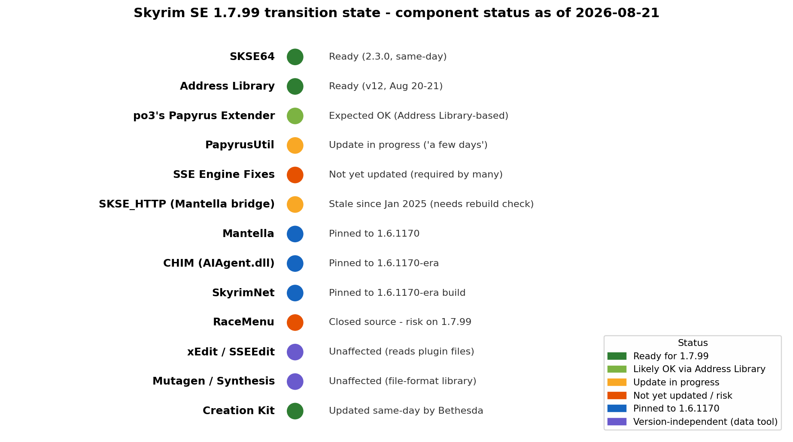

# Skyrim SE/AE 1.7.99 Compatibility Landscape for a Thin SKSE Stack on Linux/Proton

**Research date: 2026-08-21 (one day after the 1.7.99 patch and SKSE64 2.3.0 shipped).** This report covers the transition state of game version 1.7.99, the version-pin decision for a new SKSE-based mod project, the HTTP/WebSocket bridge options for game↔localhost transport, Proton/Linux specifics, and data-tool readiness — ending with a concrete recommended pin and lockdown procedure.

## TL;DR

**Pin to game 1.6.1170 + SKSE64 2.2.6.** The 1.7.99 patch did not change FormIDs, the ESM/ESP record format, or the save format, but it *did* recompile the executable enough that every SKSE DLL plugin needs an updated CommonLib and a rebuild — Address Library alone does not save plugins this time. As of 2026-08-21, SKSE64 2.3.0 and Address Library v12 are out, but PapyrusUtil is still being ported ("a few days"), SSE Engine Fixes has no 1.7.99 build, and all three major AI-NPC frameworks (Mantella, CHIM, SkyrimNet) are built against the 1.6.1170-era runtime. The community consensus is overwhelmingly "don't update yet"; maintainers estimate a week to a month for the ecosystem to settle. Re-evaluate 1.7.99 around late September 2026.

---

## 1. The 1.7.99 Transition State

### 1.1 What actually happened

On 2026-08-20, after roughly two and a half years of silence (the previous build, 1.6.1170, dates to January 2024), Bethesda deployed patch **1.7.99** for Skyrim Special/Anniversary Edition. The stated purpose was increasing console mod storage to 15 GB on PS5/Xbox and bringing "more Creations improvements"  [(GAMINGbible)](https://www.gamingbible.com/news/elder-scrolls-skyrim-update-mods-759328-20260820) . Bethesda explicitly claimed the update "should not affect load orders," while advising players to log into old saves as a precaution  [(GamesRadar+)](https://www.gamesradar.com/games/the-elder-scrolls/the-first-big-skyrim-update-in-ages-is-huge-news-for-mods-and-bethesda-promises-it-should-not-affect-load-orders/) . The full changelog is dominated by Creations storefront work (bundling, box-art sizes, "Most Popular" sorting, Verified Creator achievement-friendly flags), plus a handful of genuine game fixes — notably a crash when opening the virtual keyboard on Steam Deck, a crash on race transformation, and a Creations-menu crash  [(Wccftech)](https://wccftech.com/skyrim-1-7-99-update-modded-save-freeze-version/) . A same-day Creation Kit update shipped alongside it (details in §5)  [(Wccftech)](https://wccftech.com/skyrim-1-7-99-update-modded-save-freeze-version/) .

### 1.2 What changed in the binary — and what did not

The critical distinction for a mod developer:

- **Data formats: unchanged.** There is no indication anywhere in the changelog or in maintainer communications of changes to FormID allocation, the ESM/ESP/ESL record structure, the plugin header version, or the save-game format. The last data-format break in this family was the extended-FormID-range change (header version 1.71), which dates to the 1.6.x era and is already understood by all tooling  [(xEdit)](https://tes5edit.github.io/docs/18-whatsnew.html) . Bethesda's own "should not affect load orders" claim is consistent with this — plugins, load order, and saves carry over  [(Wccftech)](https://wccftech.com/skyrim-1-7-99-update-modded-save-freeze-version/) .
- **Code layout: changed.** The executable was recompiled, so function offsets, RTTI, and vtable layouts moved. Address Library's maintainer meh321 warned explicitly that "there are also other changes made to game code that require plugins to update CommonLib and recompile," meaning every DLL plugin needs its own update on top of the SKSE64 and Address Library updates  [(Skyrim Update - August 20 : r/skyrimmods)](https://www.reddit.com/r/skyrimmods/comments/1vtmtg2/skyrim_update_august_20/?solution=10b94da9d19c769d10b94da9d19c769d&js_challenge=1&token=7afd7253fec22262ff1c52b1703fe9ec5812b064aaf5573cda15156cd73e5e69&jsc_orig_r=) . Community technical consensus adds nuance: plugins built on CommonLibSSE-NG were reported "fully working already" once Address Library landed, while plugins on older CommonLib forks or with hardcoded 1.6 assumptions need real updates  [(Skyrim Update - August 20 : r/skyrimmods)](https://www.reddit.com/r/skyrimmods/comments/1vtmtg2/skyrim_update_august_20/?solution=10b94da9d19c769d10b94da9d19c769d&js_challenge=1&token=7afd7253fec22262ff1c52b1703fe9ec5812b064aaf5573cda15156cd73e5e69&jsc_orig_r=) . In practice the safe assumption is that **every native DLL in your stack must be confirmed individually** for 1.7.99.

### 1.3 Core infrastructure status

**SKSE64 2.3.0 shipped the same day** with 1.7.99 support; it is distributed via the Nexus page, while skse.silverlock.org still hosts the GOG build 2.2.6 (game 1.6.1179), the SE build 2.0.20 (game 1.5.97), and legacy builds  [(Nexus Mods)](https://www.nexusmods.com/skyrimspecialedition/mods/30379) . Note that SKSE continues its long-standing policy of supporting only the latest Steam runtime — 2.3.0 targets 1.7.99, and 2.2.6 remains the build for a 1.6.1170 pin  [(SKSE)](https://skse.silverlock.org/) .

**Address Library was updated within hours.** meh321 pushed version 12 (page timestamp 2026-08-21, sticky posted 2026-08-20 morning), and the consolidated "all game versions" package now covers 1.7.99.0  [(Nexus Mods)](https://www.nexusmods.com/skyrimspecialedition/mods/32444?tab) . This matters because Address Library's whole purpose is making DLL plugins version-independent — but per §1.2, this patch moved more than addresses, so the database alone is necessary but not sufficient.

### 1.4 Core plugin compatibility board

| Component | Latest version | 1.7.99 status (2026-08-21) | Notes |
|---|---|---|---|
| SKSE64 | 2.3.0 | **Ready** | Same-day release; Nexus-only distribution for Steam AE  [(Nexus Mods)](https://www.nexusmods.com/skyrimspecialedition/mods/30379)  |
| Address Library | v12 (all-in-one) | **Ready** | Database for 1.7.99.0 shipped Aug 20–21  [(Nexus Mods)](https://www.nexusmods.com/skyrimspecialedition/mods/32444?tab)  |
| po3's Papyrus Extender | 6.4.2 (2026-07-20) | **Expected to work** | Address Library-based; page advertises "Skyrim SE (from 1.5.39 – future updates)"  [(Nexus Mods)](https://www.nexusmods.com/skyrimspecialedition/mods/22854) . Verify against the meh321 recompile caveat  [(Skyrim Update - August 20 : r/skyrimmods)](https://www.reddit.com/r/skyrimmods/comments/1vtmtg2/skyrim_update_august_20/?solution=10b94da9d19c769d10b94da9d19c769d&js_challenge=1&token=7afd7253fec22262ff1c52b1703fe9ec5812b064aaf5573cda15156cd73e5e69&jsc_orig_r=)  |
| PapyrusUtil | 4.6 (for 1.6.1170) | **Update in progress** | Maintainer: "Working on an update for 1.7.99. It might be a few days." Policy: latest release only ever supports the newest Steam version  [(Nexus Mods)](https://www.nexusmods.com/skyrimspecialedition/mods/13048)  |
| SSE Engine Fixes | 7.0.19 (for 1.6.1170) | **Not yet updated** | Community reports Engine Fixes must be updated before the game is safely playable and "those devs haven't" yet  [(reddit.com)](https://www.reddit.com/r/skyrimmods/comments/1vto83n/skyrim_update_what_you_need_to_know/) ; it queries version-specific Address Library bins, e.g. `version-1-6-1170-0.bin`  [(Nexus Mods)](https://www.nexusmods.com/skyrimspecialedition/mods/17230?tab=posts)  |
| RaceMenu | (closed source) | **At risk** | Flagged in community discussion as a closed-source plugin heavily tied to engine internals; a "bumpy ride" is expected  [(Skyrim Update - August 20 : r/skyrimmods)](https://www.reddit.com/r/skyrimmods/comments/1vtmtg2/skyrim_update_august_20/?solution=10b94da9d19c769d10b94da9d19c769d&js_challenge=1&token=7afd7253fec22262ff1c52b1703fe9ec5812b064aaf5573cda15156cd73e5e69&jsc_orig_r=)  |

### 1.5 Community consensus

The dominant sentiment in r/skyrimmods within the first 24 hours is refusal to update: highly-upvoted comments include "I am not updating shit" and "I AIN'T UPDATING, YOU WONT TAKE ME ALIVE TODD!!!", alongside practical advice to freeze the install via the read-only `appmanifest_489830.acf` trick and Steam's "only update when I launch it" setting  [(Skyrim Update: What You Need To Know. : r/skyrimmods)](https://www.reddit.com/r/skyrimmods/comments/1vto83n/skyrim_update_what_you_need_to_know/?solution=f8aef43c0fd7f5a2f8aef43c0fd7f5a2&js_challenge=1&token=7afd7253fec22262ff1c52b1703fe9ec8ab2d317a56d7666c0a2051d0bbc7fd5&jsc_orig_r=) . The most-quoted timeline estimate is that the DLL ecosystem will take "anywhere from a week to a month" to catch up  [(Skyrim Update: What You Need To Know. : r/skyrimmods)](https://www.reddit.com/r/skyrimmods/comments/1vto83n/skyrim_update_what_you_need_to_know/?solution=f8aef43c0fd7f5a2f8aef43c0fd7f5a2&js_challenge=1&token=7afd7253fec22262ff1c52b1703fe9ec8ab2d317a56d7666c0a2051d0bbc7fd5&jsc_orig_r=) . There is also a simmering concern that "1.7.99" numbering implies another update is coming soon, which reinforces the instinct to stay pinned  [(reddit.com)](https://www.reddit.com/r/skyrimmods/comments/1vtmtg2/skyrim_update_august_20/) . For a new mod project, the pragmatic reading is: the *toolchain* (SKSE + Address Library) is ready, but the *ecosystem* — including dependencies your thin stack explicitly wants, like PapyrusUtil — is not.



---

## 2. The Pin-Target Decision

### 2.1 The four anchors compared

| Pin target | SKSE build | Address Library | Actively-maintained plugin support | Lock mechanism | Who treats it as the anchor |
|---|---|---|---|---|---|
| **1.5.97** ("downgraded SE") | 2.0.20  [(SKSE)](https://skse.silverlock.org/)  | All-in-one (1.5.x), mature  [(Nexus Mods)](https://www.nexusmods.com/skyrimspecialedition/mods/32444)  | Largest historical base; required by some legacy hardcoded plugins (e.g. old .NET Script Framework, which is incompatible with 1.6.x  [(Nexus Mods)](https://www.nexusmods.com/skyrimspecialedition/mods/21294) ); needs BEES for modern ESL support  [(Github)](https://github.com/MinLL/SkyrimNet-GamePlugin)  | Depot download or "Best of Both Worlds" patcher (a 1.7.99→1.5.97 edition shipped within a day)  [(Nexus Mods)](https://www.nexusmods.com/skyrimspecialedition/mods/169962?tab=posts)  | Legacy/NSFW-stack communities; largest-load-order players  [(youtube.com)](https://www.youtube.com/watch?v=S31FXPEcSts)  |
| **1.6.640** ("pre-Creations AE") | 2.2.1–2.2.3  [(Github)](https://github.com/ianpatt/skse64/releases)  | All-in-one (1.6.x)  [(Nexus Mods)](https://www.nexusmods.com/skyrimspecialedition/mods/32444?tab=files)  | Very strong; some prefer it to avoid the 1.6.1130 Creations menu changes | Depot download (manifests below)  [(Nexus Mods)](https://www.nexusmods.com/skyrimspecialedition/articles/6536)  | Stability-first modlists; SkyrimPlatform still lists it as a supported target  [(Github)](https://github.com/skyrim-multiplayer/skymp/blob/main/skyrim-platform/README.md)  |
| **1.6.1170** ("current AE" until Aug 2026) | **2.2.6**  [(SKSE)](https://skse.silverlock.org/)  | All-in-one (1.6.x), fully mature  [(Nexus Mods)](https://www.nexusmods.com/skyrimspecialedition/mods/32444?tab=files)  | **The de-facto standard**: virtually every actively maintained SKSE plugin was built against it for 2.5 years; modding.wiki's plugin-status tracker is organized around it  [(Modding.wiki)](https://modding.wiki/en/skyrim/users/skse-plugins)  | Depot download; new community "Downgrade Tool – Downgrade to 1.6.1170"  [(Nexus Mods)](https://www.nexusmods.com/skyrimspecialedition/mods/newrecently)  | Mainstream modding, all AI-NPC frameworks, Skyrim Together Reborn ("1.6.1170+")  [(Nexus Mods)](https://www.nexusmods.com/skyrimspecialedition/mods/69993)  |
| **1.7.99** ("new current") | **2.3.0**  [(Nexus Mods)](https://www.nexusmods.com/skyrimspecialedition/mods/30379)  | v12 all-in-one (new)  [(Nexus Mods)](https://www.nexusmods.com/skyrimspecialedition/mods/32444?tab)  | A small and growing subset; every DLL must be re-verified  [(Skyrim Update - August 20 : r/skyrimmods)](https://www.reddit.com/r/skyrimmods/comments/1vtmtg2/skyrim_update_august_20/?solution=10b94da9d19c769d10b94da9d19c769d&js_challenge=1&token=7afd7253fec22262ff1c52b1703fe9ec5812b064aaf5573cda15156cd73e5e69&jsc_orig_r=)  | It *is* the current Steam build — no locking needed, but you'll want to freeze against the *next* patch | Early adopters; console-benefit irrelevant on PC |

### 2.2 What the AI-NPC frameworks require

This is decisive for your use case. All three major AI-NPC stacks are, today, anchored to the 1.6.1170-era runtime:

- **Mantella** (v0.13/v14 era): the Nexus documentation's troubleshooting checklist explicitly references "SKSE version matches Skyrim 1.6.1170" and DLL "compatibility with Skyrim 1.6.1170"  [(Nexus Mods)](https://www.nexusmods.com/skyrimspecialedition/mods/98631?tab) . Its game-side transport (Leidtier's SKSE_HTTP plugin) last saw a commit in January 2025 and must be treated as a 1.6.x binary until rebuilt  [(Github)](https://github.com/Leidtier/SKSE_HTTP) .
- **CHIM**: the in-game half is the native `AIAgent.dll` SKSE plugin (currently v1.2.0, Nexus page refreshed 2026-08-16) talking HTTP to the WSL2-based DwemerDistro3 "HerikaServer"  [(Nexus Mods)](https://www.nexusmods.com/skyrimspecialedition/mods/126330) . Native DLL + recent build cadence = built against 1.6.1170; no 1.7.99 statement was found as of this writing.
- **SkyrimNet**: a single self-contained native DLL (no external server), with hard dependencies on SKSE, Address Library, po3's Papyrus Extender, and PapyrusUtil  [(Github)](https://github.com/MinLL/SkyrimNet-GamePlugin) . Its latest release line (beta 20+, verified build 2026-08-09) predates the patch  [(Github)](https://github.com/MinLL/SkyrimNet-GamePlugin/releases) ; two of its four hard dependencies (PapyrusUtil, and per-meh321 any CommonLib-based DLL) are exactly the pieces still being ported. SkyrimNet cannot be considered 1.7.99-ready until it and its dependency chain ship rebuilds.

**Conclusion: the AI-NPC ecosystem currently pins you to 1.6.1170.** That is also the answer to "which target do Mantella/CHIM/SkyrimNet recommend": none of them document 1.7.99 support, all of them shipped 1.6.1170-era binaries, and Mantella says so outright  [(Nexus Mods)](https://www.nexusmods.com/skyrimspecialedition/mods/98631?tab) .

### 2.3 How each pin is achieved

Steam never removes old depots, so any historical build is retrievable with the Steam console (`steam://nav/console`) and `download_depot <app> <depot> <manifest>`  [(Nexus Mods)](https://www.nexusmods.com/skyrimspecialedition/articles/6536) . The community-maintained manifest list (Nexus article 6536) gives the canonical commands  [(Nexus Mods)](https://www.nexusmods.com/skyrimspecialedition/articles/6536) :

```text
# Game 1.6.1170 (recommended pin)
download_depot 489830 489831 8442952117333549665
download_depot 489830 489832 8042843504692938467
download_depot 489830 489833 1914580699073641964

# Game 1.6.640
download_depot 489830 489831 3660787314279169352
download_depot 489830 489832 2756691988703496654
download_depot 489830 489833 5291801952219815735

# Game 1.5.97
download_depot 489830 489831 7848722008564294070
download_depot 489830 489832 8702665189575304780
download_depot 489830 489833 2289561010626853674

# Creation Kit, pre/post-Creations variants
download_depot 1946180 1946182 5099162879680505807   # 1.5.97–1.6.640 era
download_depot 1946180 1946182 926444740758492387    # 1.6.1130+ era
```

Downloaded depot trees land in `steamapps/content/app_489830/depot_<id>/`; copy them over the game folder to downgrade  [(Nexus Mods)](https://www.nexusmods.com/skyrimspecialedition/articles/6536) . The friendlier alternative is the **"Best of Both Worlds" downgrade patcher**, whose author shipped a 1.7.99→1.5.97 edition the same day as the patch, plus a community "Downgrade Tool – Downgrade to 1.6.1170"  [(Nexus Mods)](https://www.nexusmods.com/skyrimspecialedition/mods/169962?tab=posts) . To *keep* the pin: set Steam's per-game update option to "only update this game when I launch it," launch exclusively via `skse64_loader.exe` (never the Steam Play button), and make `steamapps/appmanifest_489830.acf` read-only so Steam cannot rewrite it  [(Wccftech)](https://wccftech.com/skyrim-1-7-99-update-modded-save-freeze-version/) .

---

## 3. HTTP/WebSocket Bridge Options

### 3.1 Survey of the actual options

| Bridge | Where | Transport | Interface | Maintenance | Version-sensitivity | License |
|---|---|---|---|---|---|---|
| **SKSE_HTTP** (Leidtier) | github.com/Leidtier/SKSE_HTTP  [(Github)](https://github.com/Leidtier)  | HTTP POST to localhost, strongly-typed JSON dictionaries both directions | Papyrus API (`SKSE_HTTP.sendLocalhostHttpRequest`, reply via ModEvent) | Last commit **Jan 2025** — stale; built on the SkyrimScripting/CommonLibSSE-NG template, so a rebuild against updated CommonLib + Address Library is the expected 1.7.99 path  [(Github)](https://github.com/Leidtier/SKSE_HTTP)  | CommonLib-based; no hardcoded addresses visible in design, but binary predates 1.7.99 | No explicit license file surfaced; public source, credited as based on the SkyrimScripting templates  [(Github)](https://github.com/Leidtier/SKSE_HTTP)  |
| **CHIM AIAgent.dll** | Nexus 126330 (game-side component of CHIM)  [(Nexus Mods)](https://www.nexusmods.com/skyrimspecialedition/mods/126330)  | HTTP POST to a configurable `SERVER`/`PORT`/`PATH` (default `/HerikaServer/comm.php`, port 8081), polled on an interval  [(smugtrafficker.com)](https://smugtrafficker.com/skyrimvr-mad-dogs-sfw-3-01-chim-ai-npc/)  | Opaque — driven by CHIM's own scripts, not a general-purpose Papyrus API | Actively maintained (AIAgent 1.2.0, Aug 2026)  [(Nexus Mods)](https://www.nexusmods.com/skyrimspecialedition/mods/126330)  | Native DLL; 1.6.1170-era build; third-party pattern-scanning guard mods exist precisely because it crashes on memory-layout edge cases  [(Nexus Mods)](https://www.nexusmods.com/skyrimspecialedition/mods/183462)  | CHIM project distribution |
| **SkyrimNet embedded server** | github.com/MinLL/SkyrimNet-GamePlugin  [(Github)](https://github.com/MinLL/SkyrimNet-GamePlugin)  | The plugin *is* the server: hosts a web UI/API on `localhost:8080` and calls outbound to LLM/TTS endpoints itself  [(Github)](https://github.com/MinLL/SkyrimNet-GamePlugin)  | Public **C++ DLL API** + Papyrus API (`SkyrimNetApi`, `SendCustomPromptToLLM`, events)  [(Github)](https://github.com/MinLL/SkyrimNet-GamePlugin)  | Very active (beta 20, 2026; public API v9)  [(Github)](https://github.com/MinLL/SkyrimNet-GamePlugin/releases)  | Single native DLL built against the 1.6.1170-era runtime | Project distribution; game-plugin assets public on GitHub  [(Github)](https://github.com/MinLL/SkyrimNet-GamePlugin)  |
| **SkyrimPlatform `HttpClient`** | Nexus 54909 / skymp monorepo  [(Nexus Mods)](https://www.nexusmods.com/skyrimspecialedition/mods/54909)  | **Experimental, GET-only** HTTP from JavaScript/TypeScript plugins  [(GitBookGitBook)](https://pospelovlm.gitbook.io/skyrim-multiplayer-docs/docs_skyrim_platform)  | JS/TS API with hot reload | Last Nexus release 2.9.0 (May 2024); supports 1.6.1170 and 1.6.640, 1.5.97 deprecated  [(Github)](https://github.com/skyrim-multiplayer/skymp/blob/main/skyrim-platform/README.md)  | Version-specific builds per runtime | Open source (SkyMP project) |
| **SKSE_Template_WebSockets** (SkyrimScripting) | github.com/SkyrimScripting/SKSE_Template_WebSockets  [(Github)](https://github.com/SkyrimScripting/SKSE_Template_WebSockets)  | WebSocket client from a native plugin | C++ template, not a shipped mod | Template, Jan 2023; CommonLibSSE-NG based so it targets SE/AE/GOG/VR from one DLL  [(Github)](https://github.com/SkyrimScripting/SKSE_Template_WebSockets)  | Compile-time only — you own the build | Template (0BSD-family licensing across the SkyrimScripting templates) |
| **Mantella stack** | Nexus 98631 + Mantella-Spell repo  [(Github)](https://github.com/art-from-the-machine/Mantella-Spell)  | **Uses SKSE_HTTP** for game↔`Mantella.exe` (port 4999); Mantella historically migrated from text-file polling to HTTP  [(reddit.com)](https://www.reddit.com/r/skyrimvr/comments/1f52sav/mantella_ai_npcs_easy_install_faster_responses/)  | Internal to Mantella | Mantella itself very active (v0.13/v14 era, 2026 community resources)  [(Nexus Mods)](https://www.nexusmods.com/skyrimspecialedition/mods/174770)  | Documented against 1.6.1170  [(Nexus Mods)](https://www.nexusmods.com/skyrimspecialedition/mods/98631?tab)  | Mantella: public source on GitHub  [(Github)](https://github.com/art-from-the-machine/Mantella)  |

### 3.2 What Mantella and CHIM actually use today

For the avoidance of doubt: **Mantella's game↔server transport is Leidtier's SKSE_HTTP** — the Mantella-Spell repo states the plugin dependency outright, and Mantella's own docs reference the `localhost:4999` UI/endpoint and the "cannot connect to port 4999" failure mode  [(Github)](https://github.com/art-from-the-machine/Mantella-Spell) . **CHIM's transport is AIAgent.dll's built-in HTTP client**, configured via `AIAgent.ini` (`SERVER=`/`PORT=`/`PATH=/HerikaServer/comm.php`), polling the PHP HerikaServer inside a WSL2 distribution  [(smugtrafficker.com)](https://smugtrafficker.com/skyrimvr-mad-dogs-sfw-3-01-chim-ai-npc/) . **SkyrimNet needs no bridge at all** — it inverts the architecture by hosting the web server inside the game process on `localhost:8080`  [(Github)](https://github.com/MinLL/SkyrimNet-GamePlugin) . Notably, there is no widely-adopted, currently-maintained, general-purpose WebSocket plugin; the realistic choices for a new mod are (a) SKSE_HTTP-style request/response from Papyrus, (b) your own tiny native plugin embedding libcurl/websocketpp via the CommonLibSSE-NG template, or (c) hitching to SkyrimNet's public API if the "pinned adapter" role you described is acceptable.

### 3.3 Address Library-based vs hardcoded

The general pattern to verify for any candidate: plugins declaring CommonLibSSE-NG / Address Library lookups survive patches that only shift offsets, whereas plugins with baked-in addresses die every patch. This patch is the stress test that proves the rule's limit — meh321's note that plugins must "update CommonLib and recompile" means even well-behaved AL-based plugins need fresh binaries for 1.7.99, because the RE class definitions (struct layouts, vtable orders) are compiled into the plugin, not looked up at runtime  [(Skyrim Update - August 20 : r/skyrimmods)](https://www.reddit.com/r/skyrimmods/comments/1vtmtg2/skyrim_update_august_20/?solution=10b94da9d19c769d10b94da9d19c769d&js_challenge=1&token=7afd7253fec22262ff1c52b1703fe9ec5812b064aaf5573cda15156cd73e5e69&jsc_orig_r=) . For a thin-stack project you control, this is an argument for building your own bridge on CommonLibSSE-NG + Address Library: your recompile cost on patch day is minutes, not a wait on a third-party maintainer.

---

## 4. Proton / Linux Specifics

### 4.1 Running SKSE64 under Proton

SKSE under Proton is a solved problem with stable mechanics: install SKSE into the game folder, then either rename `skse64_loader.exe` over `SkyrimSELauncher.exe` so Steam's Play button boots SKSE directly, or drive everything through Mod Organizer 2  [(GitHub Gist)](https://gist.github.com/attusan/a095d1d84a3b1aef98a3343e536b3045) . Known Linux quirks that remain true in 2026: SKSE plugin DLLs failing with error `0000007E` almost always means missing MSVC redistributables *inside the Proton prefix* — fix by installing `vcrun2022` (x86 and x64) via `protontricks-launch --appid 489830`  [(Nexus Mods)](https://www.nexusmods.com/skyrimspecialedition/mods/91500?tab=posts) ; filesystem case-sensitivity bites sloppy mod packaging (consistent lowercase avoids the class of bug)  [(Github)](https://github.com/spooknik/SkyrimSE-Linux-Modding) ; Crash Logger SSE is reported non-functional under Linux and should be removed if SKSE errors on it  [(AFK Mods)](https://www.afkmods.com/index.php?/topic/10538-bgs-games-getting-bethesda-games-to-work-on-linux/) ; and MO2's virtual filesystem works through workarounds that make launches noticeably slower than Windows  [(Nexus Mods)](https://www.nexusmods.com/skyrimspecialedition/mods/91500?tab=posts) . MO2 itself is typically installed into the game's prefix (rockerbacon's installer, or running `ModOrganizer.exe` as a non-Steam game sharing the `compatdata/489830` prefix)  [(The Nexus Forums)](https://forums.nexusmods.com/topic/13512108-using-mod-organizer-2-on-linux-the-right-way/) ; a newer native-ish alternative, Fluorine Manager, has been gaining visibility in 2026  [(Nexus Mods)](https://www.nexusmods.com/skyrimspecialedition/mods/91500?tab=posts) .

### 4.2 Which Proton to use

Current community practice for modded Skyrim clusters on **Proton 9.0-4 or Proton Experimental** (a 2026 r/skyrimmods report specifically switched to Experimental for its Wine 11 base after instability on GE-Proton 10), with **GE-Proton** as the traditional fallback — ProtonDB reports for app 489830 show success across Proton 11.x, Experimental, and GE-Proton alike  [(youtube.com)](https://www.youtube.com/watch?v=M0QahKuuI5w) . The Steam Deck angle improved with this very patch: 1.7.99 fixes the on-screen-keyboard crash that had Skyrim rated "Unsupported" on Deck, and Linux press coverage expects a re-review toward Verified  [(GamingOnLinux)](https://www.gamingonlinux.com/2026/08/bethesda-finally-fix-the-skyrim-special-edition-on-screen-keyboard-crashing-steamos-steam-deck/) . No SKSE64-2.3.0-specific Proton issues were reported in the first 24 hours, which is expected — SKSE operates below the layers Proton translates. One caveat specific to your stack: anything spawning helper processes (Mantella.exe auto-launch, CHIM's WSL2 server) needs rethinking on Linux — Mantella's exe must run in the same prefix to see localhost and the mod folder, and CHIM's WSL2 distro concept maps naturally to just running HerikaServer natively on the Linux host instead  [(art-from-the-machine.github.io)](https://art-from-the-machine.github.io/Mantella/pages/issues_qna.html) .

### 4.3 Version pinning on Linux Steam

Everything in §2.3 works identically on Linux: the Steam client console opens via `steam://nav/console` (or launching `steam -console`), `download_depot` behaves the same and writes to `~/.steam/steam/steamapps/content/app_489830/...`, and `steamcmd` is an equally valid route  [(Nexus Mods)](https://www.nexusmods.com/skyrimspecialedition/articles/6536) . The update block is the same file with a Linux mechanism: `chmod a-w steamapps/appmanifest_489830.acf` (or your library's equivalent path) instead of the Windows read-only checkbox  [(Skyrim Update: What You Need To Know. : r/skyrimmods)](https://www.reddit.com/r/skyrimmods/comments/1vto83n/skyrim_update_what_you_need_to_know/?solution=f8aef43c0fd7f5a2f8aef43c0fd7f5a2&js_challenge=1&token=7afd7253fec22262ff1c52b1703fe9ec8ab2d317a56d7666c0a2051d0bbc7fd5&jsc_orig_r=) . Combine with the per-game "only update when I launch it" setting and an MO2/SKSE-only launch habit, and a pinned install survives indefinitely — this is exactly the procedure the community was re-publishing in the week before the patch  [(Skyrim Update - August 20 : r/skyrimmods)](https://www.reddit.com/r/skyrimmods/comments/1vtmtg2/skyrim_update_august_20/?solution=10b94da9d19c769d10b94da9d19c769d&js_challenge=1&token=7afd7253fec22262ff1c52b1703fe9ec5812b064aaf5573cda15156cd73e5e69&jsc_orig_r=) .

---

## 5. Creation Kit and Data Tools

The version pin's effect on data tooling is minimal, because these tools read *files*, not the running process. The 1.7.99 patch shipped a **simultaneous Creation Kit update** (localization export support, Starfield-aligned Search & Replace, multiple-master loads by default, PlayStation archive support for .nif/.dds/.bink/.wav/.fuz, plus crash fixes)  [(Wccftech)](https://wccftech.com/skyrim-1-7-99-update-modded-save-freeze-version/) . The CK is its own Steam app (1946180) with its own depots, so you can hold the old CK via the same depot mechanism (manifests in §2.3) while pinning the game, or take the new CK freely — nothing in the changelog indicates a plugin-format or header-version change that would make its output unreadable by a 1.6.1170 game  [(Wccftech)](https://wccftech.com/skyrim-1-7-99-update-modded-save-freeze-version/) . For NPC record extraction specifically, the CK is anyway the wrong tool; it's for authoring.

**xEdit/SSEEdit** (4.1.5x) is effectively version-proof here: it parses ESM/ESP/ESL files, already understands the extended FormID range (header 1.71 modules), and has no dependency on the game executable  [(xEdit)](https://tes5edit.github.io/docs/18-whatsnew.html) . Since 1.7.99 changed no record definitions that are known, SSEEdit reads 1.7.99-era files — including NPC_ records — exactly as before. The same logic covers **Mutagen/Synthesis**: Mutagen is a file-format library (plugins, archives, strings, load order) with no runtime coupling to `SkyrimSE.exe`, so there is nothing for a binary-only patch to break  [(mutagen-modding.github.io)](https://mutagen-modding.github.io/Mutagen/) . The one legitimate watch-item is whether a future CK build starts emitting a bumped plugin header version (the FO4 precedent shows Bethesda does this when formats genuinely change) — no such bump has been reported for 1.7.99  [(Sim Settlements)](https://simsettlements.com/site/index.php?threads/changing-plugin-header-version-from-0-94-to-0-95.21778/) . Under Proton, note that xEdit and the CK run fine in the game prefix, and CK Platform Extended needs only the documented `WINEDLLOVERRIDES` launch option  [(Github)](https://github.com/spooknik/SkyrimSE-Linux-Modding) .

---

## 6. Recommended Pin and Lockdown Procedure

### 6.1 The recommendation

For a new thin-stack SKSE project starting development in the next 1–3 months:

| Layer | Pin | Why |
|---|---|---|
| Game | **Skyrim SE/AE 1.6.1170** (Steam) | 2.5 years of ecosystem maturity; every dependency you named is built for it  [(Modding.wiki)](https://modding.wiki/en/skyrim/users/skse-plugins)  |
| SKSE | **SKSE64 2.2.6** | The matching build; SKSE only supports one runtime per release  [(SKSE)](https://skse.silverlock.org/)  |
| Address Library | **All-in-one package, v11+ (v12 current)** | Install the consolidated archive; the game auto-selects the 1.6.1170 database  [(Nexus Mods)](https://www.nexusmods.com/skyrimspecialedition/mods/32444?tab=files)  |
| po3's Papyrus Extender | **6.4.2** | Current release, AL-based, version-independent by design  [(Nexus Mods)](https://www.nexusmods.com/skyrimspecialedition/mods/22854)  |
| PapyrusUtil | **4.6 (AE build)** | The 1.6.1170-compatible release; 1.7.99 port pending  [(Nexus Mods)](https://www.nexusmods.com/skyrimspecialedition/mods/13048)  |
| SSE Engine Fixes | **7.0.19 Part 1 (AE) + Part 2 preloader** | Standard engine-stability baseline; watch its page for the 1.7.99 build  [(Nexus Mods)](https://www.nexusmods.com/skyrimspecialedition/mods/17230?tab=posts)  |
| HTTP bridge | **SKSE_HTTP (latest, Jan 2025)** for Mantella-parity, **or your own CommonLibSSE-NG plugin** embedding cpr/libcurl (WebSockets via the SkyrimScripting template if you need push) | Matches what Mantella actually uses; owning the bridge minimizes patch-day exposure  [(Github)](https://github.com/Leidtier/SKSE_HTTP)  |
| AI adapter (optional) | **SkyrimNet beta 20+** as the pinned adapter (its public C++/Papyrus API and embedded `localhost:8080` server make it the cleanest integration target); Mantella v0.13.1+/CHIM AIAgent 1.2.0 if you need their ecosystems instead | All are 1.6.1170-anchored today  [(Github)](https://github.com/MinLL/SkyrimNet-GamePlugin)  |
| Proton | **Proton 9.0-4** (stable anchor) or **Proton Experimental**; GE-Proton as fallback | Current Linux/Deck community practice  [(youtube.com)](https://www.youtube.com/watch?v=M0QahKuuI5w)  |
| Data tools | SSEEdit 4.1.5x, Mutagen/Synthesis latest, CK per taste (old via depot or new 1.7.99 CK) | Format-stable regardless of pin  [(xEdit)](https://tes5edit.github.io/docs/18-whatsnew.html)  |

**Revisit trigger:** when (a) PapyrusUtil's 1.7.99 build ships, (b) SSE Engine Fixes updates, and (c) your chosen AI framework posts a 1.7.99 build — realistically late September to October 2026 given the "week to a month" community estimate  [(Skyrim Update: What You Need To Know. : r/skyrimmods)](https://www.reddit.com/r/skyrimmods/comments/1vto83n/skyrim_update_what_you_need_to_know/?solution=f8aef43c0fd7f5a2f8aef43c0fd7f5a2&js_challenge=1&token=7afd7253fec22262ff1c52b1703fe9ec8ab2d317a56d7666c0a2051d0bbc7fd5&jsc_orig_r=)  — moving the pin to 1.7.99 + SKSE 2.3.0 becomes reasonable and buys you the Deck keyboard fix and future-proofing against the next patch  [(GamingOnLinux)](https://www.gamingonlinux.com/2026/08/bethesda-finally-fix-the-skyrim-special-edition-on-screen-keyboard-crashing-steamos-steam-deck/) .

### 6.2 Lockdown procedure (Steam + Proton, Linux)

1. **Install / verify:** install Skyrim SE via Steam, launch once vanilla to populate the prefix, then close  [(Github)](https://github.com/spooknik/SkyrimSE-Linux-Modding) .
2. **Downgrade to 1.6.1170** (skip if Steam hasn't updated you yet): open the Steam console (`steam steam://nav/console`, or start Steam with `-console`) and run the three 1.6.1170 `download_depot` commands from §2.3; copy the resulting depot trees over `steamapps/common/Skyrim Special Edition/`, overwriting everything  [(Nexus Mods)](https://www.nexusmods.com/skyrimspecialedition/articles/6536) .
3. **Freeze the manifest:** `chmod a-w ~/.steam/steam/steamapps/appmanifest_489830.acf` (adjust for your library path). Steam will now show a harmless "disk write error" if it tries to update  [(Skyrim Update: What You Need To Know. : r/skyrimmods)](https://www.reddit.com/r/skyrimmods/comments/1vto83n/skyrim_update_what_you_need_to_know/?solution=f8aef43c0fd7f5a2f8aef43c0fd7f5a2&js_challenge=1&token=7afd7253fec22262ff1c52b1703fe9ec8ab2d317a56d7666c0a2051d0bbc7fd5&jsc_orig_r=) .
4. **Set update policy:** game Properties → Updates → "Only update this game when I launch it." Never launch via the Play button again  [(Skyrim Update: What You Need To Know. : r/skyrimmods)](https://www.reddit.com/r/skyrimmods/comments/1vto83n/skyrim_update_what_you_need_to_know/?solution=f8aef43c0fd7f5a2f8aef43c0fd7f5a2&js_challenge=1&token=7afd7253fec22262ff1c52b1703fe9ec8ab2d317a56d7666c0a2051d0bbc7fd5&jsc_orig_r=) .
5. **Install SKSE 2.2.6** into the game folder; either rename `skse64_loader.exe` → `SkyrimSELauncher.exe` (keeping the original renamed aside) so Steam boots SKSE, or — better for mod development — install MO2 into the same Proton prefix and launch SKSE through it  [(GitHub Gist)](https://gist.github.com/attusan/a095d1d84a3b1aef98a3343e536b3045) .
6. **Prefix dependencies:** install `vcrun2022` (x86 + x64) into the prefix via protontricks before adding any SKSE plugins; this pre-empts the `0000007E` DLL-load failures  [(Nexus Mods)](https://www.nexusmods.com/skyrimspecialedition/mods/91500?tab=posts) .
7. **Install the stack** in order: Address Library all-in-one → po3 Papyrus Extender 6.4.2 → PapyrusUtil 4.6 (AE) → Engine Fixes 7.0.19 (Part 1 via MO2, Part 2 manually to the game root) → your HTTP bridge → optional SkyrimNet/Mantella/CHIM  [(Nexus Mods)](https://www.nexusmods.com/skyrimspecialedition/mods/32444?tab=files) .
8. **Verify:** launch via SKSE, check `getskseversion` in console reports 2.2.6, and confirm each plugin loads in `skse64.log`  [(SKSE)](https://skse.silverlock.org/) .
9. **Snapshot:** back up the entire game folder and the `compatdata/489830` prefix now, so a future Steam surprise is a file-restore away rather than a re-pin.

---

*Prepared 2026-08-21 from same-day community and maintainer sources; the 1.7.99 transition is actively evolving, and plugin statuses marked "pending" or "in progress" should be re-checked against their Nexus/GitHub pages before acting on them.*
