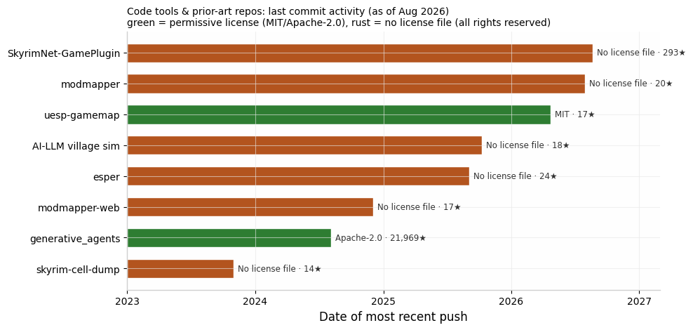

# Whiterun Debug Dashboard: Map Assets, Coordinate Data, and Visualization Prior Art

## Executive Summary

**Bottom line:** there is no clean, permissively licensed vector map of Whiterun ready to drop into a dashboard — but there is a well-documented, fully legal path to *generating* one yourself from game data you already own, plus several reusable coordinate pipelines and a rich set of prior art to borrow design ideas from.

- **Best backdrop option (real geometry, full control):** render Whiterun's top-down view yourself using the Creation Kit's built-in `World -> Create Local Maps` feature, which exports top-down DDS images of any cell — this is exactly how UESP produces its city and interior maps, and UESP's own map-design documentation describes the full workflow including how to read the NorthMarker reference for correct rotation  [(uesp.net)](https://en.uesp.net/wiki/UESPWiki:Skyrim_Map_Design) . Because the output is derived from your own licensed copy of the game and used internally in a debug tool, it is the lowest-risk route and gives pixel-perfect alignment with in-game coordinates.
- **Best ready-made raster backdrops:** the **AIO City Paper Maps for FWMF** mod (Nexus, published September 2025) ships stylized paper-like top-down maps of Whiterun, Solitude, Windhelm, and Riften  [(Nexus Mods)](https://www.nexusmods.com/skyrimspecialedition/mods/160067) , and GameMapScout hosts a detailed numbered top-down map of Whiterun  [(GameMapScout dot com)](http://www.gamemapscout.com/skyrim/whiterun.html)  — but both carry **restrictive or unclear licensing** (Nexus author permissions; GameMapScout's map appears derived from the official strategy guide). Fine as internal placeholders, not for redistribution.
- **Best coordinate pipelines:** `thallada/skyrim-cell-dump` (Rust CLI → JSON of every CELL's x/y grid coordinates)  [(Github)](https://github.com/thallada/skyrim-cell-dump) , the **xEdit scripting API** (`wbPositionToGridCell` divides world units by 4096 per cell; NPC/REFR export scripts are documented and trivial to adapt)  [(xEdit)](https://tes5edit.github.io/docs/13-Scripting-Functions.html) , and the **Info NPC Extractor** xEdit script on Nexus, built precisely to dump NPC data to CSV for Mantella/CHIM/SkyrimNet users  [(Nexus Mods)](https://www.nexusmods.com/skyrimspecialedition/mods/159144) .
- **Best prior art to study:** UESP's MIT-licensed Leaflet/Svelte gamemap codebase  [(Github)](https://github.com/uesp/uesp-gamemap) , Modmapper's external 2D map of in-game data  [(Github)](https://github.com/thallada/modmapper-web) , SkyrimNet's React web dashboard with live NPC state (no map view yet — your gap to fill)  [(Github)](https://github.com/MinLL/SkyrimNet-GamePlugin) , and Stanford's **Smallville / generative_agents** (Apache-2.0), the canonical "god view" 2D agent-simulation UI  [(Github)](https://github.com/joonspk-research/generative_agents) .

---

## 1. Top-Down and Interactive Maps of Whiterun

### 1.1 Why there is no clean vector Whiterun map

A systematic search across Nexus Mods, fan wikis, DeviantArt/ArtStation, Reddit, Etsy, and GitHub turned up **no SVG or true vector top-down map of Whiterun's in-game layout**. The vector assets that exist under "Skyrim map SVG" searches are either province-scale maps of Skyrim/Tamriel (laser-cut files sold on Etsy, so commercial products with no reuse rights) or the in-game *map marker icons* — the Skyrim Wiki on Fandom hosts `Whiterun.svg`-style files, but these are the small settlement glyphs shown on the world map, not city plans  [(fandom.com)](https://skyrim.fandom.com/wiki/Category:Map_icons) . Fan-cartography of Whiterun itself exists almost exclusively as hand-drawn raster art. This means your realistic choices are: (a) adapt a stylized raster under a restrictive license for internal use, (b) reuse a screenshot-derived map with attribution and internal-only use, or (c) generate a geometrically accurate top-down render from the game data — option (c) is covered in detail in Section 2.4 and is arguably better than any existing asset for a debug dashboard, since it aligns natively with the coordinate system your simulation will use.

The comparison table below consolidates every Whiterun-specific map asset found, with format, coordinate metadata, license posture, and maintenance status. Rows flagged ⚠ are usable as internal-only placeholders; rows flagged ✖ should be treated as non-redistributable even internally-adapted without permission.

| Asset | Format | Coordinates/metadata | License & usage terms | Status |
|---|---|---|---|---|
| **Creation Kit "Create Local Maps" render** (DIY, see §2.4) | Raster DDS → JPG/PNG; effectively unlimited resolution | Pixel-accurate vs. game world; rotation via NorthMarker REFR (FormID 0x00000003)  [(uesp.net)](https://en.uesp.net/wiki/UESPWiki:Skyrim_Map_Design)  | Derived from your licensed game copy; Bethesda assets — internal tooling use is low-risk, do not redistribute renders publicly | Method actively documented by UESP  [(uesp.net)](https://en.uesp.net/wiki/UESPWiki:Skyrim_Map_Design)  |
| **AIO City Paper Maps for FWMF** (Nexus SE mod 160067) | Raster "paper" maps packaged for in-game map menu (SWF/texture pipeline) | Covers Whiterun, Solitude, Windhelm, Riften as in-game world maps  [(Nexus Mods)](https://www.nexusmods.com/skyrimspecialedition/mods/160067)  | ⚠ Nexus default: author-reserved rights; check the mod's Permissions tab before extracting textures | Published 2025-09-26, actively maintained  [(Nexus Mods)](https://www.nexusmods.com/skyrimspecialedition/mods/160067)  |
| **GameMapScout Whiterun map** | Raster JPG with 25 numbered door/POI markers (Gates → Dragonsreach Dungeon) | Marker key maps numbers to every building; no numeric coordinates  [(GameMapScout dot com)](http://www.gamemapscout.com/skyrim/whiterun.html)  | ✖ Appears derived from the official game-guide map art; no license stated — treat as all-rights-reserved | Static fan site, undated but stable  [(GameMapScout dot com)](http://www.gamemapscout.com/skyrim/whiterun.html)  |
| **UESP city maps** (e.g., door-numbered map on the Whiterun article) | Raster PNG/JPG rendered from CK local maps  [(uesp.net)](https://en.uesp.net/wiki/Skyrim:Whiterun)  | Door dots keyed to a legend; UESP's map-design docs describe generation from game data  [(uesp.net)](https://en.uesp.net/wiki/UESPWiki:Skyrim_Map_Design)  | ⚠ Wiki text is CC BY-SA; map images are Bethesda-derived — internal reference use reasonable, redistribution not | Continuously maintained; Whiterun article updated 2026-07  [(uesp.net)](https://en.uesp.net/wiki/Skyrim:Whiterun)  |
| **UESP Skyrim Gamemap (interactive)** | Web app: modified Leaflet + Svelte + PHP; ~670k tile images (6.3 GB) for Skyrim  [(uesp.net)](https://en.uesp.net/wiki/UESPWiki:Maps)  | **2,700 Skyrim location markers with map coordinates**; tiles were produced by screenshotting every cell in the Creation Kit  [(uesp.net)](https://en.uesp.net/wiki/UESPWiki:Maps)  | Code is **MIT**  [(Github)](https://github.com/uesp/uesp-gamemap) ; ✖ map tile images themselves are Bethesda-derived and not openly licensed — self-host only with your own tiles | Live and actively developed (repo pushed 2026-04)  [(Github)](https://github.com/uesp/uesp-gamemap)  |
| **DeviantArt: "Skyrim – Whiterun Map" by Mirhayasu** | Hand-drawn raster, 3060×3251 px | None; artistic interpretation  [(DeviantArt)](https://www.deviantart.com/mirhayasu/art/Skyrim-Whiterun-Map-872921889)  | ✖ CC BY-NC-ND 3.0 — no derivatives, non-commercial only; the ND clause blocks even internal adaptation beyond verbatim display | Static (published 2021)  [(DeviantArt)](https://www.deviantart.com/mirhayasu/art/Skyrim-Whiterun-Map-872921889)  |
| **Reddit: hand-drawn Whiterun TTRPG map** | Raster | None; deliberately AU ("circa 2E 439"), 18 buildings counted from game | ✖ No license granted — assume all rights reserved; author contact via Reddit possible | One-off post  [(reddit.com)](https://www.reddit.com/r/skyrim/comments/1b0p83u/whiterun_city_map_for_ttrpg_circa_2e_439/)  |
| **Fandom Skyrim Wiki map icons** (`Whiterun.svg` etc.) | SVG vector — but marker glyphs, not city plans | None | ⚠ Fandom content is CC BY-SA; usable for dashboard *iconography* (city markers) with attribution, not as a map backdrop | Maintained  [(fandom.com)](https://skyrim.fandom.com/wiki/Category:Map_icons)  |

### 1.2 Notes on the most promising assets

The **AIO City Paper Maps for FWMF** package deserves emphasis because it is the only mod found that ships actual top-down *city* maps as first-class assets rather than world-map textures: it replaces the in-game map menu with paper-style maps for the four cities when the player is inside them, on top of the Flat World Map Framework  [(Nexus Mods)](https://www.nexusmods.com/skyrimspecialedition/mods/160067) . The framework itself (FWMF) is the standard substrate for custom world maps in Skyrim SE and has an ecosystem of paper-map addons, mostly for new-land mods rather than vanilla cities  [(Nexus Mods)](https://www.nexusmods.com/skyrimspecialedition/mods/29932) . For your purposes, the map textures can be extracted from the mod's BSA/loose files and reprojected onto a dashboard canvas; the licensing caveat is that Nexus Mods' default terms reserve all rights to the author, so this is suitable for an internal debug backdrop but not for anything you ship. A closely related data point: the SkyrimNet plugin SeverActions credits "Skyrim Paper Map for FWMF by Caro Tuts" as the cartographic base for its in-game PrismaUI World page  [(Github)](https://github.com/Severause/SeverActions)  — evidence that reusing FWMF paper maps as a UI backdrop for NPC/relationship visualization is an established pattern in exactly the ecosystem your tool is adjacent to.

The **GameMapScout map** is the most *information-complete* single image: a top-down plan of the whole walled city plus the Cloud District, with 25 numbered markers covering every named building from the Gates and Warmaiden's through Jorrvaskr and Dragonsreach, and four callouts (Skyforge, Statue of Talos, Gildergreen Tree, Market)  [(GameMapScout dot com)](http://www.gamemapscout.com/skyrim/whiterun.html) . Its weakness is provenance — the art style strongly suggests it originates from the official Prima game guide, which means redistribution or even derivative tracing is legally fraught. Treat it as a *reference for correctness* when validating your own render (building counts, relative positions, district tiers), not as an asset to ship. The same is true of UESP's door-numbered city maps, which are at least honestly generated from game data via the CK pipeline documented on UESP's map-design page  [(uesp.net)](https://en.uesp.net/wiki/UESPWiki:Skyrim_Map_Design) .

---

## 2. Extracted Coordinate Datasets and Extraction Tools

### 2.1 The key structural fact about Whiterun's coordinates

Everything in this section hinges on one engine detail: **in vanilla Skyrim SE/AE, Whiterun is not part of the Tamriel worldspace.** Walled cities live in their own worldspaces (e.g., `WhiterunWorld`), which is why province-scale tooling like the UESP gamemap and Modmapper — both of which index the Tamriel worldspace's ~11,000-cell grid  [(hallada.net)](https://www.hallada.net/2022/10/05/modmapper-putting-every-skyrim-mod-on-a-map-with-rust.html)  — will show you the wilderness around the city but not the city interior. Two consequences follow. First, any "adapt existing extracted data" plan must target `WhiterunWorld` (plus the interior cells for building interiors) rather than Tamriel. Second, the mod **Open Cities Skyrim** duplicates the five major cities into the Tamriel worldspace as part of its design  [(Nexus Mods)](https://www.nexusmods.com/skyrimspecialedition/videos/38) ; if your external simulation conceptually treats the city as continuous with the hold, it is worth knowing that Open Cities' plugin is itself a machine-readable Rosetta Stone mapping every Whiterun building and NPC reference to Tamriel-worldspace coordinates — though reusing its ESP data inherits Arthmoor's well-known restrictive permissions.

Cell-level coordinates in Skyrim plugins are integers on a grid where **one cell = 4096×4096 game units**; xEdit's scripting API exposes this directly via `wbPositionToGridCell`, which "converts a position to grid coordinates… by dividing the physical coordinates by 4096"  [(xEdit)](https://tes5edit.github.io/docs/13-Scripting-Functions.html) . Within a cell, every placed object (REFR record) carries full `DATA` position/rotation floats, so a Whiterun dashboard map needs three layers of extraction: the `WhiterunWorld` cell grid (coarse), the REFR positions of doors/buildings/NPC spawn markers within those cells (fine), and optionally each NPC's current live position if you stream from a running game (Section 3.2). Note that NPC "home" positions and schedule targets are indirect — an NPC's AI **PACK** (package) records point at locations/ markers rather than fixed coordinates — so a schedule-aware visualization needs PACK records too, not just REFRs.

### 2.2 Ready-made datasets and parsers

| Tool/dataset | What it extracts | Output format | License | Maintenance |
|---|---|---|---|---|
| **thallada/skyrim-cell-dump** | FormID + editor ID + x/y of every exterior cell a plugin touches, from any `.esp/.esm/.esl` standalone | JSON or text via CLI (`cargo install skyrim-cell-dump`)  [(Github)](https://github.com/thallada/skyrim-cell-dump)  | ⚠ No LICENSE file in repo (all rights reserved despite public source; author is reachable and collaboration-friendly)  [(hallada.net)](https://www.hallada.net/2022/10/05/modmapper-putting-every-skyrim-mod-on-a-map-with-rust.html)  | Last push 2023-11; stable/feature-complete  [(Github)](https://github.com/thallada/skyrim-cell-dump)  |
| **thallada/modmapper + modmapper-web** | **33.4M cell edits from 113k mods** (534,831 plugins), incl. base-game cells, in Postgres; dumped to per-mod JSON on CDN  [(hallada.net)](https://www.hallada.net/2022/10/05/modmapper-putting-every-skyrim-mod-on-a-map-with-rust.html)  | Postgres DB → JSON files; Next.js/Mapbox frontend  [(Github)](https://github.com/thallada/modmapper-web)  | ⚠ No LICENSE files; the author explicitly offers the full plugin dataset to researchers by email but won't publish it (mod-author license concerns)  [(hallada.net)](https://www.hallada.net/2022/10/05/modmapper-putting-every-skyrim-mod-on-a-map-with-rust.html)  | Backend actively pushed 2026-07; site live  [(Github)](https://github.com/thallada/modmapper)  |
| **xEdit (SSEEdit) scripting** | Anything in any plugin: NPC_ records, REFR positions, PACK schedules; documented sample exports NPCs to TXT/CSV-style output  [(xEdit)](https://tes5edit.github.io/docs/13-Scripting-Functions.html)  | Whatever you write (TXT/CSV/JSON via TStringList) | xEdit itself is open source; scripts you write are yours | Canonical, actively maintained tool |
| **Info NPC Extractor (xEdit script)** | NPC information to CSV/INI, purpose-built for Mantella / CHIM / SkyrimNet / SPID workflows  [(Nexus Mods)](https://www.nexusmods.com/skyrimspecialedition/mods/159144)  | CSV / INI | ⚠ Nexus default permissions — check mod page | Published 2025-09; current  [(Nexus Mods)](https://www.nexusmods.com/skyrimspecialedition/mods/159144)  |
| **Automation Tools for TES5Edit** | Large library of Pascal xEdit scripts incl. CELL-level reference manipulation  [(Nexus Mods)](https://www.nexusmods.com/skyrim/mods/49373)  | In-place edits / exports | ⚠ Nexus default permissions | Old (2014) but scripts remain the standard reference examples  [(Nexus Mods)](https://www.nexusmods.com/skyrim/mods/49373)  |
| **matortheeternal/esper** | Full Bethesda plugin parser in JS with an xEdit-like API (successor to zEdit's parser core) | Programmatic objects → any format | ⚠ No LICENSE file | Last push 2025-09  [(Github)](https://github.com/matortheeternal/esper)  |
| **UESP gamemap location DB** | ~2,700 Skyrim location markers with map coordinates, crowdsourced and curated  [(uesp.net)](https://en.uesp.net/wiki/UESPWiki:Maps)  | Web app DB (MySQL-backed); code MIT on GitHub  [(Github)](https://github.com/uesp/uesp-gamemap)  | Code MIT; location data is UESP community content — ask before bulk-scraping | Very actively maintained  [(uesp.net)](https://en.uesp.net/wiki/UESPWiki:Maps)  |
| **Creation Kit "Create Local Maps"** | Top-down rendered image of any cell, incl. `WhiterunWorld` cells; NorthMarker gives rotation; UESP's full workflow documented  [(uesp.net)](https://en.uesp.net/wiki/UESPWiki:Skyrim_Map_Design)  | DDS → JPG/PNG | Output is Bethesda-derived art | Built into official CK |

The standout for your "I'd rather adapt than redo" requirement is the **skyrim-cell-dump / modmapper family**. The CLI gives you a JSON dump of every cell edit in `Skyrim.esm` — including the `WhiterunWorld` cells — in one command  [(Github)](https://github.com/thallada/skyrim-cell-dump) . What it does *not* give you is REFR-level positions inside cells (it deliberately skips everything except CELL headers for speed), so for building-precise placement you will still need an xEdit script pass; the good news is that the documented xEdit sample for exporting NPCs is about 30 lines of Pascal and the same pattern trivially extends to REFR `DATA` positions  [(xEdit)](https://tes5edit.github.io/docs/13-Scripting-Functions.html) . If you prefer a ready-made NPC-focused export, the **Info NPC Extractor** script (2025) already targets exactly your ecosystem — it was written to feed NPC data to Mantella, CHIM, and SkyrimNet, so its CSV schema covers the fields those tools care about  [(Nexus Mods)](https://www.nexusmods.com/skyrimspecialedition/mods/159144) .

### 2.3 The Modmapper dataset caveat

Modmapper is worth a paragraph of its own because it is simultaneously the largest structured Skyrim spatial dataset in existence and a licensing trap for the unwary. The project downloaded every Skyrim SE and LE mod from Nexus (113,028 mods, 534,831 plugin files, ~191 GB uncompressed), parsed every plugin's cell edits, and stores them in Postgres; the author states he believes this is "the most complete set of all Skyrim plugins to date"  [(hallada.net)](https://www.hallada.net/2022/10/05/modmapper-putting-every-skyrim-mod-on-a-map-with-rust.html) . The website renders this as a heatmap over the UESP satellite tiles using Mapbox  [(The Nexus Forums)](https://forums.nexusmods.com/topic/11097183-modmapper-every-skyrim-se-mod-on-an-online-interactive-map/) . For you, the base-game cell layer (populated via `--backfill-is-base-game` from `Skyrim.esm`  [(Github)](https://github.com/thallada/modmapper) ) is the relevant slice. However: none of the three repos carries a LICENSE file, so the code is technically all-rights-reserved (though the author is demonstrably generous — he invites data-mining requests by email  [(hallada.net)](https://www.hallada.net/2022/10/05/modmapper-putting-every-skyrim-mod-on-a-map-with-rust.html) ); and his mass download of Nexus "is technically against their terms of service," which he flags himself  [(hallada.net)](https://www.hallada.net/2022/10/05/modmapper-putting-every-skyrim-mod-on-a-map-with-rust.html) . Use the *technique* and the small MIT-adjacent ecosystem around it; request data access directly rather than scraping Nexus yourself.

### 2.4 The DIY render path (recommended for the backdrop)

UESP's **Skyrim Map Design** documentation is, in effect, a published recipe for exactly the asset you want: open the Creation Kit, load a cell, run `World -> Create Local Maps` to get a top-down DDS render, then rotate it using the cell's NorthMarker reference — findable in game data as the REFR whose `NAME` is `0x00000003`, with the Z-rotation stored as the last of six floats in its `DATA` field (radians, counterclockwise) — then crop and convert to JPG/PNG  [(uesp.net)](https://en.uesp.net/wiki/UESPWiki:Skyrim_Map_Design) . UESP notes practical gotchas: exported resolution varies per cell, occasional missing sections require re-export, and a target of ~800–1000 px in the largest dimension works well for wiki use — but nothing stops you from exporting much larger for a dashboard  [(uesp.net)](https://en.uesp.net/wiki/UESPWiki:Skyrim_Map_Design) . Applied to `WhiterunWorld`, this yields a geometrically true top-down city render whose pixel coordinates map linearly onto game units, which is precisely the property a debug overlay needs; the UESP Whiterun article's own door-numbered maps are products of this exact pipeline  [(uesp.net)](https://en.uesp.net/wiki/Skyrim:Whiterun) .

Combining §2.2 and §2.4 gives you the full stack with zero reinvention: CK local-map render for the backdrop (real geometry), `skyrim-cell-dump` for the coarse cell grid of `WhiterunWorld`  [(Github)](https://github.com/thallada/skyrim-cell-dump) , and a short xEdit script for REFR door/building/NPC positions with `wbPositionToGridCell` semantics (4096 units per cell)  [(xEdit)](https://tes5edit.github.io/docs/13-Scripting-Functions.html) . The only layer no existing dataset provides off the shelf is per-NPC *schedule targets* (AI packages) — those are extractable with the same xEdit pass over PACK records, and UESP's NPC articles (which document daily routines in prose, curated from game data) are a viable cross-check source  [(uesp.net)](https://en.uesp.net/wiki/Skyrim:Whiterun) .

---

## 3. Prior Art: External/Companion Visualization of Skyrim NPCs

### 3.1 External tools that put game state on a 2D map

| Project | What it visualizes | Stack | License | Status |
|---|---|---|---|---|
| **Modmapper** | Every mod's cell edits as a heatmap on a satellite map of Skyrim; per-mod and per-load-order views via drag-and-drop of your Data folder (WASM client-side parsing)  [(Github)](https://github.com/thallada/modmapper-web)  | Rust → Postgres → static JSON; Next.js + Mapbox GL frontend  [(hallada.net)](https://www.hallada.net/2022/10/05/modmapper-putting-every-skyrim-mod-on-a-map-with-rust.html)  | ⚠ No license on code; data by request  [(hallada.net)](https://www.hallada.net/2022/10/05/modmapper-putting-every-skyrim-mod-on-a-map-with-rust.html)  | Live; backend active 2026  [(Github)](https://github.com/thallada/modmapper)  |
| **UESP Gamemap** | ~2,700 curated Skyrim locations on CK-screenshot tiles; live-editable marker database  [(uesp.net)](https://en.uesp.net/wiki/UESPWiki:Maps)  | Modified Leaflet + Svelte + PHP/MySQL  [(uesp.net)](https://en.uesp.net/wiki/UESPWiki:Maps)  | **Code MIT**; tiles Bethesda-derived  [(Github)](https://github.com/uesp/uesp-gamemap)  | Very active  [(Github)](https://github.com/uesp/uesp-gamemap)  |
| **SkyrimNet web dashboard** | ~30-page React control panel at localhost:8080: nearby NPCs, live actor data, event stream, memories with vector search, game-data explorer, MCP server for LLM tool access to game state  [(Github)](https://github.com/MinLL/SkyrimNet-GamePlugin)  | Native DLL in-game + React web UI | ⚠ No LICENSE file in public repo | Extremely active (pushed 2026-08-22; 293★)  [(Github)](https://github.com/MinLL/SkyrimNet-GamePlugin)  |
| **CHIM (AIAgent + DwemerDistro)** | Web-served AI brain for NPCs: per-NPC witnessed-event scoping, diary entries, Soulgaze vision descriptions, MCP debug server, Twitch chat control  [(Nexus Mods)](https://www.nexusmods.com/skyrimspecialedition/mods/126330)  | Skyrim mod + WSL2 VM backend + web UI | ⚠ Nexus default permissions | Actively maintained (page updated 2026-08)  [(Nexus Mods)](https://www.nexusmods.com/skyrimspecialedition/mods/126330)  |
| **Mantella** | Browser UI at localhost:4999 for conversation config, NPC actions incl. LLM-directed `MoveTo`, per-NPC conversation summaries saved to disk  [(art-from-the-machine.github.io)](https://art-from-the-machine.github.io/Mantella/pages/installation.html)  | Python exe + web UI | Open-source project (Art From The Machine) | Mature, documented  [(art-from-the-machine.github.io)](https://art-from-the-machine.github.io/Mantella/pages/installation.html)  |
| **SeverActions (SkyrimNet plugin)** | In-game (not external) PrismaUI/React panel: companion roster with **relationship bars (rapport/trust/loyalty/mood)**, per-hold bounty grid on a paper-map backdrop  [(Github)](https://github.com/Severause/SeverActions)  | C++ SKSE + React 19/Zustand via PrismaUI | GitHub source available; check repo license | Active (2026-02)  [(Github)](https://github.com/Severause/SeverActions)  |
| **Where Are You** / **NPC Lookup** | In-game NPC search, tracking markers on the *world* map, teleport — proof the live-position APIs exist and are cheap  [(Nexus Mods)](https://www.nexusmods.com/skyrimspecialedition/mods/76063)  | SKSE (CommonLib-NG) + Papyrus | ⚠ Nexus defaults | Maintained; SE/AE/GOG/VR  [(Nexus Mods)](https://www.nexusmods.com/skyrimspecialedition/mods/76063)  |

The single most instructive project for your dashboard's *frontend* is **UESP's gamemap**: it is MIT-licensed, deliberately game-agnostic ("supports a variety of other map formats, and can be modified to support other games/sites if desired"), and demonstrates the mature pattern of serving a custom tile pyramid into a Leaflet-style viewer with a live-editable marker layer on top  [(Github)](https://github.com/uesp/uesp-gamemap) . Even if you don't reuse the code, its architecture (tile pyramid + marker DB + live edit) is a proven template for a game map that isn't geographically projected. **Modmapper** adds the second key idea: rendering *data about the game* (its 33M cell edits) as a colored overlay on the same tiles, and — critically for a debug tool — doing plugin parsing **client-side in WebAssembly** so users can drop their own Data folder onto the page  [(Github)](https://github.com/thallada/modmapper-web) . Between those two you have the complete prior art for the map half of your dashboard.

### 3.2 The SkyrimNet ecosystem: your closest neighbors, and the gap

The "SkyrimNet-adjacent" tools you mentioned are real and thriving, and none of them has a top-down 2D map of NPC positions — which means your project fills a genuine gap rather than duplicating one. **SkyrimNet** itself is a native in-game DLL whose React dashboard at `localhost:8080` already exposes everything a god-view needs *except* spatialization: a live nearby-NPC list, per-actor live data, an event stream, memory stores, and an MCP server through which LLM agents query game state  [(Github)](https://github.com/MinLL/SkyrimNet-GamePlugin) . Its public repo is updated almost daily and has no LICENSE file (source-available, rights reserved) — fine to build *against* via its documented Papyrus/C++ APIs, but don't vendor its code  [(Github)](https://github.com/MinLL/SkyrimNet-GamePlugin) . **CHIM** takes the external-brain architecture furthest (a WSL2 "DwemerDistro" VM serving the game), with per-NPC knowledge scoping — "each AI NPC will only be aware of events which they have witnessed" — which is conceptually identical to a belief/rumor engine and makes its web UI the best prior art for *per-agent knowledge inspection* panels  [(Nexus Mods)](https://www.nexusmods.com/skyrimspecialedition/mods/126330) . Its GitHub-adjacent companion **MinAI** adds a dungeon-master layer and radiant AI enablement for nearby actors  [(Github)](https://github.com/MinLL/MinAI) .

For streaming live positions out of the game, the tracking mods are the existence proof and the API documentation rolled into one: **Where Are You** resolves any unique NPC by name to a live reference, reads stats, and plants up to 100 tracking markers  [(Nexus Mods)](https://www.nexusmods.com/skyrimspecialedition/mods/76063) , while **NPC Lookup** enumerates static/dynamic/leveled bases and loaded references with map marking  [(Nexus Mods)](https://www.nexusmods.com/skyrimspecialedition/mods/43097) . Both are CommonLib-NG SKSE plugins; the SKSE/Papyrus calls they use (`GetPositionX/Y/Z`, alias-based tracking) are exactly what a SkyrimNet-style plugin would poll and push to your external dashboard over HTTP/WebSocket. If your engine is purely external (no in-game component), the static extraction route from Section 2 gives you *initial/spawn* positions and schedule targets, while live positions require one of these in-game bridges — that architectural fork is the main design decision the prior art illuminates.

### 3.3 Academic and hobbyist "god view" agent visualization

The canonical reference for your "watching Sims from above" framing is Stanford/Google's **Generative Agents (Smallville)**: 25 LLM-driven agents living in a 2D sprite town rendered with **Phaser**, with a browser replay server that plays back agent movement, conversations, and state over time from JSON snapshots  [(Github)](https://github.com/joonspk-research/generative_agents) . The repo is **Apache-2.0** — genuinely reusable — and its design decisions translate directly: Tiled-authored map, per-timestep environment JSON, and a replay/scrub UI that is arguably a better model for a *debug* dashboard than a live-only view, since belief/rumor propagation debugging is fundamentally about replaying and diffing social state over time  [(Github)](https://github.com/joonspk-research/generative_agents) . The accompanying paper (Park et al., UIST '23) documents the memory-stream/reflection/planning architecture your belief engine will rhyme with  [(Stanford HAI)](https://hai.stanford.edu/news/computational-agents-exhibit-believable-humanlike-behavior) .

Two smaller projects round out the design space. A student/hobbyist **virtual village simulation** (Pygame + Tiled frontend, GPT-3.5 backend with neuroscience-inspired memory and emotion) demonstrates the minimal viable version: real-time 2D town rendering of LLM NPC interactions with a French written report included  [(Github)](https://github.com/gabriel-mercier/AI-LLM-Driven-NPC-Generation-A-Virtual-Village-Simulation)  — no license file, so treat as inspiration only. And outside AI entirely, a **Tableau hobbyist project** shows the pragmatic "poor man's pipeline" for getting Skyrim onto a 2D canvas: take UESP's map as a background image, drop colored dots in Figma, extract dot coordinates with the Automeris digitizer into CSV, divide coordinates to fit lat/long ranges, and render in Tableau with map layers and parameter actions  [(consult-ant.uk)](https://consult-ant.uk/2022/03/04/building-an-interactive-skyrim-map/) . If you ever need to hand-annotate a handful of Whiterun POIs on a raster before your xEdit extraction is ready, that Automeris trick is a one-hour stopgap  [(consult-ant.uk)](https://consult-ant.uk/2022/03/04/building-an-interactive-skyrim-map/) .

---

## 4. Licensing Risk Flags (Consolidated)

The figure below summarizes the code-side maintenance and license posture found during this research; the notes after it flag the asset-side risks you asked to have surfaced rather than omitted.

**Restrictive / unclear — flagged as requested.** The **GameMapScout Whiterun map** shows every sign of being official strategy-guide art and carries no license statement; use it only as a correctness reference  [(GameMapScout dot com)](http://www.gamemapscout.com/skyrim/whiterun.html) . **Mirhayasu's DeviantArt Whiterun map** is CC BY-NC-ND 3.0 — the NoDerivatives clause is the killer: even internal adaptation for a dashboard backdrop is outside the license, though the artist is active in the FWMF paper-map scene and could plausibly be asked for permission  [(DeviantArt)](https://www.deviantart.com/mirhayasu/art/Skyrim-Whiterun-Map-872921889) . The **Reddit TTRPG map** grants no license at all  [(reddit.com)](https://www.reddit.com/r/skyrim/comments/1b0p83u/whiterun_city_map_for_ttrpg_circa_2e_439/) . On the code side, **skyrim-cell-dump, modmapper, modmapper-web, esper, SkyrimNet-GamePlugin, and the AI village sim all lack LICENSE files** — public source ≠ open source; for internal tooling use this is usually acceptable in practice, but vendoring or redistributing their code is not cleared. Nexus-hosted items (**AIO City Paper Maps**, **FWMF**, **Info NPC Extractor**, **CHIM**, tracking mods) default to author-reserved permissions; each mod's "Permissions and credits" tab governs, and texture extraction for an internal tool is the norm in this community but not a granted right  [(Nexus Mods)](https://www.nexusmods.com/skyrimspecialedition/mods/160067) .

**Permissive and safe to build on.** UESP's **gamemap code is MIT** (by Dave Humphrey) — the cleanest reusable frontend codebase found  [(Github)](https://github.com/uesp/uesp-gamemap) . Stanford's **generative_agents is Apache-2.0**, including the replay-server design  [(Github)](https://github.com/joonspk-research/generative_agents) . Everything produced by **your own xEdit scripts or CK local-map renders from your licensed game copy** is standard modding practice; Bethesda's long-standing position tolerates non-commercial derivative tooling, which comfortably covers an internal debug dashboard, while still arguing against *publicly redistributing* rendered city art. The one asset class that is both permissive and useful is **UESP/Fandom wiki text and iconography under CC BY-SA** — handy for POI names, NPC rosters, and marker icons with attribution  [(fandom.com)](https://skyrim.fandom.com/wiki/Category:Map_icons) . Finally, a process warning from Modmapper's author worth heeding: bulk-downloading Nexus mods programmatically violates Nexus ToS; adapt his *parsers*, don't replay his *scrape*  [(hallada.net)](https://www.hallada.net/2022/10/05/modmapper-putting-every-skyrim-mod-on-a-map-with-rust.html) .

---

## 5. Recommended Pipeline for the Debug Dashboard

**Phase 1 — backdrop (day 1).** Run the CK `Create Local Maps` export over the `WhiterunWorld` cells per UESP's documented workflow, rotate via the NorthMarker (REFR `0x00000003`, last DATA float, radians CCW), stitch into a single PNG, and cut a Leaflet-compatible tile pyramid or use a single-image overlay with an affine transform  [(uesp.net)](https://en.uesp.net/wiki/UESPWiki:Skyrim_Map_Design) . Optionally prototype first with the Tableau/Automeris stopgap on a GameMapScout-style reference  [(consult-ant.uk)](https://consult-ant.uk/2022/03/04/building-an-interactive-skyrim-map/) .

**Phase 2 — static data (day 2–3).** Run `skyrim-cell-dump` on `Skyrim.esm` for the cell grid  [(Github)](https://github.com/thallada/skyrim-cell-dump) ; write a ~30-line xEdit Pascal script (pattern after the documented NPC export sample) to dump REFR positions of doors, buildings, and NPC spawn/idle markers in `WhiterunWorld` to CSV, converting to pixels via the 4096-units-per-cell grid  [(xEdit)](https://tes5edit.github.io/docs/13-Scripting-Functions.html) ; optionally layer in the Info NPC Extractor's CSV for NPC identity/schedule metadata already shaped for SkyrimNet-class tools  [(Nexus Mods)](https://www.nexusmods.com/skyrimspecialedition/mods/159144) .

**Phase 3 — live layer and UI (week 2+).** If your simulation needs live positions, mirror the Where Are You / SkyrimNet pattern: a small SKSE or SkyrimNet-API bridge pushing `GetPos` updates over WebSocket  [(Nexus Mods)](https://www.nexusmods.com/skyrimspecialedition/mods/76063) . For the frontend, clone the architecture (or the MIT code) of uesp-gamemap — tiles + live marker layer  [(Github)](https://github.com/uesp/uesp-gamemap)  — and steal the killer feature from Smallville: **time-scrubbed replay of agent state**, because rumor/belief debugging is a temporal-diff problem, not just a spatial one  [(Github)](https://github.com/joonspk-research/generative_agents) .

 [(reddit.com)](https://www.reddit.com/r/skyrim/comments/1b0p83u/whiterun_city_map_for_ttrpg_circa_2e_439/) : https://www.reddit.com/r/skyrim/comments/1b0p83u/whiterun_city_map_for_ttrpg_circa_2e_439/
 [(fandom.com)](https://skyrim.fandom.com/wiki/Category:Map_icons) : https://skyrim.fandom.com/wiki/Category:Map_icons
 [(DeviantArt)](https://www.deviantart.com/mirhayasu/art/Skyrim-Whiterun-Map-872921889) : https://www.deviantart.com/mirhayasu/art/Skyrim-Whiterun-Map-872921889
 [(uesp.net)](https://en.uesp.net/wiki/Skyrim:Maps) : https://en.uesp.net/wiki/Skyrim:Maps
 [(consult-ant.uk)](https://consult-ant.uk/2022/03/04/building-an-interactive-skyrim-map/) : https://consult-ant.uk/2022/03/04/building-an-interactive-skyrim-map/
 [(GameMapScout dot com)](http://www.gamemapscout.com/skyrim/whiterun.html) : http://www.gamemapscout.com/skyrim/whiterun.html
 [(uesp.net)](https://en.uesp.net/wiki/Skyrim:Whiterun) : https://en.uesp.net/wiki/Skyrim:Whiterun
 [(Github)](https://github.com/thallada/skyrim-cell-dump) : https://github.com/thallada/skyrim-cell-dump
 [(Github)](https://github.com/thallada/modmapper) : https://github.com/thallada/modmapper
 [(xEdit)](https://tes5edit.github.io/docs/13-Scripting-Functions.html) : https://tes5edit.github.io/docs/13-Scripting-Functions.html
 [(Nexus Mods)](https://www.nexusmods.com/skyrimspecialedition/mods/159144) : https://www.nexusmods.com/skyrimspecialedition/mods/159144
 [(hallada.net)](https://www.hallada.net/2022/10/05/modmapper-putting-every-skyrim-mod-on-a-map-with-rust.html) : https://www.hallada.net/2022/10/05/modmapper-putting-every-skyrim-mod-on-a-map-with-rust.html
 [(Github)](https://github.com/Severause/SeverActions) : https://github.com/Severause/SeverActions
 [(Github)](https://github.com/MinLL/SkyrimNet-GamePlugin) : https://github.com/MinLL/SkyrimNet-GamePlugin
 [(Github)](https://github.com/uesp/uesp-gamemap) : https://github.com/uesp/uesp-gamemap
 [(Github)](https://github.com/MinLL/MinAI) : https://github.com/MinLL/MinAI
 [(art-from-the-machine.github.io)](https://art-from-the-machine.github.io/Mantella/pages/installation.html) : https://art-from-the-machine.github.io/Mantella/pages/installation.html
 [(reddit.com)](https://www.reddit.com/r/skyrim/comments/11ij8m3/is_there_any_way_i_can_access_the_database_of_all/) : https://www.reddit.com/r/skyrim/comments/11ij8m3/is_there_any_way_i_can_access_the_database_of_all/
 [(uesp.net)](https://en.uesp.net/wiki/UESPWiki:Maps) : https://en.uesp.net/wiki/UESPWiki:Maps
 [(Github)](https://github.com/gabriel-mercier/AI-LLM-Driven-NPC-Generation-A-Virtual-Village-Simulation) : https://github.com/gabriel-mercier/AI-LLM-Driven-NPC-Generation-A-Virtual-Village-Simulation
 [(Github)](https://github.com/thallada/modmapper-web) : https://github.com/thallada/modmapper-web
 [(Stanford HAI)](https://hai.stanford.edu/news/computational-agents-exhibit-believable-humanlike-behavior) : https://hai.stanford.edu/news/computational-agents-exhibit-believable-humanlike-behavior
 [(Nexus Mods)](https://www.nexusmods.com/skyrimspecialedition/mods/160067) : https://www.nexusmods.com/skyrimspecialedition/mods/160067
 [(Nexus Mods)](https://www.nexusmods.com/skyrimspecialedition/mods/126330) : https://www.nexusmods.com/skyrimspecialedition/mods/126330
 [(The Nexus Forums)](https://forums.nexusmods.com/topic/11097183-modmapper-every-skyrim-se-mod-on-an-online-interactive-map/) : https://forums.nexusmods.com/topic/11097183-modmapper-every-skyrim-se-mod-on-an-online-interactive-map/
 [(modmapper.com)](https://modmapper.com/) : https://modmapper.com/
 [(Github)](https://github.com/matortheeternal/esper) : https://github.com/matortheeternal/esper
 [(Nexus Mods)](https://www.nexusmods.com/skyrimspecialedition/mods/76063) : https://www.nexusmods.com/skyrimspecialedition/mods/76063
 [(Nexus Mods)](https://www.nexusmods.com/skyrimspecialedition/mods/43097) : https://www.nexusmods.com/skyrimspecialedition/mods/43097
 [(Nexus Mods)](https://www.nexusmods.com/skyrim/mods/49373) : https://www.nexusmods.com/skyrim/mods/49373
 [(Github)](https://github.com/joonspk-research/generative_agents) : https://github.com/joonspk-research/generative_agents
 [(substack.com)](https://gonzoml.substack.com/p/generative-agents-interactive-simulacra) : https://gonzoml.substack.com/p/generative-agents-interactive-simulacra
 [(Nexus Mods)](https://www.nexusmods.com/skyrimspecialedition/mods/29932) : https://www.nexusmods.com/skyrimspecialedition/mods/29932
 [(uesp.net)](https://en.uesp.net/wiki/UESPWiki:Skyrim_Map_Design) : https://en.uesp.net/wiki/UESPWiki:Skyrim_Map_Design
 [(Nexus Mods)](https://www.nexusmods.com/skyrimspecialedition/videos/38) : https://www.nexusmods.com/skyrimspecialedition/videos/38
 [(STEP Modifications)](https://stepmodifications.org/forum/topic/18862-open-cities-alternatives-no-gates/) : https://stepmodifications.org/forum/topic/18862-open-cities-alternatives-no-gates/
